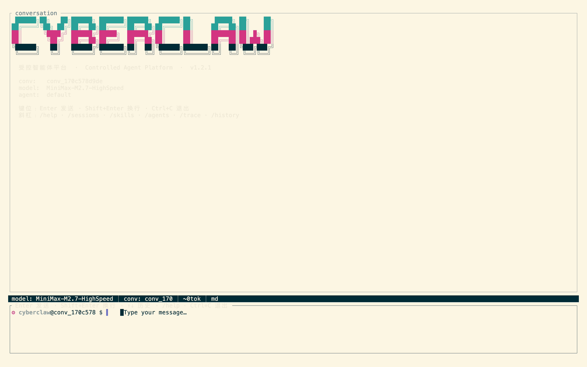
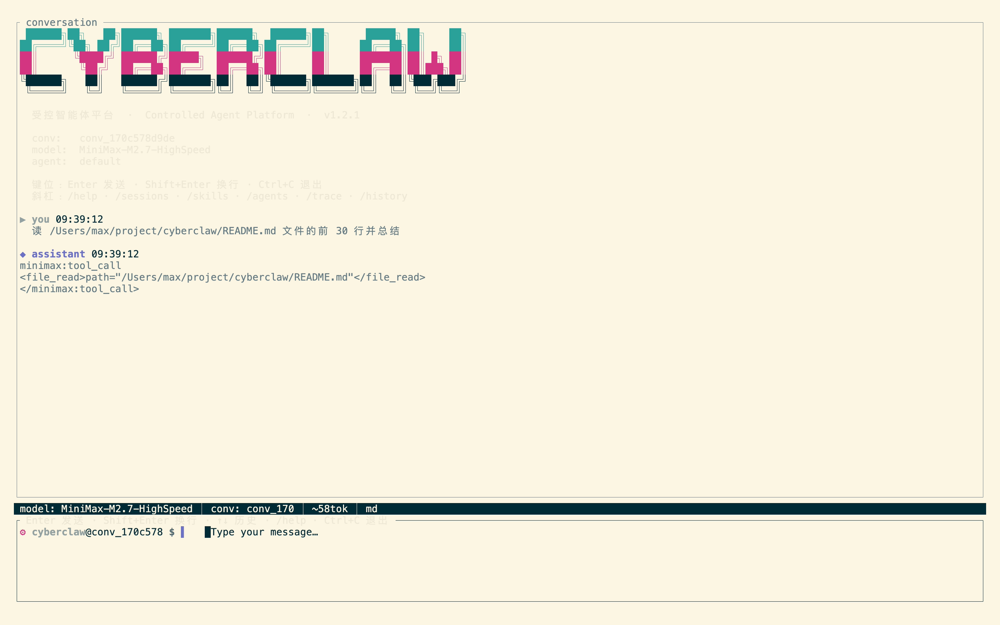
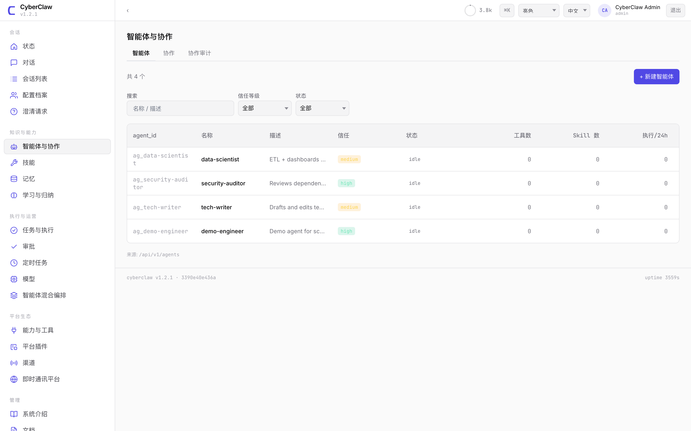
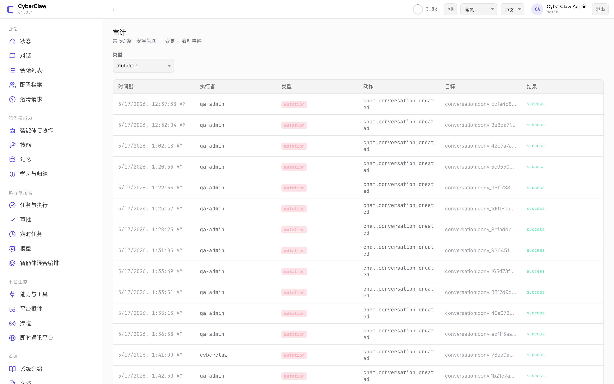
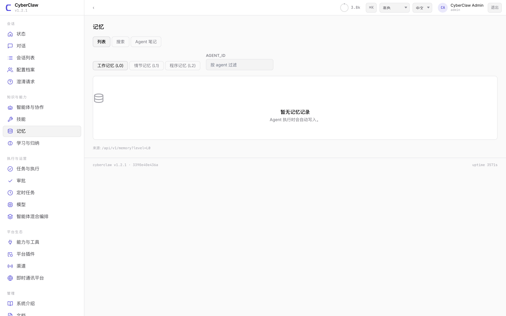
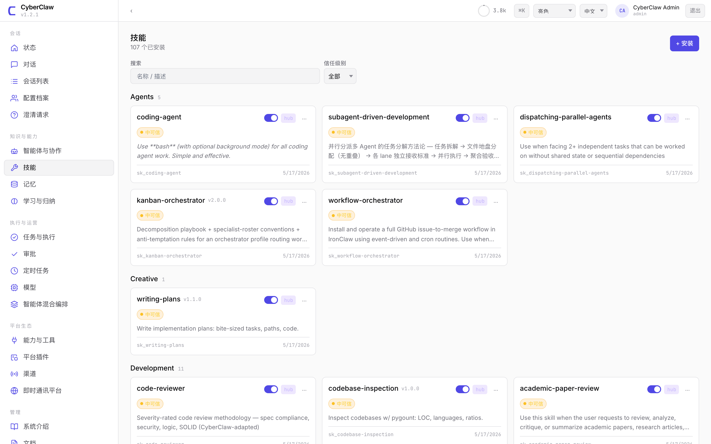

# CyberClaw

<p align="center">
  <a href="LICENSE"></a>
  <a href="https://www.rust-lang.org/"></a>
  <a href="docs/README.md"></a>
  <a href="README.md"></a>
</p>

<p align="center"><strong>面向高风险业务环境的通用安全可控 Agent 平台。</strong></p>

> ⚠ **状态：Beta，研究与开发阶段，不要在此阶段把真实资金、生产数据库或对外业务系统接入 CyberClaw**。

CyberClaw 是一个 Agent 运行时，把治理、审计、身份认证与外部接入做成 Agent 通向真实系统的唯一路径。所有动作必经规则评估，必要时进入人工审批，并完整记录于可验证审计链。适用于安全运营、DevOps、Web3 等高风险的业务场景。

[文档](docs/README.md) · [快速开始](docs/GUIDE.md) · [English](README.md)

---

## 安全架构

安全不是 CyberClaw 的附加层，而是从编程语言、运行时到接口的原生设计——任何 Agent 通向外部世界的动作，都得逐层穿过：

- **语言层** — Rust 实现。内存安全、零数据竞争由编译器静态保证；buffer overflow、use-after-free、悬挂指针等整类漏洞被消除。
- **沙箱与执行隔离** — 同一 Capability 可在多种运行时执行（本地、独立进程、容器、远程）。高风险动作默认走容器隔离；单个 Agent 故障或被攻陷不污染其他 Agent。
- **模型层** — 部分系统提示词由服务端固定，模型无法改写。
- **输入输出层** — 工具返回先经过 prompt-injection 与凭据扫描，再进入模型上下文。
- **执行层** — 升权模式下自动撤销高风险能力，连续失败强制退出。
- **接口层** — 文件与网络的边界写在代码里，规则配错也无法突破。
- **鉴权层** — 防时序攻击的密码学比较，外部 webhook 强制签名验证。
- **审计层** — 每个动作生成密码学链式记录，任何篡改可被检测。


## 五个对象


|                                       |                                                                           |
| ------------------------------------- | ------------------------------------------------------------------------- |
| **Agent（智能体）**             | 谁在做。每个 Agent 有自己的身份、信任级别、预算                           |
| **Skill（技能）**               | 这个角色具体怎么做事。例如"代码审查方法"、"事件响应剧本"                  |
| **Connector（连接器）**         | 通向外部世界的接口。一个 Connector 对接一种系统（数据库、钱包、Slack 等） |
| **Capability（能力）**          | 一次具体的操作。例如"写文件"、"签一笔交易"、"发一条消息"                  |
| **Platform Plugin（平台插件）** | 平台级扩展。例如把审计数据导出到企业 SIEM                                 |

## 一次 Agent 执行动作的流程

当 Agent 想做点什么——例如"把报告写到磁盘"——发生的是这样：

1. **请求**：Agent 说"我要调 `fs.write`，文件名是 X，内容是 Y，原因是 Z"。
2. **裁决**：治理引擎查规则，决定这次调用是放行、拒绝，还是要人工审批。
3. **执行与记录**：放行后由对应 Connector 执行；执行结果先过内容检测（防恶意注入），然后整条链路——请求、裁决、结果——写进一条不可篡改的审计记录。
4. **审计**：每次 Agent 动作生成一行记录：谁请求了什么、规则怎么裁决、结果是什么。每行用密码学方式相互链接，任何篡改可被检测到。可一键校验整条链。


## 使用场景

- **安全运营** — 告警量永远多过分析师，但又不敢让 AI 真去操作。CyberClaw 让 Agent 在策略边界内做告警分诊、事件响应、PR 风险审查。"Agent 起草、SOC 审批"从 demo 变成可上线的工作流。
- **DevOps 与变更** — 发版门禁、数据库迁移、变更审批长期由人盯。Agent 起草 PR 已经常见，但敢把合并权交给它的不多。CyberClaw 让 Agent 跑完整流程、最后一步交人审批，并自动产出 SOX/SOC2 需要的操作记录。
- **Web3** — 多签流水、国库划转、链上 runbook 一直是运维手动跑。在 CyberClaw 上，Agent 起草交易、组织上下文、提交执行计划；签名权限由治理规则决定能否走下一步；每笔动作上链时同步落审计——链上链下证据合一。

## 截图

<table>
<tr>
  <td></td>
  <td></td>
</tr>
<tr>
  <td align="center"><sub>TUI · 聊天界面</sub></td>
  <td align="center"><sub>TUI · 工具调用</sub></td>
</tr>
<tr>
  <td></td>
  <td></td>
</tr>
<tr>
  <td align="center"><sub>WebUI · Agent 列表</sub></td>
  <td align="center"><sub>WebUI · 链路追踪</sub></td>
</tr>
<tr>
  <td></td>
  <td></td>
</tr>
<tr>
  <td align="center"><sub>WebUI · 记忆浏览</sub></td>
  <td align="center"><sub>WebUI · Skill 市场</sub></td>
</tr>
</table>

## 快速开始

```bash
git clone https://github.com/cyberclawlabs/cyberclaw.git
cd cyberclaw
cp .env.example .env       # 配置 LLM_API_KEY 和 CYBERCLAW_APPROVAL_SECRET
cargo run -p cyberclaw-server
# 打开 http://127.0.0.1:38090/admin/v2/
```

生产部署（JWT 签发、TLS、多副本）见[使用指南](docs/GUIDE.md)。

## 已支持

- **LLM 提供商** — Anthropic、OpenAI、DeepSeek、MiniMax、火山方舟，以及任何 OpenAI 兼容端点。
- **可接入的外部系统** — 文件系统、HTTP、浏览器、MCP 工具桥。
- **消息平台** — Slack、Telegram、Discord、飞书、企业微信、LINE、通用 webhook。
- **多 Agent 协作** — 子 Agent 委派、多数票汇总、多模型综合判断。
- **可观测性** — 链路追踪导出（兼容 Jaeger、Datadog、Grafana 等）、Prometheus 指标。
- **运维控制台** — React 管理界面，含登录、审批队列、审计查看器、与任意 Agent 实时对话；命令行配套。
- **部署模式** — 单节点或 Raft 集群（多副本一致性 + 任务派发）。跨副本的分布式审批见路线图第二阶段。

## 路线图

- **第一阶段 — 可用**（v1.x）：核心五对象、声明式治理、审计链、六个 IM 平台、多 LLM provider、自主执行模式与熔断。**已发布。**
- **第二阶段 — 受治理**（v2.x 计划）：跨副本分布式审批、企业 IAM 接入、更细的权限划分、多租户隔离、合规模板（SOX / SOC2 / HIPAA）。
- **第三阶段 — 可扩展生态**（v3.x 计划）：第三方 Connector / Skill / Plugin 注册中心、签名分发的 Skill、共享治理模板库。

## 贡献

欢迎贡献：

- 新的 Connector（IM 平台、SaaS API、内部系统接入）
- 新的 Skill（垂直领域方法、prompt 模板、知识包）
- 治理规则模板（特定业务场景或合规框架）
- 文档、示例、应用案例

详见 [CONTRIBUTING.md](CONTRIBUTING.md)。

## 致谢与引用

CyberClaw 的核心架构参考了一系列学术成果与开源项目。

**借鉴的项目与概念：**

- [Anthropic Model Context Protocol (MCP)](https://modelcontextprotocol.io/) — 工具接入的协议设计参考。
- [OpenTelemetry](https://opentelemetry.io/) — 链路追踪的格式与导出规范。
- [Nous Research Hermes Agent](https://github.com/NousResearch/hermes-agent) — 精神最相近的同类；autopilot、定时触发、跨会话记忆、子代理委派的对照基准。
- [ralph](https://github.com/snarktank/ralph) — "持续循环到任务完成"的范式；CyberClaw PersistentExecution 模块的直系祖先。
- [OpenClaw](https://github.com/openclaw/openclaw) 与 [OpenClaw-RL](https://github.com/Gen-Verse/OpenClaw-RL) — `claw` 系命名脉络、SOUL.md 角色定义、approval-gate 模式、自演化方向。
- [NanoClaw](https://github.com/qwibitai/nanoclaw) — 文件基记忆 + 容器隔离模式。
- [IronClaw-NearAI](https://github.com/nearai/ironclaw) — Rust 实现的企业 Agent，WASM 沙箱 + policy engine 的架构同行。
- [Cline](https://github.com/cline/cline) 与 [OpenCode](https://github.com/anomalyco/opencode) — Human-in-the-loop UX、MCP 集成模式、Client/Server 拆分。
- HashiCorp Sentinel / OPA — Policy-as-Code 与声明式治理思想。
- AWS IAM — Capability-based authorization 的语义参考。

**开发 Harness：** [oh-my-claudecode](https://github.com/Yeachan-Heo/oh-my-claudecode) — CyberClaw 就是在这套多代理编排层上面开发的。`autopilot` / `ralph` / `team` / `ai-slop-cleaner` 等 skill 驱动了 v1.2.16 发布闭环。

**主要依赖：** Tokio、Axum、Serde、Tracing、Prometheus、subtle、HMAC/SHA-2、Reqwest（Rust 端）；React、TypeScript、Vite、Tailwind CSS（前端）。

**迁移的 Skill 来源：** 仓库 `ecosystem/skills/` 中部分 Skill 在 Apache-2.0 / MIT 许可下从以下上游项目迁移并改写，每个 Skill 的 `SKILL.md` 头部注明了原始来源链接：

- **obra/superpowers** — `brainstorming`、`test-driven-development`、`subagent-driven-development` 等
- **oh-my-claudecode** — `debug`、`plan`、`verify`、`learner`、`skill`、`omc-reference`
- **NousResearch/hermes-agent** — `daily-digest`、`requesting-code-review`、`spike`、`systematic-debugging`、`writing-plans`（其中部分由 hermes 二次改写自 obra/superpowers 与 gsd-build/get-shit-done）
- **anthropics/skills** — `skill-creator`

完整研究背景见 [ACKNOWLEDGMENTS.md](ACKNOWLEDGMENTS.md)；学术论文与标准引用见 [CITATIONS.md](CITATIONS.md)。

## 项目信息

- **主页** — [cyberclawlabs.ai](https://cyberclawlabs.ai)
- **GitHub** — [github.com/cyberclawlabs/cyberclaw](https://github.com/cyberclawlabs/cyberclaw)
- **安全报告与联系** — `info@cyberclawlabs.ai` · 详见 [SECURITY.md](SECURITY.md)

## License

Apache-2.0
