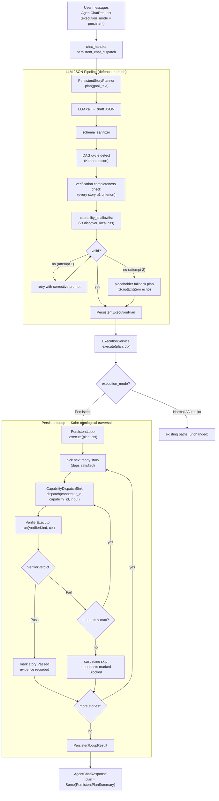

# Autonomous Delivery Loop Architecture

- Status: Active
- Scope: Architecture
- Owner: CyberClaw Maintainers
- Created: 2026-05-05
- Sprints: D1 – D5 + Layer E + chat-handler wiring

---

## 1. Design Rationale

The original proposal introduced a `DeliveryOrchestrator` trait as the entry point for
autonomous multi-phase delivery. An external architecture review rejected this design:
adding a coordinator trait would constitute a sixth top-level object, violating the
platform's five-object boundary (`Agent / Skill / Connector / Capability / Platform Plugin`).

The corrected approach reuses the existing `PersistentLoop / AcceptanceCriterion` skeleton
from Sprint S10 and extends it via three additions:

| Addition | Mechanism |
|---|---|
| Richer verifier vocabulary | `VerifierKind` enum — 8 typed variants |
| Capability-aware story planning | `CapabilitySource` field on `Story` |
| LLM-driven DAG generation | `PersistentStoryPlanner` (not a coordinator — stateless) |

**Invariants preserved:**

- Zero new coordinator traits
- All execution still flows `Connector → Capability`
- `Skill` carries no platform execution authority
- `CapabilityDiscovery` is a stateless query service, not a registry owner

---

## 2. Sprint History

| Sprint | Commit | Summary |
|---|---|---|
| D1 | `6447fca` | Data model: `VerifierKind` (8 variants), `CapabilitySource` (6 variants), `Story.capability_id` / `.source` fields, `ExecutionMode::Persistent` routing stub in `ExecutionService` |
| D2 | `0725bed` | `CapabilityDiscovery` stateless query service: 3 sync segments (stop-on-first-hit) + 3 async segments |
| D3+D4 | `399dcc3` | `PersistentLoop` async runner, `PersistentStoryPlanner` LLM pipeline, `DefaultVerifierExecutor` (all 8 variants real), `PortabilityVerifier` (Tier 1/2/3) |
| D5 | `42557f2` | E2E test suite — 4 cases covering three delivery phases (data, code, voice/PPT) |
| Layer E | `20831af` | `Curator` integrates `PortabilityVerifier`; writes `metadata.cyberclaw.portability` frontmatter |
| D5 follow-up | `a1d27b1` | `AgentChatRequest.execution_mode` field wired through to `persistent_chat_dispatch` |
| chat-handler | `eec0ae0` | `persistent_chat_dispatch` switched to real `PersistentStoryPlanner`; closes `a1d27b1` deferred item |

---

## 3. End-to-End Flow



---

## 4. Data Model

### 4.1 VerifierKind (D1 — `cyberclaw-core`)

Eight typed variants; attached to `AcceptanceCriterion.verifier: Option<VerifierKind>`
with `#[serde(default)]` so pre-D1 serialized payloads decode cleanly.

| Variant | Runtime requirement |
|---|---|
| `FileExists { path }` | `tokio::fs::metadata` |
| `FileMimeMatches { path, expected }` | magic-byte sniff (first 8 bytes, no new deps) |
| `FileNonEmpty { path }` | metadata size > 0 |
| `TextNonEmpty { path }` | read + trim |
| `AudioDurationGt { path, min_secs }` | `ffprobe` shell-out |
| `NumericMatchesCsv { csv_path, formula, tolerance }` | `verify.numeric_aggregate` capability |
| `ScriptExitZero { script, args, cwd }` | `tokio::process::Command` |
| `LlmSemanticMatch { reference, actual_path, threshold }` | LLM single chat call |

### 4.2 CapabilitySource (D1)

Six variants on `Story.source: Option<CapabilitySource>` describing how the
dispatching capability was resolved: `Native`, `InstalledSkill`, `CmdRuntime`,
`SkillHub`, `ProviderModality`, `CapabilityRequest`.

### 4.3 ExecutionMode (D1 — `cyberclaw-core::execution`)

`Normal | Autopilot | Persistent` with `#[serde(default)]`. The `Persistent`
variant is the routing signal that `ExecutionService::execute` uses to branch
into `PersistentLoop`.

---

## 5. Module Responsibilities

### `control-plane::CapabilityDiscovery` (D2)

Stateless query service. No mutable state, no coordinator authority.

- **Sync path** (`discover_local`): segments 1–3, stop-on-first-hit, µs-level
  1. `Native` — `ConnectorRegistry` + capability list
  2. `InstalledSkill` — local `SkillHub` in-memory index
  3. `CmdRuntime` — binary probe (`which python3`, `ffmpeg`, …)

- **Async path** (`discover_remote`): segments 4–6, called from background task
  when `discover_local` returns empty
  4. `SkillHub` — remote registry HTTP fetch
  5. `ProviderModality` — LLM provider modality probe
  6. `CapabilityRequest` — write-to-queue when nothing matched

- **`discover_full`**: chains both paths with a configurable total timeout.

### `control-plane::PersistentStoryPlanner` (D3)

LLM-driven planner. Builds a `PersistentExecutionPlan` from free-form goal text:

1. Calls `CapabilityDiscovery::discover_local` to enumerate available `(connector_id, capability_id)` pairs.
2. Prompts the LLM with goal + available capabilities; expects a JSON Story DAG.
3. Validates: ≥1 criterion per story, all `capability_id` in the local hit set, DAG is acyclic.
4. On failure: one corrective retry, then placeholder fallback (`ScriptExitZero { script: "echo placeholder" }`).

The planner is stateless: no mutable fields, no coordinator trait.

### `control-plane::PersistentLoop` async runner (D3)

Wraps the Sprint S10 synchronous state machine with an async `execute(plan, ctx)` entry point:

- Traverses stories in Kahn topological order.
- Dispatches each story via `CapabilityDispatchSink.dispatch(connector_id, capability_id, input)`.
- Passes `VerifierKind` to `VerifierExecutor` after dispatch.
- On `Fail` verdict: retries up to `LoopConfig.max_attempts`; on exhaustion, marks story `Failed` and cascades skip to dependents.
- Records `VerifierVerdict::Pass::evidence` in `AcceptanceCriterion.evidence`.

### `control-plane::DefaultVerifierExecutor` (D4)

Implements `VerifierExecutor` for all 8 `VerifierKind` variants. Key implementation notes:

- `AudioDurationGt`: shells out to `ffprobe`; returns `Fail` if binary is absent or output is unparseable — never fakes a pass.
- `LlmSemanticMatch`: single chat call; passes when model reply starts with "YES" (case-insensitive).
- `NumericMatchesCsv`: routes through the `verify.numeric_aggregate` capability via `ConnectorRegistry`.

### `control-plane::ExecutionService::execute` (D1 routing, D3 wiring)

Branches on `execution_mode`:

```
Normal    → existing governed loop path
Autopilot → existing autopilot path
Persistent → PersistentLoop::execute (returns error if no PersistentLoop wired)
```

### `skill-runtime::PortabilityVerifier` (D4)

Static analysis of `SKILL.md` frontmatter + body. No execution.

| Tier | Capability prefixes | Meaning |
|---|---|---|
| Tier 1 | `cmd.*`, `fs.*`, `search.*`, `lsp.*` | Sandboxed primitives; runs anywhere |
| Tier 2 | `http.*`, `database.*`, `git.*` | Needs trusted local services |
| Tier 3 | `openai.*`, `anthropic.*`, `slack.*`, `minimax.*` | Third-party SaaS; requires provisioning |

A skill's tier is the maximum tier of any capability it references.

### `skill-runtime::Curator` (Layer E — `20831af`)

Periodic portability scan. On each scheduled run:

1. Calls `PortabilityVerifier::scan_path` on each installed skill's `SKILL.md`.
2. Writes the result to `metadata.cyberclaw.portability` frontmatter in the skill file.

---

## 6. Test Coverage

| Sprint / layer | Test count | Location |
|---|---|---|
| D1 data model | 12 | `persistent_execution.rs` (inline) |
| D2 discovery | 15 | `capability_discovery.rs` (inline) |
| D3+D4 runner + verifier | 56 | `persistent_execution.rs` + `verifier_impl.rs` |
| Layer E Curator | 3 | `curator.rs` (inline) |
| chat-handler wiring | 22 | `gateway_router.rs` tests |
| **workspace lib total** | **3 649 passed / 0 failed** | `cargo test --workspace` |

E2E suites:

- `sd1` + `sd2` — CI default (mock-LLM gated)
- `sd3` — real-LLM gate (`LLM_GATED_TEST=1`)
- `s37` – `s42` — AGI business delivery suite (mock LLM)
- `s28` – `s46` — full GA suite

---

## 7. Physical Limits (not TODOs)

These are environmental constraints, not implementation gaps:

| Feature | Requirement |
|---|---|
| Real LLM calls in planner | `LLM_API_KEY` (wired from `apps/cyberclaw-server/.env`) |
| `ScriptExitZero` container isolation | `docker` present on host |
| `AudioDurationGt` verifier | `ffprobe` binary on `PATH` |
| voice/PPT skill scripts | `python-pptx` + `python3` on host |

---

## 8. Follow-up Candidates

These items are not outstanding bugs; they are deferred improvements with spec in place:

- **Voice/PPT end-to-end real-LLM retest**: spec (`sd3`) is in place; blocked on provisioned `LLM_API_KEY` + `ffprobe` + `python-pptx` in CI.
- **LLM JSON schema accuracy monitoring**: instrument `PersistentStoryPlanner` retry counts as a metric for tracking LLM DAG quality over time.
- **Curator automatic Tier 3 rejection**: extend the Curator scheduler to auto-reject skill installation when `PortabilityTier::Tier3` is detected and the environment flag is unset.

---

## 9. Related Documents

- [Runtime Blueprint V2.0](runtime/RUNTIME_BLUEPRINT_V2.0.md)
- [Autopilot Architecture V1](runtime/CYBERCLAW_AUTOPILOT_ARCHITECTURE_V1.md)
- [Architecture Overview V2.0](overview/ARCHITECTURE_V2.0.md)
- [Code Maps Index](codemaps/INDEX.md)
