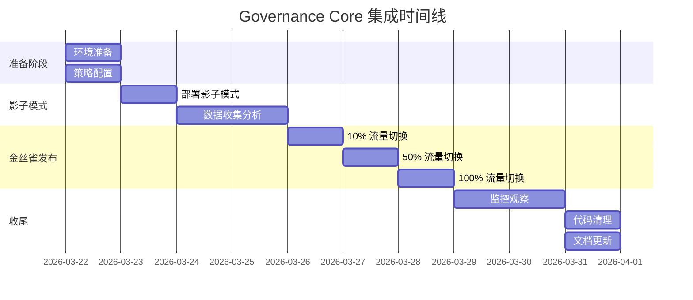

# CyberClaw M2 Governance Core - 集成与迁移方案

- Status: Draft
- Scope: Integration
- Owner: CyberClaw Platform Team
- Created: 2026-03-21
- Target: M2 Milestone

---

## 执行摘要

本文档详细描述 Governance Core 与现有 Control Plane 的集成方案、迁移路径、风险评估和缓解措施。采用渐进式迁移策略，确保零停机和向后兼容。

**核心策略**：
- 影子模式验证新旧决策一致性
- 特性开关控制流量切换
- 完整的回滚机制
- 全程监控和审计

---

## 1. 集成架构

### 1.1 集成点分析

```
Control Plane 集成点：
├── orchestrator.rs
│   ├── evaluate_risk() → evaluate_governance()
│   ├── process_ingress() → 调用 PolicyEngine
│   └── enqueue_for_review() → 使用 GovernanceDecision
│
├── execution_service.rs
│   ├── execute() → 添加 capability 级别检查
│   ├── submit() → 验证执行权限
│   └── update_status() → 记录决策审计
│
├── review_queue.rs
│   ├── enqueue() → 包含 required_reviewers
│   └── process_review() → 调用 evaluate_review()
│
└── resolver.rs
    └── plan() → 为 governance 提供 capability 信息
```

### 1.2 数据流变化

```
旧流程：
Task → Resolver → Plan → Risk评估（硬编码） → 执行/审批

新流程：
Task → Resolver → Plan → PolicyEngine评估 → 决策路由 → 执行/审批/拒绝
                              ↑
                         策略配置文件
```

---

## 2. 详细集成方案

### 2.1 Orchestrator 集成

```rust
// crates/cyberclaw-control-plane/src/orchestrator.rs

use cyberclaw_governance::prelude::*;

pub struct ControlPlaneOrchestrator {
    // 新增字段
    governance: Arc<dyn PolicyEngine>,
    // 特性开关
    use_new_governance: AtomicBool,
    // ... 其他字段
}

impl ControlPlaneOrchestrator {
    /// 新的构造函数
    pub fn new_with_governance(
        // ... 现有参数
        governance: Arc<dyn PolicyEngine>,
    ) -> Self {
        Self {
            governance,
            use_new_governance: AtomicBool::new(false), // 默认关闭
            // ... 其他字段初始化
        }
    }

    /// 修改后的 process_ingress
    pub async fn process_ingress(
        &self,
        request: IngressRequest,
    ) -> anyhow::Result<SubmitExecutionResult> {
        // ... 步骤 1-4 不变 ...

        // Step 5: 评估治理决策
        let decision = if self.use_new_governance.load(Ordering::Relaxed) {
            // 使用新的 governance
            self.evaluate_with_governance(&plan, &task, &normalized).await?
        } else {
            // 使用旧逻辑（用于回滚）
            self.evaluate_with_legacy(&plan, &task)
        };

        // 记录决策差异（影子模式）
        if cfg!(feature = "shadow-mode") {
            self.record_decision_diff(&plan, &task, &decision).await;
        }

        // Step 6: 基于决策路由
        match decision.decision_type() {
            DecisionType::Deny => {
                self.handle_denial(execution_id, decision).await
            }
            DecisionType::ReviewRequired => {
                self.handle_review_required(execution_id, trace_id, decision).await
            }
            DecisionType::Allow => {
                self.handle_allowed(execution_id, trace_id, &plan, &task).await
            }
        }
    }

    /// 新的 governance 评估方法
    async fn evaluate_with_governance(
        &self,
        plan: &ExecutionPlan,
        task: &Task,
        context: &NormalizedRequest,
    ) -> anyhow::Result<GovernanceDecision> {
        let request = ExecutionEvaluationRequest {
            execution_id: ExecutionId::new(),
            task: task.clone(),
            plan: plan.clone(),
            actor: context.actor.clone(),
            workspace: context.workspace.clone(),
            session: context.session.clone(),
        };

        let decision = self.governance.evaluate_execution(request).await?;

        // 记录审计
        if decision.audit_required {
            self.audit_decision(&decision).await?;
        }

        Ok(decision)
    }

    /// 旧逻辑包装（用于兼容和回滚）
    fn evaluate_with_legacy(
        &self,
        plan: &ExecutionPlan,
        task: &Task,
    ) -> LegacyDecision {
        // 保留原有 evaluate_risk 逻辑
        let risk = if plan.review_required {
            RiskLevel::Medium
        } else {
            RiskLevel::Low
        };

        LegacyDecision::from_risk(risk)
    }

    /// 记录决策差异（影子模式）
    async fn record_decision_diff(
        &self,
        plan: &ExecutionPlan,
        task: &Task,
        decision: &GovernanceDecision,
    ) {
        let legacy = self.evaluate_with_legacy(plan, task);
        let new = self.evaluate_with_governance(plan, task, &context).await;

        if !decisions_match(&legacy, &new) {
            warn!(
                "Decision mismatch for task {}: legacy={:?}, new={:?}",
                task.id, legacy, new
            );
            metrics::GOVERNANCE_DECISION_MISMATCH.inc();
        }
    }
}
```

### 2.2 ExecutionService 集成

```rust
// crates/cyberclaw-control-plane/src/execution_service.rs

impl ExecutionService {
    governance: Option<Arc<dyn PolicyEngine>>,

    /// 执行前的 capability 检查
    async fn pre_execution_check(
        &self,
        plan: &ExecutionPlan,
        context: &ExecutionContext,
    ) -> anyhow::Result<()> {
        if let Some(ref governance) = self.governance {
            for action in &plan.actions {
                let request = CapabilityEvaluationRequest {
                    capability_id: action.capability.id.clone(),
                    connector_id: action.capability.connector_id.clone(),
                    risk: action.capability.risk.clone(),
                    effects: action.capability.effects.clone(),
                    actor: context.actor.clone(),
                    workspace: context.workspace.clone(),
                    session: context.session.clone(),
                    input: Some(action.input.clone()),
                    trace_id: context.trace_id.clone(),
                };

                let decision = governance.evaluate_capability(request).await?;

                match decision.decision {
                    Decision::Deny => {
                        return Err(anyhow::anyhow!(
                            "Capability {} denied: {}",
                            action.capability.id,
                            decision.reason
                        ));
                    }
                    Decision::ReviewRequired => {
                        return Err(anyhow::anyhow!(
                            "Capability {} requires additional review: {}",
                            action.capability.id,
                            decision.reason
                        ));
                    }
                    Decision::Allow => {
                        // 继续执行
                        debug!("Capability {} allowed", action.capability.id);
                    }
                }
            }
        }

        Ok(())
    }

    /// 修改 execute 方法
    pub async fn execute(&self, execution_id: &ExecutionId) -> anyhow::Result<()> {
        // 获取执行计划
        let (plan, context) = self.get_execution_details(execution_id).await?;

        // 新增：执行前检查
        self.pre_execution_check(&plan, &context).await?;

        // 原有执行逻辑
        self.execute_plan(plan, context).await
    }
}
```

### 2.3 配置集成

```yaml
# config/governance.yaml
governance:
  enabled: true
  engine: default
  policy_dir: /etc/cyberclaw/policies

  features:
    shadow_mode: true  # 影子模式
    audit: true        # 审计
    cache: true        # 策略缓存

  performance:
    max_concurrent_evaluations: 100
    evaluation_timeout_ms: 100
    enable_short_circuit: true

  defaults:
    decision: deny  # 默认拒绝

  reload:
    interval_secs: 60  # 策略重载间隔
    on_signal: SIGHUP  # 信号触发重载
```

---

## 3. 迁移路径

### 3.1 四阶段迁移计划


### 3.2 阶段详情

#### 阶段 1：并行部署（Day 1-2）

**目标**：部署 governance crate，不影响现有流程

**任务清单**：
```bash
# 1. 部署 governance crate
cargo build --package cyberclaw-governance

# 2. 部署策略文件
mkdir -p /etc/cyberclaw/policies
cp config/policies/*.yaml /etc/cyberclaw/policies/

# 3. 验证加载
cyberclaw-cli governance validate

# 4. 启用监控
kubectl apply -f monitoring/governance-dashboard.yaml
```

**验证标准**：
- [ ] Governance crate 编译成功
- [ ] 策略文件语法正确
- [ ] 监控指标正常上报

#### 阶段 2：影子模式（Day 3-4）

**目标**：并行运行新旧逻辑，收集决策差异

**配置变更**：
```yaml
governance:
  features:
    shadow_mode: true
    shadow_log_path: /var/log/cyberclaw/shadow.log
```

**监控指标**：
```prometheus
# 决策一致性
rate(governance_decision_mismatch_total[5m])

# 性能对比
histogram_quantile(0.99, governance_evaluation_duration_seconds)
```

**分析工具**：
```python
# scripts/analyze_shadow_log.py
def analyze_shadow_decisions():
    mismatches = []
    with open('/var/log/cyberclaw/shadow.log') as f:
        for line in f:
            decision = json.loads(line)
            if decision['legacy'] != decision['new']:
                mismatches.append(decision)

    # 生成差异报告
    report = {
        'total_decisions': total,
        'mismatches': len(mismatches),
        'mismatch_rate': len(mismatches) / total,
        'categories': categorize_mismatches(mismatches)
    }

    return report
```

#### 阶段 3：金丝雀发布（Day 5-6）

**目标**：逐步切换流量到新逻辑

**流量切换策略**：
```rust
// 基于百分比的切换
pub fn should_use_new_governance() -> bool {
    let percentage = config.governance_rollout_percentage();
    rand::random::<f64>() * 100.0 < percentage
}

// 基于租户的切换
pub fn should_use_new_governance_for_tenant(tenant: &TenantId) -> bool {
    config.governance_enabled_tenants().contains(tenant)
}
```

**回滚触发器**：
```yaml
alerts:
  - name: GovernanceHighErrorRate
    expr: rate(governance_errors_total[5m]) > 0.01
    action: rollback

  - name: GovernanceHighLatency
    expr: governance_evaluation_duration_seconds > 0.1
    action: alert
```

#### 阶段 4：完全切换（Day 7）

**目标**：全量切换到新 governance

**切换步骤**：
```bash
# 1. 设置特性开关
cyberclaw-cli config set governance.use_new true

# 2. 监控关键指标
watch -n 1 'cyberclaw-cli metrics governance'

# 3. 验证功能
cyberclaw-cli test governance --suite full
```

#### 阶段 5：清理（Day 8）

**目标**：移除旧代码，完成迁移

**清理任务**：
- [ ] 移除 orchestrator 中的旧 evaluate_risk 方法
- [ ] 移除 execution_service 中的硬编码检查
- [ ] 删除影子模式代码
- [ ] 更新文档
- [ ] 归档迁移日志

---

## 4. 风险评估与缓解

### 4.1 技术风险矩阵

| 风险类别 | 风险描述 | 可能性 | 影响 | 风险值 | 缓解措施 |
|---------|---------|--------|------|--------|---------|
| **性能** | 策略评估导致延迟增加 | 中 | 高 | 6 | 1. 策略缓存<br>2. 短路评估<br>3. 异步处理 |
| **可用性** | 策略配置错误导致服务中断 | 中 | 极高 | 8 | 1. 配置验证<br>2. 默认策略<br>3. 快速回滚 |
| **兼容性** | 新旧决策不一致 | 高 | 中 | 6 | 1. 影子模式<br>2. 渐进切换<br>3. 详细日志 |
| **安全** | 策略绕过或权限提升 | 低 | 极高 | 5 | 1. Deny 优先<br>2. 审计日志<br>3. 安全测试 |
| **运维** | 策略管理复杂度 | 高 | 低 | 3 | 1. CLI 工具<br>2. 可视化界面<br>3. 培训文档 |

### 4.2 具体缓解措施

#### 4.2.1 性能优化

```rust
// 策略缓存实现
pub struct CachedPolicyEngine {
    inner: Arc<dyn PolicyEngine>,
    cache: Arc<Cache<String, GovernanceDecision>>,
}

impl CachedPolicyEngine {
    async fn evaluate_with_cache(
        &self,
        request: &ExecutionEvaluationRequest,
    ) -> Result<GovernanceDecision> {
        let cache_key = self.compute_cache_key(request);

        if let Some(cached) = self.cache.get(&cache_key).await {
            metrics::CACHE_HIT.inc();
            return Ok(cached);
        }

        let decision = self.inner.evaluate_execution(request).await?;
        self.cache.insert(cache_key, decision.clone()).await;
        Ok(decision)
    }
}
```

#### 4.2.2 配置验证

```rust
// 策略配置验证器
pub struct PolicyValidator {
    schema: Schema,
}

impl PolicyValidator {
    pub fn validate_policy_file(&self, path: &Path) -> Result<()> {
        let content = fs::read_to_string(path)?;
        let policy: PolicyConfig = serde_yaml::from_str(&content)?;

        // 1. 结构验证
        self.schema.validate(&policy)?;

        // 2. 逻辑验证
        self.validate_no_conflicts(&policy)?;
        self.validate_references(&policy)?;

        // 3. 模拟评估
        self.dry_run(&policy)?;

        Ok(())
    }

    fn validate_no_conflicts(&self, policy: &PolicyConfig) -> Result<()> {
        // 检查策略之间是否有逻辑冲突
        // 例如：同时 Allow 和 Deny 相同的 capability
        Ok(())
    }
}
```

#### 4.2.3 快速回滚机制

```bash
#!/bin/bash
# scripts/rollback_governance.sh

echo "Starting governance rollback..."

# 1. 切换特性开关
cyberclaw-cli config set governance.use_new false

# 2. 验证切换
if [ "$(cyberclaw-cli config get governance.use_new)" != "false" ]; then
    echo "ERROR: Failed to disable new governance"
    exit 1
fi

# 3. 清除缓存
cyberclaw-cli cache clear governance

# 4. 重启受影响的服务
kubectl rollout restart deployment/control-plane

# 5. 验证服务健康
cyberclaw-cli health check

echo "Rollback completed successfully"
```

### 4.3 监控和告警

```yaml
# monitoring/governance_alerts.yaml
groups:
  - name: governance
    rules:
      - alert: GovernanceHighErrorRate
        expr: rate(governance_evaluation_errors_total[5m]) > 0.01
        for: 2m
        labels:
          severity: critical
        annotations:
          summary: "High governance evaluation error rate"

      - alert: GovernanceHighLatency
        expr: histogram_quantile(0.99, governance_evaluation_duration_seconds) > 0.1
        for: 5m
        labels:
          severity: warning
        annotations:
          summary: "Governance evaluation latency is high"

      - alert: PolicyReloadFailure
        expr: increase(governance_policy_reload_failures_total[1h]) > 0
        labels:
          severity: warning
        annotations:
          summary: "Policy reload failed"
```

---

## 5. 测试计划

### 5.1 单元测试

```rust
#[cfg(test)]
mod integration_tests {
    #[tokio::test]
    async fn test_backward_compatibility() {
        let legacy = LegacyEvaluator::new();
        let governance = create_governance_with_legacy_rules();

        for test_case in load_test_cases() {
            let legacy_result = legacy.evaluate(&test_case);
            let governance_result = governance.evaluate(&test_case).await;

            assert_decisions_equivalent(legacy_result, governance_result);
        }
    }
}
```

### 5.2 集成测试

```bash
# tests/integration/governance_migration_test.sh

# 1. 部署测试环境
./deploy_test_env.sh

# 2. 运行影子模式测试
./test_shadow_mode.sh

# 3. 测试金丝雀发布
./test_canary_rollout.sh

# 4. 测试回滚
./test_rollback.sh

# 5. 清理
./cleanup_test_env.sh
```

### 5.3 性能测试

```rust
#[bench]
fn bench_policy_evaluation(b: &mut Bencher) {
    let engine = create_engine_with_100_policies();
    let request = create_typical_request();

    b.iter(|| {
        black_box(engine.evaluate_execution(request.clone()));
    });
}
```

---

## 6. 文档和培训

### 6.1 文档更新清单

- [ ] 架构文档：更新 control plane 架构图
- [ ] API 文档：添加 governance 接口说明
- [ ] 运维手册：添加策略管理章节
- [ ] 故障排查指南：添加 governance 相关问题
- [ ] 迁移指南：记录迁移经验

### 6.2 培训计划

1. **开发团队培训**（2 小时）
   - Governance 架构介绍
   - 策略编写指南
   - 调试和故障排查

2. **运维团队培训**（1 小时）
   - 策略配置管理
   - 监控和告警
   - 应急响应流程

3. **用户培训**（30 分钟）
   - 审批流程变化
   - 新的安全特性
   - 常见问题解答

---

## 7. 成功标准

### 7.1 功能标准

- [ ] 所有现有功能正常工作
- [ ] 新的策略系统完全可用
- [ ] 向后兼容性得到保证

### 7.2 性能标准

- [ ] P99 延迟 < 100ms
- [ ] 策略评估 < 10ms
- [ ] 内存增长 < 10%

### 7.3 质量标准

- [ ] 零生产事故
- [ ] 测试覆盖率 > 80%
- [ ] 文档完整性 100%

---

## 8. 时间线



---

## 9. 应急预案

### 9.1 回滚流程

```
触发条件：
1. 错误率 > 1%
2. P99 延迟 > 200ms
3. 关键功能失效

回滚步骤：
1. 执行 rollback_governance.sh
2. 验证服务恢复
3. 通知相关人员
4. 分析问题原因
5. 制定修复计划
```

### 9.2 故障处理矩阵

| 故障类型 | 症状 | 诊断步骤 | 解决方案 |
|---------|------|---------|---------|
| 策略加载失败 | 服务启动失败 | 检查策略文件语法 | 修复配置文件 |
| 评估超时 | 请求延迟高 | 分析慢策略 | 优化或禁用问题策略 |
| 决策错误 | 意外的拒绝/允许 | 审计日志分析 | 调整策略规则 |
| 内存泄漏 | 内存持续增长 | Profile 分析 | 修复泄漏或重启 |

---

**结论**：本集成方案通过渐进式迁移策略，确保 Governance Core 的平滑集成，最大限度降低风险，实现零停机迁移。