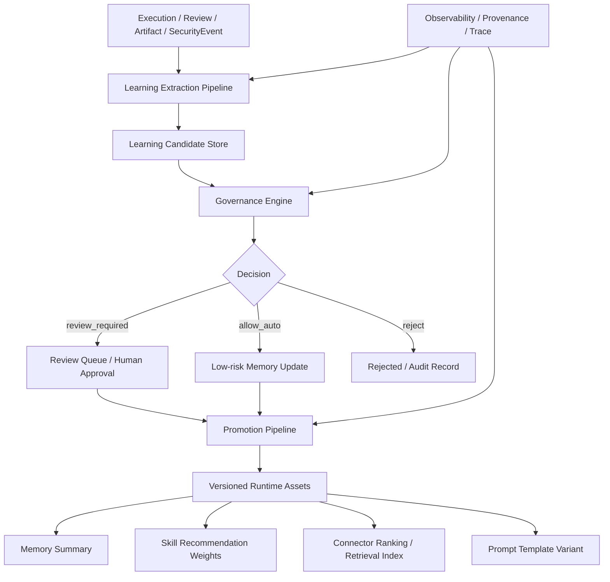

# CyberClaw 自我学习治理架构方案 v1

- Status: Draft
- Scope: Architecture
- Owner: CyberClaw Platform Team
- Created: 2026-03-21
- Target: Post-Beta Governance Learning

---

## 执行摘要

CyberClaw 不应支持“在线自治自我改写”，而应支持一条工业级的受控学习链路：

> 在线低风险适应 + 离线证据评估 + 治理化晋升发布

这意味着：

1. 运行时允许低风险记忆沉淀、摘要提炼和检索索引更新建议
2. 中风险学习结果必须进入治理决策与审批
3. 高风险系统规则、权限边界和治理策略禁止自动学习与自动生效
4. 所有学习结果都必须具备 `trace / provenance / actor / timestamp / rollback` 能力

本方案与当前正式口径保持一致：

1. 记忆运行时 Beta 仍采用 `Working + Episodic + Procedural`
2. `Semantic Memory` 延后到 Post-Beta
3. `Knowledge Retrieval`、`Letta`、`Zep`、`PageIndex` 统一通过 `Connector` 接入，不进入 Memory Core

---

## 1. 设计目标

### 1.1 目标

1. 给 CyberClaw 定义“允许学习什么、怎样学习、何时生效”
2. 避免把“学习能力”变成绕过治理和审计的后门
3. 让学习结果可版本化、可审计、可回滚
4. 为后续 `cyberclaw-governance`、`cyberclaw-control-plane` 和 `cyberclaw-core` 提供实现边界

### 1.2 非目标

1. 不实现在线模型微调
2. 不让 Agent 自动改写治理规则
3. 不把外部记忆框架升级为平台核心对象
4. 不在当前阶段引入新的独立学习服务或独立数据库

---

## 2. 正式定义

CyberClaw 中的“自我学习”拆分为四类：

### 2.1 上下文学习

- 会话摘要
- 热路径压缩
- 当前 case 的短期线索保留
- 失败原因和执行线索延续

### 2.2 事实学习

- 从 Execution、Artifact、Review、SecurityEvent 中提炼事实
- 形成 `Memory Summary / Fact / Case Note`
- 保留来源证据和写入决策

### 2.3 策略学习

- Skill 成功率统计
- Connector 可靠性排序
- Plan/Prompt 变体效果对比
- 仅产生“候选优化建议”，不直接在线替换

### 2.4 配置学习

- Prompt 模板优化
- Skill 推荐顺序优化
- Connector ranking 优化
- 必须经过离线评估与治理晋升

---

## 3. 总体原则

### 3.1 学习与执行分离

- 执行链路负责完成任务
- 学习链路负责产出候选项
- 晋升链路负责让候选项变成正式资产

### 3.2 事实与规则分离

- 事实可自动沉淀
- 建议可自动生成
- 规则不能自动改写

### 3.3 在线与离线分离

- 在线只做低风险适应
- 离线做评测、比较、回归、择优

### 3.4 生效与回滚分离

- 学习结果必须版本化
- 生效必须可回滚

### 3.5 内核与外部系统分离

- Memory Core 继续由 CyberClaw 内核维护
- Letta / Zep / PageIndex / RAG 统一按 `Connector` 接入

---

## 4. 总体架构



---

## 5. 自我学习治理矩阵 V1

| 学习对象 | 示例 | 在线自动 | 审批后允许 | 永久禁止 | 落位 |
|---|---|---:|---:|---:|---|
| Working Memory 更新 | 最近执行摘要、临时线索 | 是 | 否 | 否 | Working |
| Episodic Summary | case 总结、失败原因、审批结论摘要 | 是 | 否 | 否 | Episodic |
| Artifact 摘要提炼 | 报告摘要、工单摘要、检索摘要 | 是 | 否 | 否 | Artifact + Memory Summary |
| 检索索引更新建议 | PageIndex/Zep/向量索引候选更新 | 否 | 是 | 否 | Connector |
| Skill 推荐排序调整 | “告警研判优先用 skill A” | 否 | 是 | 否 | Governance Promotion |
| Prompt 变体切换 | 新提示词模板候选 | 否 | 是 | 否 | Versioned Runtime Asset |
| 新 Skill 启用 | 新的行业技能包启用 | 否 | 是 | 否 | Ecosystem + Governance |
| 新 Connector 启用 | 新知识库、新 SOAR 接入 | 否 | 是 | 否 | Ecosystem + Governance |
| 组织级事实更新 | 组织偏好、默认流程结论 | 否 | 是 | 否 | Memory Summary / Org Scope |
| Governance Policy 修改 | 风险等级、审批门槛 | 否 | 否 | 是 | Governance |
| Connector 权限放宽 | 更宽的文件系统或网络权限 | 否 | 否 | 是 | Governance |
| Procedural Rule 自动改写 | `AGENTS.md`、安全基线、runbook 正文 | 否 | 否 | 是 | Procedural |

---

## 6. 允许、条件允许、禁止

### 6.1 允许自动生效

满足以下条件可自动生效：

1. 仅影响当前会话、当前 case 或低风险摘要层
2. 有明确来源证据
3. 可被后续 compaction 或回滚移除
4. 不触碰权限、治理、规则边界

典型对象：

1. 会话摘要
2. 执行失败原因摘要
3. Artifact 元信息摘要
4. 检索结果的临时缓存与引用整理

### 6.2 条件允许

满足以下任一条件应进入 review：

1. 影响组织级、workspace 级默认行为
2. 涉及外部知识库写入或索引更新
3. 会改变 Skill/Connector 选择结果
4. 可能影响后续自动化链路

典型对象：

1. Connector ranking
2. Skill ranking
3. Prompt variant promotion
4. 组织级 fact upsert
5. 外部检索索引更新

### 6.3 必须禁止

以下行为不得自动化：

1. 自动改 Governance Policy
2. 自动降低 review gate
3. 自动放宽 Connector 权限
4. 自动改写系统 Procedural 文档
5. 把未脱敏敏感数据写入长期记忆
6. 把模型推测当事实长期保存

---

## 7. 与 CyberClaw 四类对象的关系

### 7.1 Agent

- 负责消费学习结果
- 可提出学习候选
- 不负责私自提升权限或改写规则

### 7.2 Skill

- 可声明需要哪些学习上下文
- 可产生执行经验和方法摘要
- 不能直接把自己升级成正式策略

### 7.3 Connector

- 提供外部学习能力与检索能力
- 例如：
  - `PageIndexConnector`
  - `ZepConnector`
  - `VectorRetrievalConnector`
  - `LettaConnector`
- 不承担平台治理主权

### 7.4 Platform Plugin

- 适合做横切增强：
  - Hook
  - 审计增强
  - 候选项扫描
  - 晋升前检查
- 不应承载主学习逻辑本体

---

## 8. 工业级方案

### 8.1 推荐方案：三段式学习治理

#### 第一段：Online Adaptation

职责：

- Working Memory 更新
- Episodic Summary 提炼
- Retrieval Recall
- Fact Candidate 提取

特点：

- 在线
- 快速
- 低风险
- 不改治理

#### 第二段：Offline Evaluation

职责：

- 回放执行轨迹
- 比较 Skill/Prompt/Connector 变体
- 分析成功率、误报率、审批率、风险事件

特点：

- 离线
- 不直接改生产
- 面向策略优化

#### 第三段：Governed Promotion

职责：

- 人审或策略审批
- 版本化发布
- 回滚
- 审计闭环

特点：

- 受控
- 可追责
- 可回滚

---

## 9. Rust 类型草案

以下草案只定义最小对象，不引入新的重量级子系统。

### 9.1 `cyberclaw-core` 共享类型

建议新增文件：

- `crates/cyberclaw-core/src/learning.rs`

建议导出到：

- `crates/cyberclaw-core/src/lib.rs`

```rust
use chrono::{DateTime, Utc};
use serde::{Deserialize, Serialize};

use crate::artifact::ArtifactRef;
use crate::capability::RiskLevel;
use crate::execution::ExecutionId;
use crate::identity::{ActorRef, TenantId, WorkspaceId};
use crate::trace::TraceId;

#[derive(Debug, Clone, PartialEq, Eq, Hash, Serialize, Deserialize)]
pub struct LearningCandidateId(pub String);

#[derive(Debug, Clone, PartialEq, Eq, Serialize, Deserialize)]
pub enum LearningCandidateType {
    WorkingSummary,
    EpisodicFact,
    ArtifactSummary,
    RetrievalIndexUpdate,
    SkillRankingAdjustment,
    ConnectorRankingAdjustment,
    PromptVariant,
    ProceduralNoteProposal,
}

#[derive(Debug, Clone, PartialEq, Eq, Serialize, Deserialize)]
pub enum LearningScope {
    Session,
    Case,
    Workspace,
    Tenant,
}

#[derive(Debug, Clone, PartialEq, Eq, Serialize, Deserialize)]
pub enum LearningStatus {
    Draft,
    PendingReview,
    Approved,
    Rejected,
    Promoted,
    RolledBack,
}

#[derive(Debug, Clone, PartialEq, Eq, Serialize, Deserialize)]
pub enum LearningTargetType {
    MemorySummary,
    RetrievalIndex,
    SkillRanking,
    ConnectorRanking,
    PromptTemplate,
}

#[derive(Debug, Clone, Serialize, Deserialize)]
pub struct LearningSourceRef {
    pub execution_id: Option<ExecutionId>,
    pub artifact_ref: Option<ArtifactRef>,
    pub trace_id: Option<TraceId>,
    pub note: Option<String>,
}

#[derive(Debug, Clone, Serialize, Deserialize)]
pub struct LearningCandidate {
    pub id: LearningCandidateId,
    pub scope: LearningScope,
    pub status: LearningStatus,
    pub tenant_id: TenantId,
    pub workspace_id: Option<WorkspaceId>,
    pub actor: Option<ActorRef>,
    pub candidate_type: LearningCandidateType,
    pub risk: RiskLevel,
    pub confidence: f32,
    pub title: String,
    pub content: serde_json::Value,
    pub sources: Vec<LearningSourceRef>,
    pub created_at: DateTime<Utc>,
    pub updated_at: DateTime<Utc>,
}

#[derive(Debug, Clone, Serialize, Deserialize)]
pub struct PromotionTarget {
    pub target_type: LearningTargetType,
    pub target_ref: String,
    pub version: String,
}
```

### 9.2 `cyberclaw-governance` 决策类型

建议新增文件：

- `crates/cyberclaw-governance/src/learning.rs`

```rust
use chrono::{DateTime, Utc};
use serde::{Deserialize, Serialize};

use cyberclaw_core::identity::ActorRef;
use cyberclaw_core::learning::{LearningCandidateId, PromotionTarget};
use cyberclaw_core::review::ReviewId;

#[derive(Debug, Clone, PartialEq, Eq, Serialize, Deserialize)]
pub enum LearningDecisionKind {
    AllowAuto,
    ReviewRequired,
    Reject,
}

#[derive(Debug, Clone, Serialize, Deserialize)]
pub struct LearningDecision {
    pub candidate_id: LearningCandidateId,
    pub decision: LearningDecisionKind,
    pub reason: String,
    pub review_required: bool,
    pub review_id: Option<ReviewId>,
    pub approved_by: Option<ActorRef>,
    pub decided_at: DateTime<Utc>,
}

#[derive(Debug, Clone, Serialize, Deserialize)]
pub struct PromotionRecord {
    pub candidate_id: LearningCandidateId,
    pub target: PromotionTarget,
    pub promoted_by: Option<ActorRef>,
    pub rollback_ref: Option<String>,
    pub promoted_at: DateTime<Utc>,
}

#[derive(Debug, Clone, Serialize, Deserialize)]
pub struct RollbackRecord {
    pub target_ref: String,
    pub rolled_back_by: ActorRef,
    pub reason: String,
    pub rolled_back_at: DateTime<Utc>,
}
```

### 9.3 `cyberclaw-control-plane` 编排接口

建议新增文件：

- `crates/cyberclaw-control-plane/src/learning_pipeline.rs`

```rust
use async_trait::async_trait;
use anyhow::Result;

use cyberclaw_core::execution::ExecutionId;
use cyberclaw_core::learning::LearningCandidate;
use cyberclaw_governance::learning::{LearningDecision, PromotionRecord};

#[async_trait]
pub trait LearningExtractor: Send + Sync {
    async fn extract_from_execution(
        &self,
        execution_id: &ExecutionId,
    ) -> Result<Vec<LearningCandidate>>;
}

#[async_trait]
pub trait LearningPromotionService: Send + Sync {
    async fn promote(
        &self,
        decision: LearningDecision,
    ) -> Result<Option<PromotionRecord>>;
}
```

---

## 10. 完整代码方案

本节定义可直接进入实现阶段的完整代码方案。目标不是新增一个“大而全学习平台”，而是在现有 `core / governance / control-plane / observability` 四个 crate 内打通最小可运行闭环。

### 10.1 必须完成的实现范围

1. `SecurityEvent` 补齐 `actor / tenant_id / workspace_id / timestamp` 等查询语义
2. `LearningCandidate`、`LearningDecision`、`PromotionRecord` 完整落地
3. `PolicyEngine::evaluate_learning_candidate()` 落地
4. `LearningCandidateStore` 的默认内存实现
5. `LearningExtractor` 的默认实现
6. `LearningPipeline` 的默认实现
7. `review_queue` 与 learning promotion 的联动
8. observability 事件闭环

### 10.2 本阶段不做

1. 不引入新数据库
2. 不新建 `cyberclaw-learning` crate
3. 不做向量数据库或图数据库主存
4. 不做在线 prompt 自动优化
5. 不做在线 procedural 正文自动改写
6. 不做 governance policy 自动学习

### 10.3 `cyberclaw-core` 实现要求

#### `security.rs`

当前 `SecurityEvent` 已经具备 `actor`、`timestamp`、`case_id`、`node_id`、`trace_id` 等核心字段。

这轮要求是**增量扩展现有模型**，不是重做事件模型。

建议只在现有结构上补充必要查询语义：

```rust
pub struct SecurityEvent {
    pub id: SecurityEventId,
    pub actor: Option<ActorRef>,
    pub timestamp: DateTime<Utc>,
    pub execution_id: Option<ExecutionId>,
    pub case_id: Option<CaseId>,
    pub node_id: Option<NodeId>,
    pub runtime_instance_id: Option<String>,
    pub source: SecurityEventSource,
    pub event_type: SecurityEventType,
    pub severity: Severity,
    pub summary: String,
    pub details: serde_json::Value,
    pub trace_id: Option<TraceId>,
    pub tenant_id: Option<TenantId>,
    pub workspace_id: Option<WorkspaceId>,
    pub capability_id: Option<CapabilityId>,
    pub connector_id: Option<ConnectorId>,
    pub credential_evidence: Option<SensitiveString>,
}
```

要求：

1. 保留现有已落地字段和语义
2. `actor` 不再依赖 `details` contains
3. 新增 `tenant_id / workspace_id / capability_id / connector_id` 作为独立查询字段
4. `details` 仅保留扩展用途，不承载主查询语义

#### `learning.rs`

新增共享学习类型：

1. `LearningCandidateId`
2. `LearningCandidateType`
3. `LearningScope`
4. `LearningStatus`
5. `LearningTargetType`
6. `LearningSourceRef`
7. `LearningCandidate`
8. `PromotionTarget`

实现原则：

1. 顶层 metadata 强类型
2. `content` 可先使用 `serde_json::Value`
3. 所有对象 `Debug + Clone + Serialize + Deserialize`

### 10.4 `cyberclaw-governance` 实现要求

#### 新增 `learning.rs`

必须包含：

1. `LearningDecisionKind`
2. `LearningDecision`
3. `PromotionRecord`
4. `RollbackRecord`

#### 扩展 `PolicyEngine`

新增：

```rust
async fn evaluate_learning_candidate(
    &self,
    candidate: LearningCandidate,
) -> Result<LearningDecision>;
```

#### 默认规则

`DefaultPolicyEngine::evaluate_learning_candidate()` 的建议判定：

##### 自动允许

1. `WorkingSummary`
2. `EpisodicFact`
3. `ArtifactSummary`

前提：

1. `risk == Low`
2. `confidence >= 0.6`
3. 无敏感数据命中
4. `scope` 不超过 `Case`

##### 需要审批

1. `RetrievalIndexUpdate`
2. `SkillRankingAdjustment`
3. `ConnectorRankingAdjustment`
4. `PromptVariant`
5. `scope == Workspace/Tenant`

##### 直接拒绝

1. `ProceduralNoteProposal`
2. `risk == High`
3. 缺失 `actor / tenant / source`
4. 内容存在敏感数据但未脱敏
5. 试图触发治理或权限边界变更

### 10.5 `cyberclaw-control-plane` 实现要求

#### 新增 `learning_store.rs`

定义：

```rust
#[async_trait]
pub trait LearningCandidateStore: Send + Sync {
    async fn insert(&self, candidate: LearningCandidate) -> Result<()>;
    async fn get(&self, id: &LearningCandidateId) -> Result<Option<LearningCandidate>>;
    async fn update_status(&self, id: &LearningCandidateId, status: LearningStatus) -> Result<()>;
    async fn list_pending_review(&self) -> Result<Vec<LearningCandidate>>;
    async fn list_by_execution(&self, execution_id: &str) -> Result<Vec<LearningCandidate>>;
    async fn bind_review(
        &self,
        review_id: &ReviewId,
        candidate_id: &LearningCandidateId,
    ) -> Result<()>;
    async fn get_by_review(
        &self,
        review_id: &ReviewId,
    ) -> Result<Option<LearningCandidate>>;
}
```

默认实现：

1. `InMemoryLearningCandidateStore`
2. 使用 `RwLock<HashMap<...>>`
3. 支持按 `status` 和 `execution_id` 查询
4. 支持 `review_id -> candidate_id` 绑定关系

#### 新增 `promotion_service.rs`

定义：

```rust
#[async_trait]
pub trait LearningPromotionService: Send + Sync {
    async fn promote(&self, decision: LearningDecision) -> Result<Option<PromotionRecord>>;
}
```

默认实现：

1. `InMemoryLearningPromotionService`
2. 支持这些目标：
   - `MemorySummary`
   - `RetrievalIndex`
   - `SkillRanking`
   - `ConnectorRanking`
   - `PromptTemplate`
3. 这轮允许“仅生成 PromotionRecord”，不要求真实外部写入

#### 新增 `learning_pipeline.rs`

定义：

```rust
#[async_trait]
pub trait LearningExtractor: Send + Sync {
    async fn extract_from_execution(
        &self,
        execution_id: &ExecutionId,
    ) -> Result<Vec<LearningCandidate>>;
}
```

`LearningPipeline` 结构建议：

```rust
pub struct LearningPipeline {
    extractor: Arc<dyn LearningExtractor>,
    store: Arc<dyn LearningCandidateStore>,
    governance: Arc<dyn PolicyEngine>,
    promotion: Arc<dyn LearningPromotionService>,
    review_queue: Arc<dyn ReviewQueue>,
    observability: Option<Arc<dyn EventRecorder>>,
}
```

主入口：

```rust
impl LearningPipeline {
    pub async fn process_execution(
        &self,
        execution_id: &ExecutionId,
    ) -> anyhow::Result<Vec<LearningCandidateId>>;
}
```

执行流程：

1. `extractor.extract_from_execution`
2. candidate 写入 store
3. `governance.evaluate_learning_candidate`
4. 分流：
   - `AllowAuto` -> 直接 promotion
   - `ReviewRequired` -> `PendingReview` + enqueue review + bind review
   - `Reject` -> `Rejected`
5. 写 observability 事件

#### 默认 `LearningExtractor`

至少支持四类提炼：

1. `WorkingSummary`
   - execution `Completed / Failed`
   - 生成低风险摘要
2. `EpisodicFact`
   - execution 完成且存在明确结构化结论
   - 不允许写入推测
3. `ArtifactSummary`
   - 对产出 artifact 生成摘要候选
4. `RetrievalIndexUpdate`
   - 对外部知识或长文档摘要结果生成需要审批的索引更新候选

#### 控制平面接入点

##### `execution_service.rs`

在 execution 进入 `Completed / Failed` 后调用：

```rust
if let Err(err) = self.learning_pipeline.process_execution(&execution_id).await {
    warn!("learning pipeline failed for execution {}: {err}", execution_id);
    self.record_learning_failure_event(&execution_id, &err).await;
}
```

要求：

1. learning pipeline 失败不得影响 execution 最终状态
2. 但必须写 observability / security event

##### `review_queue.rs`

当 learning review 通过时：

1. 通过 `review_id` 取回绑定的 candidate
2. candidate 状态 -> `Approved`
3. 调用 `promotion_service.promote`
4. 记录 `PromotionRecord`

当 learning review 拒绝时：

1. 通过 `review_id` 取回绑定的 candidate
2. candidate 状态 -> `Rejected`
3. 写 audit / security event

##### `orchestrator.rs`

仅负责装配 `LearningPipeline`，不在编排器中硬编码学习逻辑。

### 10.6 `cyberclaw-observability` 实现要求

#### 新增学习事件

在 `events.rs` 中增加：

1. `learning.candidate.created`
2. `learning.candidate.review_required`
3. `learning.candidate.rejected`
4. `learning.candidate.promoted`
5. `learning.candidate.rollback`

事件字段至少包括：

1. `trace_id`
2. `execution_id`
3. `candidate_id`
4. `candidate_type`
5. `decision`
6. `actor`
7. `timestamp`
8. `outcome`

#### `security_event_store.rs`

必须完成：

1. `EventFilter.actor` 基于 `event.actor` 精确匹配
2. `EventFilter.time_range` 基于 `event.timestamp` 真实过滤
3. 不再用 `details` contains actor
4. learning reject / promotion failure 写入 `SecurityEvent`

### 10.7 状态机

#### LearningCandidate 状态机

```text
Draft
 -> PendingReview
 -> Approved
 -> Promoted

Draft
 -> Rejected

Approved
 -> Promoted

Promoted
 -> RolledBack
```

规则：

1. `AllowAuto`: `Draft -> Approved -> Promoted`
2. `ReviewRequired`: `Draft -> PendingReview -> Approved -> Promoted`
3. `Reject`: `Draft -> Rejected`
4. `Rollback`: `Promoted -> RolledBack`

### 10.8 测试方案

#### `cyberclaw-core`

1. `LearningCandidate` serde roundtrip
2. `SecurityEvent` actor/timestamp roundtrip

#### `cyberclaw-governance`

1. low-risk summary -> `AllowAuto`
2. retrieval index update -> `ReviewRequired`
3. procedural proposal -> `Reject`
4. missing actor/source -> `Reject`

#### `cyberclaw-control-plane`

##### extractor

1. completed execution -> working summary
2. artifact output -> artifact summary
3. external knowledge artifact -> retrieval index update

##### pipeline

1. auto path: extract -> allow -> promote
2. review path: extract -> review queue
3. reject path: extract -> reject
4. promotion failure path: execution 不回滚，但记录事件

##### review integration

1. review approve -> promoted
2. review reject -> rejected

#### `cyberclaw-observability`

1. actor filter 真过滤
2. time_range 真过滤
3. learning candidate event query

### 10.9 完成标准

1. `cargo fmt --all`
2. `cargo clippy --workspace --all-targets -- -D warnings`
3. `cargo test --workspace`
4. 至少一条完整链路：
   - execution completed
   - extract learning candidates
   - governance decision
   - auto promote / review
   - event recorded

---

## 11. 目录落位建议

坚持最小增量，不新建独立学习平台。

### 10.1 建议目录

```text
crates/
├── cyberclaw-core/
│   └── src/
│       ├── learning.rs
│       └── lib.rs
├── cyberclaw-governance/
│   └── src/
│       ├── learning.rs
│       ├── engine.rs
│       └── lib.rs
├── cyberclaw-control-plane/
│   └── src/
│       ├── learning_pipeline.rs
│       ├── orchestrator.rs
│       └── execution_service.rs
└── cyberclaw-observability/
    └── src/
        └── security_event_store.rs
```

### 10.2 原则

1. 共享对象放 `cyberclaw-core`
2. 治理判定放 `cyberclaw-governance`
3. 编排和提炼触发放 `cyberclaw-control-plane`
4. 审计事件和查询仍放 `cyberclaw-observability`

### 10.3 不建议

1. 不建议立即新建 `cyberclaw-learning` crate
2. 不建议把学习提炼塞进 `Connector`
3. 不建议把治理判断塞回 `orchestrator.rs` 的硬编码逻辑

---

## 12. 分阶段实施建议

### Phase 1

1. 定义 `LearningCandidate`
2. 定义 `LearningDecision`
3. 定义 `PromotionRecord`
4. 实现低风险 summary/fact 候选提炼

### Phase 2

1. 接入 Governance Engine
2. 接入 Review Queue
3. 让审批通过后可晋升到 `Memory Summary / Ranking / Prompt Variant`

### Phase 3

1. 补离线评估和回放
2. 接入 Retrieval Index Update 的 review 流程
3. 增加 rollback 管理

---

## 13. 最终定稿

> CyberClaw 的自我学习必须采用“受控记忆学习 + 离线证据评估 + 治理化晋升发布”的工业级架构。  
> 允许学习事实，不允许在线改规则；允许产生建议，不允许自动放权；允许沉淀经验，不允许无审计自强化。
