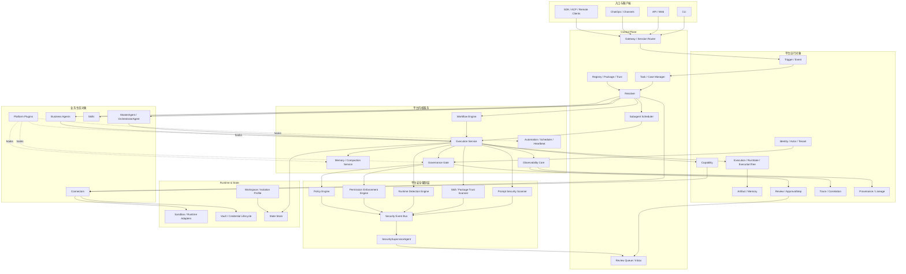
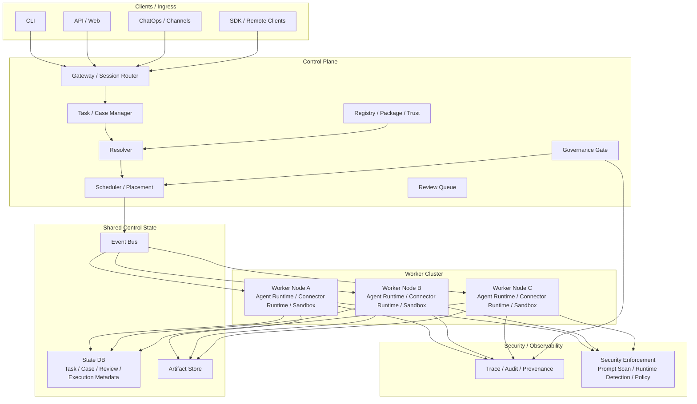
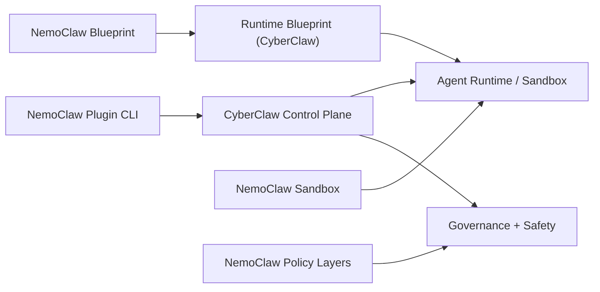
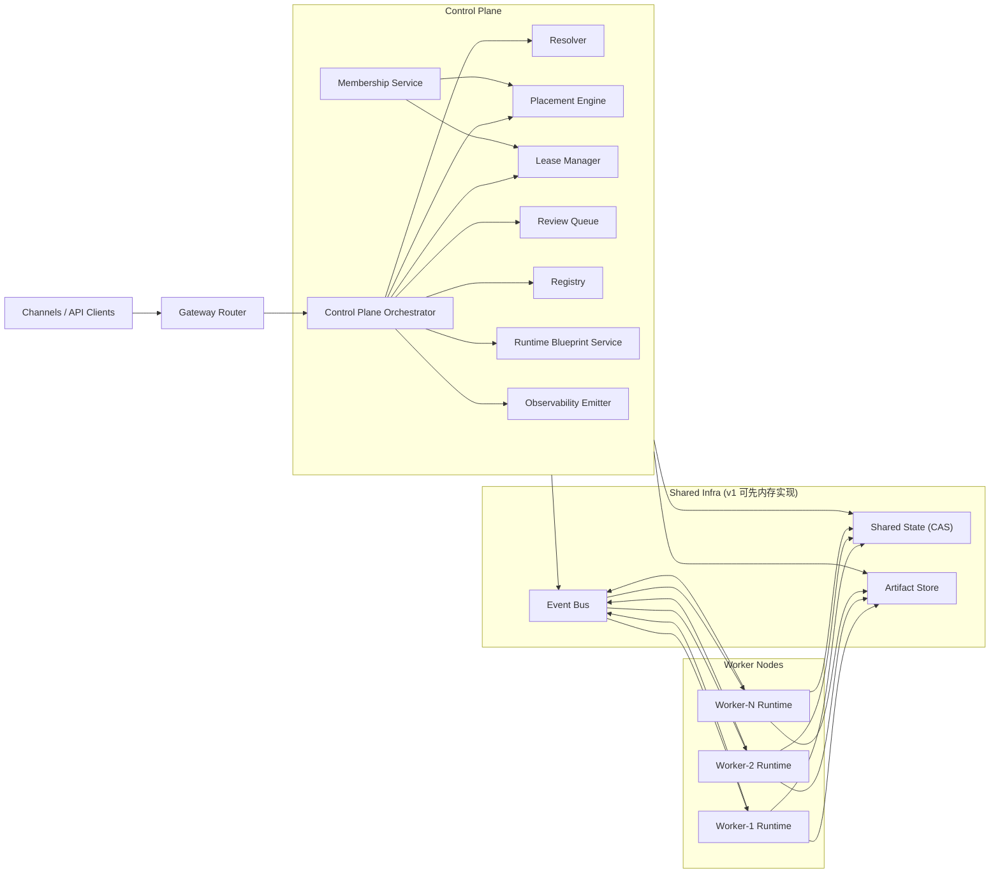

# CyberClaw 架构设计文档 v2.0

<p align="center">
  <strong>面向开发者和工程组织的受控智能体平台</strong><br>
  <em>组织 Agent、Skill、Connector 与 Platform Plugin 生态</em><br>
  <small>A Controlled Agent Platform for Developers and Engineering Organizations</small>
</p>

<p align="center">
  
  
</p>

---

## 1. 平台定位

CyberClaw 是一个**面向开发者和工程组织的轻量级受控智能体平台**。

平台的目标不是做某个单一场景的 Agent 工具，而是提供一套稳定的智能体抽象与运行底座，用于组织：

- 角色化 Agent
- 标准 Skill
- 外部能力接入
- 平台级扩展
- 并行协作
- 治理控制
- 可观察、可审计、可溯源执行

CyberClaw 特别适用于以下场景：

1. `R&D`
2. `DevOps / Platform Engineering`
3. `Security / AppSec / SecOps / GRC`
4. `Compliance / Audit`
5. 其他高治理要求的自动化场景
6. 更可控的个人智能助手

安全不是 CyberClaw 的唯一业务边界，而是平台的**内生能力**。

---

## 2. 核心价值

CyberClaw 继承并保留以下平台价值表达：

- **轻量级智能体调度框架**
- **多 Agent 协同体系**
- **可执行、可扩展、可治理**
- **可解释、可追踪、可验证、可控制**

这四组表述定义了平台的基本方向：

1. 平台关注可组合和可运行，而不是只关注对话体验
2. 平台关注协同执行，而不是单一 Agent 的提示词能力
3. 平台关注治理与执行并重，而不是无约束自动化
4. 平台关注生态对象的长期复用，而不是一次性工作流拼装

---

## 3. 设计目标

1. 提供简洁、稳定、可扩展的智能体抽象层
2. 支持多 Agent 协同与并行 Subagent 执行
3. 兼容标准 `Claude/Codex Skill`
4. 统一外部能力接入模型
5. 提供统一执行、统一治理、统一审计、统一追踪
6. 支持开发者围绕 Agent、Skill、Connector、Platform Plugin 建设生态
7. 让平台在复杂执行场景下仍然可解释、可追踪、可验证、可控制

---

## 4. 核心设计原则

1. **轻量级**
平台追求最少而稳定的抽象，不引入重型分层和无效中间层。

2. **受控执行**
所有执行都必须进入统一执行入口和统一治理门禁。

3. **生态优先**
平台围绕少量核心对象建设生态，而不是围绕内部模块名建设生态。

4. **角色与能力分离**
Agent 负责角色主体，Skill 负责方法与知识，Connector 负责能力接入。

5. **执行树优先**
多 Agent 协作的本质是执行树，不是自由通信网络。

6. **安全内生**
安全、权限、审计、追踪、溯源属于平台底座，而不是外挂模块。

7. **边界清晰**
平台内核、平台扩展、生态对象、业务对象各司其职。

---

## 5. 核心对象模型

### 5.1 业务生态对象

#### `Agent`
回答“谁来做”。

职责：

- 定义角色主体
- 定义默认人格和行为边界
- 定义默认 Skill 集合
- 定义默认 Connector 集合
- 定义风险上限
- 定义工作区和记忆视角

分类：

1. `MasterAgent / OrchestratorAgent`
2. `BusinessAgent`
3. `SecuritySupervisorAgent`
4. `Subagent`

约束：

- Agent 可扩展
- 扩展的是声明式角色包
- 不开放任意运行时替换

#### `Skill`
回答“怎么做”。

职责：

- 提供方法、知识、playbook、模板、资源
- 承载标准化技能包
- 支持按需加载

约束：

- 保持 `Claude/Codex Skill` 兼容
- 不承载平台私有执行逻辑
- 不承载凭证、审批、租户治理语义

典型结构：

- `SKILL.md`
- `scripts/`
- `references/`
- `assets/`

#### `Connector`
回答“用什么做”。

职责：

- 对接外部系统
- 对接本地执行能力
- 对接模型能力
- 对接渠道能力
- 对接外部 Agent Runtime

统一承载：

1. 渠道接入
2. 厂商接入
3. 工具接入
4. 模型接入
5. 外部 Agent 接入

约束：

- Connector 是唯一代码级能力接入面
- 所有动作通过 `Capability` 暴露
- 不承载业务角色定义

### 5.2 平台扩展对象

#### `Platform Plugin`
回答“平台怎么被增强”。

职责：

- 事件监听
- 前后置拦截
- 审计增强
- 自动化挂点
- 上下文增强
- 平台级安全增强

约束：

- 不承载业务角色
- 不替代 Skill
- 不替代 Connector
- 不绕过治理、审计和追踪

### 5.3 业务对象

#### `Task`
表示一次原子业务请求。

#### `Case`
表示同一工作单元下的上下文聚合。

#### `Workflow`
表示执行计划，包括顺序、并行、条件分支、重试和人工节点。

#### `Artifact`
表示执行产物，例如报告、证据、分析结果、工单更新和记忆条目。

### 5.4 平台运行对象

#### `Identity / Actor / Tenant`
定义发起者、执行者、归属关系和租户边界。

#### `Workspace / IsolationProfile`
定义文件边界、工作目录、隔离策略和资源访问范围。

#### `Session`
定义持续交互上下文。

#### `Execution / RunState / ExecutionTree`
定义平台中的实际执行实例、状态机和父子执行关系。

#### `Capability`
定义治理和授权的最小动作单元。

示例：

- `soar.block_ip`
- `github.issue.create`
- `feishu.message.send`
- `host.isolate`

#### `Trigger / Event`
定义任务唤起来源，例如人工请求、Webhook、消息事件、定时任务和审批回流。

#### `Registry / Package / Manifest / Trust`
定义生态对象的发现、安装、升级、验证和信任元数据。

#### `Trace / Correlation`
定义全链路可观察能力。

#### `Review / ApprovalStep`
定义人工复核和审批节点。

#### `Provenance / Lineage`
定义产物与执行链路的血缘关系。

---

## 6. 平台生态分层

CyberClaw 的生态可以用四层表达，但最终落到统一对象模型：

1. **角色生态**：`Agent`
2. **流程生态**：`Workflow`
3. **工具生态**：`Connector`
4. **知识生态**：`Skill`

在这四层之上，再增加平台级横切扩展：

5. **平台扩展生态**：`Platform Plugin`

这样既保留“角色生态、流程生态、工具生态、知识生态”的原始表达，也把平台增强能力单独收敛为显式对象。

---

## 7. 平台内核服务

CyberClaw 的平台内核服务包括：

1. `Control Plane`
2. `Execution Service`
3. `Workflow Engine`
4. `Governance Gate`
5. `Memory / Compaction Service`
6. `Automation / Scheduler / Heartbeat`
7. `Observability Core`
8. `State Store`

这些服务属于平台内核，不属于生态对象。

---

## 8. 控制平面

控制平面是平台中枢。

职责：

1. 接收和归一化入口请求
2. 创建和管理 `Task / Case`
3. 解析 Agent、Skill、Connector、Workflow
4. 驱动执行树
5. 连接 Review Queue
6. 管理 Registry、Package、Trust
7. 驱动自动化和周期任务

控制平面至少应包含这些逻辑模块：

1. `Gateway / Session Router`
2. `Task / Case Manager`
3. `Resolver`
4. `Registry / Package / Trust`
5. `Review Queue / Inbox`
6. `Subagent Scheduler`
7. `Automation / Scheduler / Heartbeat`

---

## 9. 平台架构图



---

## 10. Agent 与 Subagent 模型

### 10.1 `MasterAgent`
平台默认内置 `MasterAgent / OrchestratorAgent`。

职责：

1. 接收 `Task / Case`
2. 选择 Agent、Skill、Connector、Workflow
3. 决定串行还是并行
4. 派生 Subagent
5. 汇总结果
6. 驱动 Review / Approval
7. 控制预算、超时、取消和重试

它是系统编排器，不是业务专家。

### 10.2 `BusinessAgent`
业务 Agent 面向具体场景工作。

例如：

- `GrcAgent`
- `PentestAgent`
- `AlertTriageAgent`
- `ReportAgent`

职责：

1. 承接业务任务
2. 使用 Skill 和 Connector 完成任务
3. 在需要时申请派生 Subagent

### 10.3 `Subagent`
Subagent 是并行执行单元。

原则：

1. 任意 Agent 都可以申请派生 Subagent
2. 真正创建由平台统一完成
3. 所有 Subagent 挂到 `ExecutionTree`
4. 子执行独立上下文、预算、权限和 Workspace
5. 子执行只回传结构化结果
6. 不支持自由 peer-to-peer 通信

### 10.4 并行模型
平台的并行本质是**执行树**，不是 Agent 自由通信网络。

建议支持：

1. `join_all`
2. `join_any`
3. `fanout / fanin`
4. `map_reduce`

---

## 11. 执行树与内部协议

内部不使用 ACP 作为 Agent 总线。

平台内部应采用结构化调度协议。

### `SpawnRequest`
表示派生请求。

建议字段：

- `parent_execution_id`
- `requesting_agent_id`
- `target_agent_id`
- `task_spec`
- `expected_output_schema`
- `budget`
- `workspace_mode`
- `memory_scope`
- `tool_scope`
- `priority`

### `ContextPack`
表示传递给子执行的上下文引用。

建议字段：

- `artifact_refs`
- `memory_refs`
- `workspace_ref`
- `case_ref`
- `policy_ref`

### `ResultEnvelope`
表示子执行返回结果。

建议字段：

- `status`
- `summary`
- `artifacts`
- `evidence_refs`
- `metrics`
- `failure_reason`

### `ExecutionTree`
建议至少记录：

- `execution_id`
- `parent_execution_id`
- `root_execution_id`
- `root_case_id`
- `depth`
- `status`
- `join_strategy`

---

## 12. ACP 与外部 Agent Runtime 的边界

ACP 不是平台内部 Agent 总线。

ACP 适合：

1. CyberClaw 对 IDE / Editor 暴露自己
2. CyberClaw 接入一个本身通过 ACP 暴露的外部 Agent

内部 Master/Subagent 通信不使用 ACP。

### 外部 Agent Runtime 接入
外部的 `Codex / Claude Code / OpenCode` 不作为内部 Agent 总线的一部分。

统一通过 `RemoteAgentConnector` 接入。

例如：

- `codex-remote-worker`
- `claude-code-remote-worker`
- `opencode-remote-worker`

职责：

1. 提交任务
2. 传递上下文
3. 拉取进度
4. 获取产物
5. 取消任务
6. 回收结果

好处：

1. 外部运行时差异由 Connector 吸收
2. 平台内部调度模型保持统一
3. 外部执行仍然经过治理、审计和追踪

---

## 13. 平台安全模型

平台默认内置安全能力，分为两层。

### 13.1 平台安全强制层
这部分不可绕过：

1. `Prompt Security Scanner`
2. `Skill / Package Trust Scanner`
3. `Runtime Detection Engine`
4. `Permission Enforcement Engine`
5. `Policy Engine`
6. `Security Event Bus`

职责：

1. 提示词注入检测
2. Skill 投毒检测
3. 包信任检测
4. 运行时异常检测
5. 权限校验
6. 策略阻断
7. 安全事件汇聚

### 13.2 `SecuritySupervisorAgent`
默认内置系统 Agent。

职责：

1. 消费安全事件
2. 分析全局风险
3. 发起 Review / 审批建议
4. 做平台安全巡检
5. 输出安全报告

约束：

- 负责分析与监督
- 不替代平台强制控制

---

## 14. 可观察、可审计、可溯源

这是平台底座，不是附加模块。

### 14.1 可观察
平台默认记录：

1. Trigger 来源
2. Task / Case 路由
3. Agent / Subagent 派生关系
4. Workflow 状态流转
5. Connector 调用
6. Review 队列状态

### 14.2 可审计
平台默认记录：

1. 谁发起
2. 谁执行
3. 谁审批
4. 调用了什么 Capability
5. 使用了哪个 Connector
6. 最终结果是什么

### 14.3 可溯源
平台默认记录：

1. 哪个 Artifact 来源于哪个 Execution
2. 哪个结果依赖了哪些 Skill / Connector
3. 哪次安全事件触发了哪个阻断或审批
4. 哪次 Review 针对哪次动作请求

### 14.4 核心对象建议

#### `SecurityEvent`
统一安全事件对象。

建议字段：

- `event_id`
- `timestamp`
- `tenant_id`
- `case_id`
- `execution_id`
- `source_type`
- `source_id`
- `event_type`
- `severity`
- `risk_score`
- `summary`
- `details`
- `artifact_refs`
- `trace_id`
- `status`

#### `PolicyDecision`
统一治理判定对象。

建议字段：

- `decision_id`
- `timestamp`
- `actor_id`
- `agent_id`
- `execution_id`
- `capability_id`
- `resource_ref`
- `decision`
- `risk_level`
- `reason_codes`
- `requires_review`
- `approval_step_id`
- `policy_refs`
- `trace_id`

#### `ProvenanceRecord`
统一溯源对象。

建议字段：

- `provenance_id`
- `artifact_id`
- `execution_id`
- `parent_execution_id`
- `root_case_id`
- `agent_id`
- `skill_refs`
- `connector_refs`
- `capability_refs`
- `input_refs`
- `output_refs`
- `workspace_ref`
- `trace_id`
- `created_at`

---

## 15. 目录结构建议

CyberClaw 的代码结构分为三部分：

1. 入口适配层
2. 平台内核层
3. 生态内容层

推荐结构：

```text
cyberclaw/
├── apps/
│   ├── cyberclaw-server/              # HTTP / Web / ACP server
│   ├── cyberclaw-cli/                 # CLI
│   └── cyberclaw-worker/              # 后台任务、scheduler、job runner（可选）
│
├── crates/
│   ├── cyberclaw-core/                # 核心类型与抽象
│   ├── cyberclaw-control-plane/       # 控制平面
│   ├── cyberclaw-agent-runtime/       # Agent runtime / subagent runtime
│   ├── cyberclaw-workflow/            # Workflow engine
│   ├── cyberclaw-governance/          # Governance gate
│   ├── cyberclaw-observability/       # audit / trace / provenance
│   ├── cyberclaw-safety/              # prompt scan / runtime detection / trust
│   ├── cyberclaw-memory/              # memory / compaction
│   ├── cyberclaw-automation/          # scheduler / heartbeat
│   ├── cyberclaw-connectors/          # connector runtime / capability registry
│   ├── cyberclaw-skill-runtime/       # skill loader / resolver
│   ├── cyberclaw-platform-plugins/    # platform plugin runtime
│   ├── cyberclaw-vault/               # secrets / credential lifecycle
│   └── cyberclaw-store/               # state store / review queue / persistence
│
├── ecosystem/
│   ├── agents/
│   ├── skills/
│   ├── connectors/
│   └── platform-plugins/
│
├── workflows/
├── policies/
├── state/
└── docs/
```

---

## 16. 正式定义

> **CyberClaw 是一个面向开发者和工程组织的轻量级受控智能体平台。它将角色分工、工作流、工具接入与知识沉淀抽象为可组合的多 Agent 协同体系，并围绕 Agent、Skill、Connector、Platform Plugin 四类核心对象建设生态。平台内置 MasterAgent 负责全局编排，支持业务 Agent 派生 Subagent 进行并行作业；所有执行统一由 Execution Service 调度，所有高风险动作统一由 Governance Gate 治理，并由 Observability、Audit、Trace 与 Provenance 提供可观察、可审计、可溯源的底座能力。安全是平台的内生能力，不是唯一业务边界。**

---

## 17. 一句话版本

> **CyberClaw 是一个面向开发者和工程组织的受控智能体平台，用于组织 Agent、Skill、Connector 与 Platform Plugin 生态，并提供统一执行、治理控制以及内建的安全与可观测能力。**

---

## 18. 多节点演进边界（Cluster v1）

CyberClaw 当前主实现保持单控制面部署模型。  
多节点能力作为后续演进方向，采用 **单逻辑控制面 + 多 Worker 节点** 的最小可行架构。

### 18.1 多节点 v1 架构图



### 18.2 当前阶段约束

1. 不引入多主控制面。
2. 不引入跨节点自由 Agent 对话模型。
3. 不引入全局共享可写 Workspace 文件系统。
4. Cluster 语义先通过对象字段扩展保留，不在当前阶段强制实现。

---

## 19. Cluster-aware 字段扩展清单

以下字段已经在 Rust 类型草案中落地，用于为多节点演进预留接口。

### 19.1 执行与调度

- `Execution.owner_node_id`
- `Execution.scheduled_node_id`
- `Execution.placement_group`
- `Execution.lease_id`
- `Execution.handoff_count`
- `ExecutionTreeNode.owner_node_id`
- `ExecutionTreeNode.locality_hint`

对应实现：
- [execution.rs](/Users/cyber/cyberclawlabs/cyberclaw/crates/cyberclaw-core/src/execution.rs)

### 19.2 工作区

- `WorkspaceRef.materialization_mode`
- `WorkspaceRef.home_node_id`
- `WorkspaceRef.backing_store`

对应实现：
- [workspace.rs](/Users/cyber/cyberclawlabs/cyberclaw/crates/cyberclaw-core/src/workspace.rs)

### 19.3 能力与放置约束

- `CapabilityRef.placement`
- `CapabilityContract.placement`

对应实现：
- [capability.rs](/Users/cyber/cyberclawlabs/cyberclaw/crates/cyberclaw-core/src/capability.rs)
- [manifests.rs](/Users/cyber/cyberclawlabs/cyberclaw/crates/cyberclaw-core/src/manifests.rs)

### 19.4 审核、安全、溯源

- `ReviewRequest.owner_node_id`
- `ReviewRequest.lease_id`
- `SecurityEvent.node_id`
- `SecurityEvent.runtime_instance_id`
- `ProvenanceRecord.execution_owner_node_id`
- `ProvenanceRecord.node_lineage`

对应实现：
- [review.rs](/Users/cyber/cyberclawlabs/cyberclaw/crates/cyberclaw-core/src/review.rs)
- [security.rs](/Users/cyber/cyberclawlabs/cyberclaw/crates/cyberclaw-core/src/security.rs)
- [provenance.rs](/Users/cyber/cyberclawlabs/cyberclaw/crates/cyberclaw-core/src/provenance.rs)

### 19.5 节点与租约基础类型

- `NodeId`
- `LeaseId`
- `NodeRecord`
- `ExecutionLease`
- `CapabilityPlacement`

对应实现：
- [ids.rs](/Users/cyber/cyberclawlabs/cyberclaw/crates/cyberclaw-core/src/ids.rs)
- [cluster.rs](/Users/cyber/cyberclawlabs/cyberclaw/crates/cyberclaw-core/src/cluster.rs)

---

## 20. NemoClaw 可借鉴点映射

NemoClaw 的价值主要在运行时部署与策略治理层，不在 Agent 抽象层。

### 20.1 组件映射

| NemoClaw 组件 | CyberClaw 映射位置 | 说明 |
|---|---|---|
| Plugin CLI | `apps/` + `cyberclaw-control-plane` | 宿主侧编排入口 |
| Blueprint | Runtime Blueprint（平台运行对象） | 版本化运行时配置 |
| Sandbox | `Runtime & State` + `cyberclaw-agent-runtime` | 执行隔离与资源边界 |
| Policy-controlled Inference/Network/FS | `cyberclaw-governance` + `cyberclaw-safety` | 热更新策略 + 创建期锁定策略 |

### 20.2 生命周期映射

NemoClaw 的 `resolve -> verify -> plan -> apply` 可直接映射到 CyberClaw：

1. `Registry/Loader` 负责 `resolve`
2. `Trust/Schema/Policy` 负责 `verify`
3. `Resolver/ExecutionService` 负责 `plan`
4. `Runtime/Sandbox` 负责 `apply`

### 20.3 架构映射图



---

## 21. Runtime Blueprint 设计草案

Runtime Blueprint 已补充为独立文档：

- [RUNTIME_BLUEPRINT_V2.0.md](/Users/cyber/cyberclawlabs/cyberclaw/docs/architecture/runtime/RUNTIME_BLUEPRINT_V2.0.md)

该草案定义了：

1. Blueprint 对象边界
2. `resolve -> verify -> plan -> apply` 生命周期
3. 热更新策略与创建期锁定策略分层
4. 与 Control Plane / Governance / Runtime 的集成接口

---

## 22. 多节点 v1 最小架构补充（平台级定义）

为了避免“多台机器部署”被误判为“多节点平台”，CyberClaw 对多节点 v1 采用最小但完整的判定：

必须同时具备以下能力：

1. `Node`
2. `Membership`
3. `Placement`
4. `Lease`
5. `Shared State`
6. `Event Bus`
7. `Artifact Store`
8. `Control Plane / Worker` 分层

只有前 4 项通常只能做“调度雏形”；补齐 8 项后，才能形成可恢复、可重分配、可审计的多节点执行闭环。

### 22.1 多节点 v1 结构图（补充版）



### 22.2 v1 边界

1. 允许单逻辑 Control Plane，暂不引入多主一致性协议。
2. Worker 通过 Event Bus 领取任务，不走自由 Agent 点对点通信。
3. 执行所有权通过 Lease 强约束，过期可重分配。
4. 共享状态通过版本化写入（CAS）避免并发覆盖。

---

## 23. Cluster-aware 字段增补（现状 + v1 补充）

### 23.1 现有已落地字段（已在 core 中）

1. `Execution.owner_node_id / scheduled_node_id / lease_id / handoff_count`
2. `ExecutionTreeNode.owner_node_id / locality_hint`
3. `WorkspaceRef.home_node_id / backing_store / materialization_mode`
4. `CapabilityPlacement`
5. `ReviewRequest.owner_node_id / lease_id`
6. `SecurityEvent.node_id`
7. `ProvenanceRecord.execution_owner_node_id / node_lineage`

### 23.2 建议补充字段（v1 多节点最小闭环）

1. `NodeRecord.membership_epoch`
2. `Execution.dispatch_epoch`
3. `Execution.retry_count`
4. `ExecutionLease.version`
5. `CapabilityPlacement.affinity / anti_affinity`
6. `ArtifactRecord.store_uri / digest / size_bytes / created_by_node_id`
7. `EventEnvelope.sequence / produced_by_node_id`

以上字段用于支持：

1. 节点成员变更与调度一致性
2. 租约并发冲突防护
3. 执行重分配可追踪
4. 产物跨节点可校验
5. 事件重放与顺序消费

---

## 24. Rust 类型草案文件清单（多节点）

以下是建议的类型落点（含现有与新增目标）：

### 24.1 已存在文件（继续扩展）

1. [ids.rs](/Users/cyber/cyberclawlabs/cyberclaw/crates/cyberclaw-core/src/ids.rs)
2. [cluster.rs](/Users/cyber/cyberclawlabs/cyberclaw/crates/cyberclaw-core/src/cluster.rs)
3. [execution.rs](/Users/cyber/cyberclawlabs/cyberclaw/crates/cyberclaw-core/src/execution.rs)
4. [capability.rs](/Users/cyber/cyberclawlabs/cyberclaw/crates/cyberclaw-core/src/capability.rs)
5. [workspace.rs](/Users/cyber/cyberclawlabs/cyberclaw/crates/cyberclaw-core/src/workspace.rs)
6. [review.rs](/Users/cyber/cyberclawlabs/cyberclaw/crates/cyberclaw-core/src/review.rs)
7. [security.rs](/Users/cyber/cyberclawlabs/cyberclaw/crates/cyberclaw-core/src/security.rs)
8. [provenance.rs](/Users/cyber/cyberclawlabs/cyberclaw/crates/cyberclaw-core/src/provenance.rs)
9. [manifests.rs](/Users/cyber/cyberclawlabs/cyberclaw/crates/cyberclaw-core/src/manifests.rs)

### 24.2 建议新增文件（core）

1. `/Users/cyber/cyberclawlabs/cyberclaw/crates/cyberclaw-core/src/membership.rs`
2. `/Users/cyber/cyberclawlabs/cyberclaw/crates/cyberclaw-core/src/event.rs`
3. `/Users/cyber/cyberclawlabs/cyberclaw/crates/cyberclaw-core/src/artifact_store.rs`

### 24.3 建议新增文件（control-plane）

1. `/Users/cyber/cyberclawlabs/cyberclaw/crates/cyberclaw-control-plane/src/membership.rs`
2. `/Users/cyber/cyberclawlabs/cyberclaw/crates/cyberclaw-control-plane/src/placement.rs`
3. `/Users/cyber/cyberclawlabs/cyberclaw/crates/cyberclaw-control-plane/src/lease_manager.rs`
4. `/Users/cyber/cyberclawlabs/cyberclaw/crates/cyberclaw-control-plane/src/shared_state.rs`
5. `/Users/cyber/cyberclawlabs/cyberclaw/crates/cyberclaw-control-plane/src/event_bus.rs`
6. `/Users/cyber/cyberclawlabs/cyberclaw/crates/cyberclaw-control-plane/src/worker_dispatch.rs`

### 24.4 建议新增文件（runtime / observability）

1. `/Users/cyber/cyberclawlabs/cyberclaw/crates/cyberclaw-agent-runtime/src/worker_loop.rs`
2. `/Users/cyber/cyberclawlabs/cyberclaw/crates/cyberclaw-agent-runtime/src/lease_heartbeat.rs`
3. `/Users/cyber/cyberclawlabs/cyberclaw/crates/cyberclaw-observability/src/event_envelope.rs`
4. `/Users/cyber/cyberclawlabs/cyberclaw/crates/cyberclaw-observability/src/trace_index.rs`

---

## 25. 多节点 Milestone C 开发提示词（可直接执行）

```markdown
Milestone C：Multi-node Foundation v1（在 A/B 完成后执行）

必须完成：

1. Node / Membership
- 新增 ClusterMembership 与 MembershipState
- 提供 MembershipService（in-memory）
- 支持 join / heartbeat / draining / timeout eviction / list_active_nodes

2. Placement
- 新增 PlacementEngine（in-memory）
- 仅选择 active + healthy 节点
- 满足 CapabilityPlacement 的 labels/runtime/network_zone
- 使用最小负载策略（当前执行数最少）

3. Lease
- 新增 LeaseManager：acquire / renew / release / expire_and_reassign
- 任一 execution 同时最多一个 active lease
- lease 过期后可重分配并 handoff_count +1

4. Shared State（CAS）
- 新增 SharedStateStore 与 InMemorySharedStateStore
- 提供 get / put(versioned) / cas
- Execution/Review/Membership 写入走版本化路径

5. Event Bus
- 新增 EventBus 与 InMemoryEventBus
- 支持 publish / subscribe
- 事件至少包括 execution.assigned / lease.expired / execution.reassigned / heartbeat.missed

6. Artifact Store
- 新增 ArtifactStore（本地文件系统 + 内存元数据）
- 提供 put / get / list_by_execution
- 记录 digest / size / store_uri

7. CP/Worker 分层
- Control Plane 负责 resolve/placement/lease/review/governance
- Worker 负责执行、续租、上报结果和产物
- 增加最小 worker loop（可内存模拟）

8. 测试
- membership/placement/lease/shared-state/event-bus/artifact-store 单元测试
- 至少 1 条多节点重分配 e2e（worker 超时 -> 任务转移）

DoD：
- cargo fmt --all
- cargo clippy --workspace --all-targets -- -D warnings
- cargo test --workspace
```
