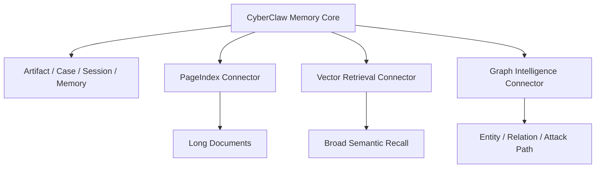

# CyberClaw 知识检索选型评估 v1

## 1. 评估目标

本文评估三类知识检索路线在 CyberClaw 中的适配性：

1. `PageIndex` 类型的 vectorless / reasoning-based retrieval
2. `GraphRAG` 类型的图谱检索
3. `传统向量库 RAG`

评估目标不是找“唯一方案”，而是确定：

- 哪种最适合做主路径
- 哪种适合做补充能力
- 哪种不适合做平台内核

---

## 2. 先给结论

CyberClaw 不应把三者当成互斥关系，而应采用**分层组合策略**。

正式建议：

1. **长期记忆主线**：仍由 CyberClaw 自己的 `Artifact / Memory / Case / Session` 内核承载
2. **长文档知识检索**：优先接 `PageIndexConnector`
3. **广域语义检索**：按需接传统向量库 connector
4. **实体关系 / 攻击链 / 证据关联**：按需接 GraphRAG / graph connector

一句话：

> CyberClaw 的 Memory Core 不能外包；检索引擎可以按场景分层选择。

---

## 3. 三类路线的本质区别

| 路线 | 本质 | 强项 | 弱项 |
|---|---|---|---|
| `PageIndex` | 长文档树索引 + 推理式检索 | 长文档、可解释、引用精确 | 非通用 memory，不是大规模主库 |
| `GraphRAG` | 实体-关系图谱检索 | 关系推理、链路分析、因果结构 | 构建成本高、更新复杂 |
| `向量库 RAG` | embedding + similarity search | 通用、成熟、规模化方便 | 对长专业文档解释性弱，易误召回 |

---

## 4. 对 CyberClaw 的关键评估维度

### 4.1 维度定义

CyberClaw 关注的不只是召回率，还包括：

1. 可解释性
2. 可审计性
3. 多租户边界
4. 文档引用准确性
5. 动态写入能力
6. 运维复杂度
7. 安全场景适配度
8. 对 Agent 工作流的可组合性

### 4.2 对比表

| 维度 | PageIndex | GraphRAG | 向量库 RAG |
|---|---|---|---|
| 长文档检索质量 | 很强 | 中 | 中 |
| 引用可解释性 | 很强 | 中 | 弱到中 |
| 多文档大规模检索 | 中 | 中 | 强 |
| 动态写入 / 高频更新 | 弱到中 | 弱 | 强 |
| 关系推理 | 中 | 很强 | 弱 |
| 实体链路分析 | 弱到中 | 很强 | 弱 |
| 构建复杂度 | 中 | 高 | 低到中 |
| 运维复杂度 | 中 | 高 | 中 |
| 适合做 Memory Core | 否 | 否 | 否 |
| 适合做文档知识引擎 | 很强 | 弱到中 | 中 |
| 安全行业适配 | 强 | 强 | 中 |

---

## 5. PageIndex 的适配判断

### 5.1 最适合的场景

PageIndex 最适合 CyberClaw 的场景：

1. 规章制度问答
2. 审计文档分析
3. 漏洞报告理解
4. 长篇安全白皮书和标准文档检索
5. 多页 PDF 比较
6. 需要页码和章节引用的报告生成

### 5.2 不适合的场景

1. 高频更新知识片段库
2. 细粒度任务记忆
3. Agent 会话级 Memory
4. 海量碎片文档统一检索主库
5. 关系链路推理为核心的场景

### 5.3 结论

PageIndex 适合做：

- `Document Knowledge Connector`

不适合做：

- `Unified Memory Backend`

---

## 6. GraphRAG 的适配判断

### 6.1 最适合的场景

GraphRAG 在 CyberClaw 中最有价值的不是通用知识检索，而是：

1. IOC 关系图
2. 攻击链推理
3. 资产-漏洞-风险传播分析
4. 告警关联
5. 事件证据关系追踪
6. GRC 控制项与证据映射

### 6.2 不适合的场景

1. 第一阶段就做统一知识底座
2. 普通研发文档检索主路径
3. 高频轻量 Agent Memory

### 6.3 结论

GraphRAG 适合做：

- `Security Relationship Intelligence Layer`
- `Optional Graph Connector`

不适合做：

- CyberClaw 第一阶段默认知识底座
- 通用 memory backend

---

## 7. 传统向量库 RAG 的适配判断

### 7.1 最适合的场景

1. 海量中短文档语义召回
2. FAQ / SOP / wiki / ticket / issue 等碎片知识检索
3. 多租户通用知识平台
4. 高吞吐检索服务

### 7.2 主要问题

对于 CyberClaw 这类高治理平台，传统向量库的主要弱点是：

1. 引用解释性一般
2. 对复杂长文档的章节级检索不够稳
3. 容易出现“语义相似但业务不相关”的误召回
4. 在合规 / 审计 / 安全报告场景下，证据说服力偏弱

### 7.3 结论

向量库适合做：

- `Broad Semantic Retrieval Connector`

不适合独占：

- 长文档专业知识主路径
- 平台统一 memory core

---

## 8. CyberClaw 的推荐组合策略

### 8.1 推荐架构

### 8.2 角色分工

| 层 | 建议实现 |
|---|---|
| `Memory Core` | CyberClaw 自研内核 |
| `Document Retrieval` | PageIndexConnector |
| `Broad Retrieval` | Vector DB Connector |
| `Relation Intelligence` | Graph Connector |

这意味着：

- PageIndex、GraphRAG、向量库都不直接等于 Memory
- 它们都应该被建模为 Connector
- Memory 仍由 CyberClaw 平台对象负责

---

## 9. 面向安全场景的具体建议

### 9.1 默认推荐

如果 CyberClaw 第一阶段面向：

- 安全运营
- 研发工程
- 审计与合规
- 长文档分析

默认顺序建议是：

1. `PageIndexConnector`
2. `Vector Connector`
3. `Graph Connector`

原因：

- 第一阶段最常见的是文档理解与引用问题
- 第二阶段才是规模化广域检索
- 第三阶段才需要关系推理增强

### 9.2 如果偏安全分析平台

如果后续 CyberClaw 重点走：

- 威胁情报
- 攻击链关联
- 资产和漏洞关系推理
- SOAR 协同

则建议再引入：

- `Graph Connector`

但不要在 v1 就把 graph 做成默认底座。

---

## 10. 最终选型结论

### 10.1 不建议

1. 不建议把 PageIndex 直接当 Memory backend
2. 不建议把 GraphRAG 当第一阶段默认知识底座
3. 不建议只靠传统向量库承担所有知识检索场景

### 10.2 建议

1. Memory Core 继续由 CyberClaw 自己维护
2. PageIndex 作为高质量长文档知识 connector
3. Vector DB 作为广域语义召回 connector
4. GraphRAG 作为可选关系推理 connector

### 10.3 一句话定稿

> CyberClaw 的知识层应采用“Memory Core 自研 + 检索引擎分层接入”的策略；其中 PageIndex 最适合长文档知识，向量库最适合广域召回，GraphRAG 最适合关系推理。

---

## 11. 推荐优先级

### Phase 1

1. 落地 `PageIndexConnector`
2. 将结果沉淀到 `Artifact + Memory Summary`

### Phase 2

1. 引入 `Vector Retrieval Connector`
2. 用于 wiki / ticket / SOP / issue 等宽检索场景

### Phase 3

1. 引入 `Graph Connector`
2. 面向 IOC / Attack Path / Evidence Graph / GRC 映射

---

## 12. 参考来源

评估日期：`2026-03-20`

参考资料：

1. [PageIndex GitHub](https://github.com/VectifyAI/PageIndex)
2. [PageIndex README](https://raw.githubusercontent.com/VectifyAI/PageIndex/main/README.md)
3. [PageIndex Docs](https://docs.pageindex.ai/)
4. [Document Search](https://docs.pageindex.ai/tutorials/doc-search)
5. [Python SDK](https://docs.pageindex.ai/sdk)
6. [PageIndex Framework Blog](https://pageindex.ai/blog/pageindex-intro)
