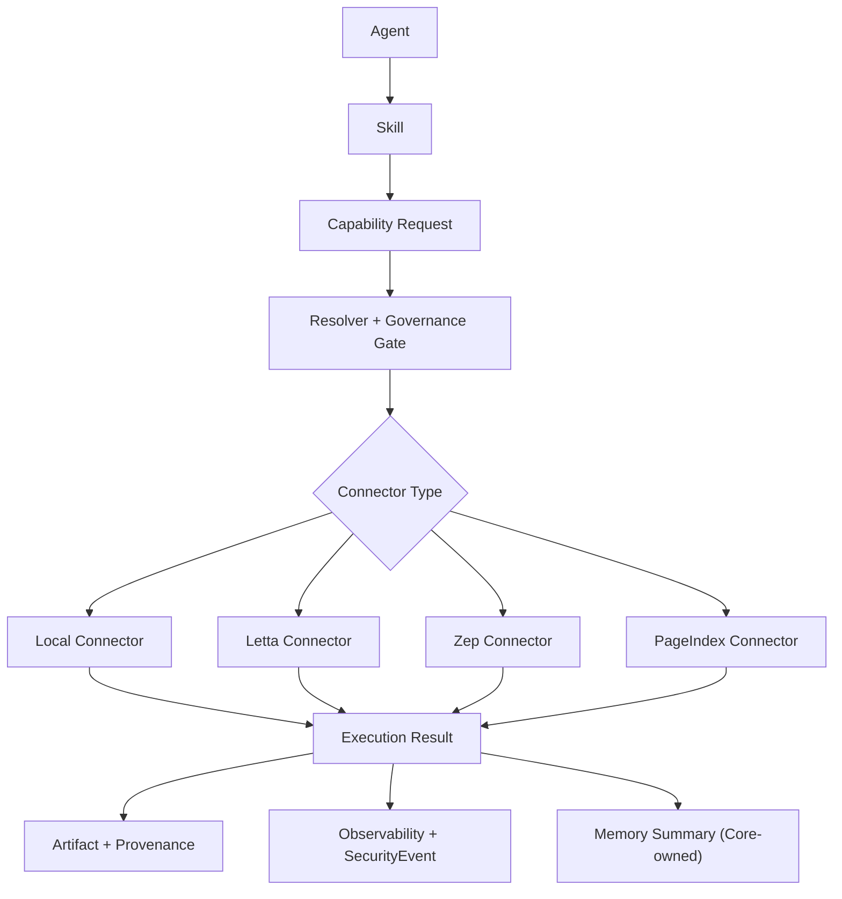

# CyberClaw Letta / Zep / PageIndex Connector 策略 v1

- Status: Active
- Scope: Architecture
- Owner: CyberClaw Maintainers
- Last Updated: 2026-03-21

## 1. 复核结论

结论明确：

1. `Letta` 只作为 `Connector`（自主决策能力连接器）
2. `Zep` 只作为 `Connector`（时态/图谱检索连接器）
3. `PageIndex` 只作为 `Connector`（长文档知识连接器）
4. 三者都不进入 `Memory Core`
5. `Platform Plugin` 只做横切增强，不承载主执行能力

一句话定稿：

> CyberClaw 保持“平台内核记忆自研 + 外部能力 Connector 化接入”，避免平台核心被第三方记忆框架反向绑架。

---

## 2. 回答关键疑问

### 2.1 五层会不会过度设计

不会，只要区分“逻辑分层”和“工程实现层”。

建议落地方式：

1. 逻辑层保持清晰：`Agent / Skill / Connector / Capability / Governance`
2. 代码层保持简洁：优先少模块、少接口、少状态机分叉
3. 外部系统统一走 Connector，不在核心继续加新对象类型

过度设计的根因不是“层数”，而是“职责重复”和“跨层耦合”。

### 2.2 Letta / Zep 能不能做原生内核

不建议。

原因：

1. CyberClaw 需要统一审计、统一审批、统一多租户边界
2. 内核对象（Case/Execution/Artifact/Review/Provenance）必须可控
3. 外部系统适合做能力提供者，不适合承载平台主状态

---

## 3. 统一对象映射

| 对象 | 职责 | 可扩展性边界 |
|---|---|---|
| `Agent` | 谁来做（角色决策） | 可新增角色包，不承载外部执行 SDK |
| `Skill` | 怎么做（方法/模板/流程知识） | 兼容 `Claude/Codex/OpenClaw` 风格 Skill |
| `Connector` | 用什么做（能力接入） | Letta/Zep/PageIndex/本地执行/模型/渠道统一放这里 |
| `Capability` | 最小治理动作单元 | 风险分级、审批、审计、限额都绑 Capability |
| `Platform Plugin` | 平台横切增强 | 事件 Hook、审计扩展、策略增强，不做主执行 |

---

## 4. 三类 Connector 的正式定位

## 4.1 Letta Connector

定位：`Autonomous Decision Connector`

适用：

1. 长流程自主决策
2. 多步任务拆解
3. 需要“反思-重规划”的任务链

不适用：

1. 直接替代 CyberClaw 的执行状态机
2. 直接替代审批与治理模块

推荐 Capability：

1. `letta.agent.step`
2. `letta.agent.plan`
3. `letta.memory.context.fetch`
4. `letta.memory.context.update`

## 4.2 Zep Connector

定位：`Temporal/Graph Retrieval Connector`

适用：

1. 时间轴证据检索
2. 实体关系检索
3. SOC/SDL/GRC 的证据关联查询

不适用：

1. 作为平台唯一长期记忆主库
2. 直接承载运行时状态

推荐 Capability：

1. `zep.timeline.query`
2. `zep.graph.query`
3. `zep.fact.upsert`
4. `zep.fact.link`

## 4.3 PageIndex Connector

定位：`Long-form Document Knowledge Connector`

适用：

1. 长文档检索与引用
2. 文档结构化导航
3. 多文档比较

不适用：

1. 会话记忆主库
2. 执行状态存储

推荐 Capability（MVP）：

1. `doc.ingest`
2. `doc.query`
3. `doc.compare`
4. `doc.tree.get`

---

## 5. 执行链路（统一）

要点：

1. 任何外部调用都必须先过 `Capability` 风险与策略门禁
2. 审批触发规则统一由平台治理层决定，不由 Connector 私自决定
3. 结果统一沉淀到 Artifact/Trace/SecurityEvent

---

## 6. 为什么不用 Platform Plugin 承载 Letta/Zep/PageIndex

`Platform Plugin` 的职责是横切增强，不是主执行路径。

如果把 Letta/Zep/PageIndex 做成 Plugin，会出现：

1. 主能力路径不可见（难治理）
2. 审批与审计不完整（难合规）
3. 风险分级粒度不稳定（难运维）

因此正式约束：

1. 外部能力系统统一建模为 `Connector`
2. Plugin 只能对事件做增强，不直接承载业务能力入口

---

## 7. 安全与治理基线

## 7.1 Capability 风险分级建议

1. `Low`：只读检索（`doc.query`, `zep.timeline.query`）
2. `Medium`：写入事实或上下文（`zep.fact.upsert`, `letta.memory.context.update`）
3. `High`：触发外部执行或高影响动作（`letta.agent.step` 若可触发行动）

## 7.2 审批规则建议

1. `risk >= medium` 默认进入 review gate
2. 跨租户/跨工作区访问强制审批
3. 输出都要带 `trace_id + execution_id + connector_id + capability_id`

---

## 8. 面向 CyberClaw 的落地优先级

### Phase A（先做）

1. 固化 `Connector-only` 规则到架构文档与代码注释
2. 完成 `PageIndexConnector` MVP（`doc.ingest/query/compare/tree.get`）
3. 给 Connector Dispatcher 增加统一输入校验和错误模型

### Phase B

1. 落地 `ZepConnector` 只读查询能力（timeline/graph query）
2. 通过 Capability 风险模型接入 review gate
3. 写入审计闭环（SecurityEvent + Trace）

### Phase C

1. 落地 `LettaConnector`（先 plan/step，后 memory.update）
2. 与 Subagent 机制结合，限制最大深度与预算
3. 逐步启用自动化策略，不直接开放全自主执行

---

## 9. 最终决策（供团队执行）

1. 对外统一术语：`Agent / Skill / Connector / Capability / Platform Plugin`
2. 对外不再使用 `Tool` 作为架构一级对象
3. Letta/Zep/PageIndex 都作为 `Connector` 集成
4. CyberClaw Memory Core 继续由平台内核对象承载
5. 先实现 PageIndex 能力，再按治理成熟度接 Zep 和 Letta
