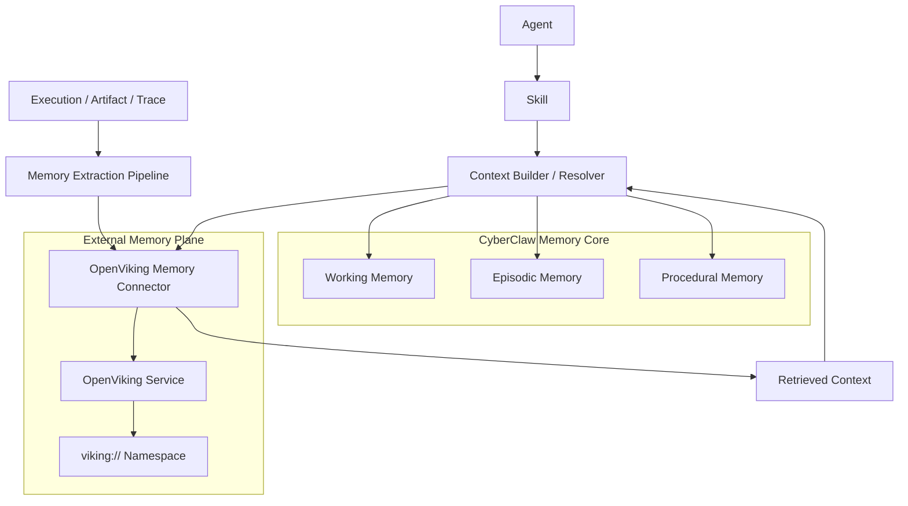
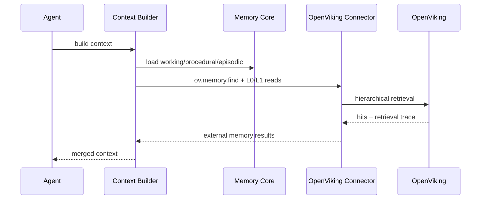
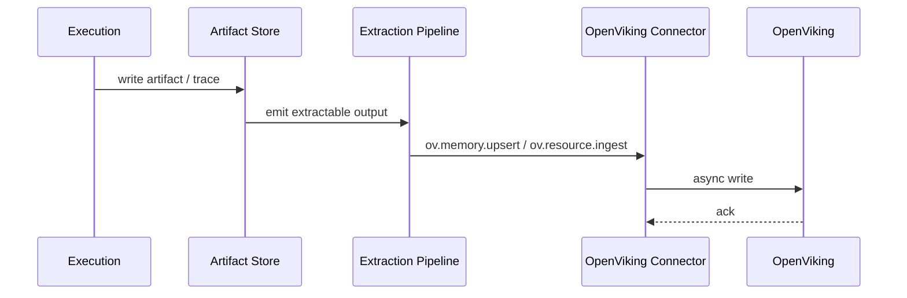

# CyberClaw OpenViking 默认外接记忆架构方案 v1

- Status: Draft
- Scope: Architecture
- Owner: CyberClaw Maintainers
- Last Updated: 2026-03-26
- Target: Post-Beta Retrieval / External Memory

---

## 1. 结论

CyberClaw 将 `OpenViking` 定位为：

> 平台默认外接记忆 Connector。

这个定位有三个边界：

1. `OpenViking` 是默认的 **外接记忆与上下文检索后端**
2. `OpenViking` 不是 `Memory Core`
3. `OpenViking` 不是 `Platform Plugin`

正式定稿如下：

1. CyberClaw 内核继续拥有 `Working / Episodic / Procedural` 的主状态与治理权
2. `OpenViking` 负责外部长期上下文、资源型记忆和层级检索
3. 所有对 `OpenViking` 的访问统一通过 `Connector -> Capability -> Governance`
4. `OpenViking` 默认成为平台的第一外接记忆源，但不是平台唯一知识源
5. `Zep / PageIndex / Letta` 继续保留为场景型 Connector

一句话定稿：

> CyberClaw 采用“内核记忆自持 + OpenViking 作为默认外接记忆”的双层策略，让平台既可控，又具备层级上下文扩展能力。

---

## 2. 采用依据

根据 OpenViking 官方公开资料，它的核心能力是：

1. 用文件系统范式统一管理 `memory / resources / skills`
2. 使用 `viking://` 虚拟路径组织上下文
3. 提供 `L0 / L1 / L2` 分层上下文加载
4. 提供目录递归检索和检索轨迹可观测
5. 提供会话提交后的上下文自迭代能力

这些能力与 CyberClaw 的需求高度对齐：

1. CyberClaw 需要一个默认外接记忆后端，而不是只靠扁平向量检索
2. CyberClaw 需要可观测的检索链，而不是黑盒 RAG
3. CyberClaw 需要把长期上下文从执行热路径中剥离出去
4. CyberClaw 需要保留 `Capability` 粒度治理，不让外部记忆框架反向接管平台内核

因此，OpenViking 适合成为默认外接记忆，但不能反向吞并 CyberClaw 的内核对象。

---

## 3. 正式定位

## 3.1 OpenViking 在 CyberClaw 中是什么

OpenViking 在 CyberClaw 中是：

1. `Connector`: `openviking-memory`
2. 文档分类标签：`external-default-memory`
3. 主要职责：长期上下文检索、资源型记忆管理、层级记忆供给

说明：

1. 上述“分类标签/主要职责”是文档中的设计分类，不是当前 `manifest/schema` 的标准字段
2. 当前生态规范仍以 [MANIFESTS_V2.0.md](/Users/cyber/cyberclawlabs/cyberclaw/docs/architecture/overview/MANIFESTS_V2.0.md) 为准
3. 若后续要把这些分类进入 manifest，必须先单独修改 schema，而不是由 Connector 实现自行扩展

## 3.2 OpenViking 在 CyberClaw 中不是什么

OpenViking 不是：

1. `Execution / Review / Artifact / Provenance` 的主状态库
2. `Skill` 生态的事实来源
3. `Platform Plugin`
4. 多租户授权、审批和审计的决策源
5. 绕开平台治理的隐藏执行入口

---

## 4. 与 Memory Core 的边界

CyberClaw 的内核记忆仍然采用既定边界：

1. `Working Memory`: 会话热上下文
2. `Episodic Memory`: 执行历史、审计、证据、产物关系
3. `Procedural Memory`: 文件化规则、说明、方法模板

OpenViking 只补充以下外部能力：

1. 长周期资源型记忆
2. 跨会话外接记忆检索
3. 层级上下文按需加载
4. 外部文档和资源目录化组织

核心原则：

1. `Memory Core` 管平台状态
2. `OpenViking` 管外接上下文
3. 平台状态永不以 OpenViking 为唯一事实来源

---

## 5. 总体架构

设计含义：

1. Context Builder 先读取内核记忆，再调用 OpenViking
2. OpenViking 只作为外接上下文层
3. 写回路径走 `Execution -> Artifact -> Extraction -> Connector`
4. 不允许 `Agent` 直接绕过 Connector 与 OpenViking 交互

---

## 6. 默认接入顺序

在默认配置下，CyberClaw 的上下文读取顺序应固定为：

1. `Working Memory`
2. `Procedural Memory`
3. `Episodic Memory`
4. `OpenViking L0 / L1`
5. `OpenViking L2` 按需展开
6. 其他场景型 Connector（如 `Zep / PageIndex / Letta`）

原因：

1. `Working` 与 `Procedural` 最接近当前任务，权威性最高
2. `Episodic` 持有平台自身的执行和审计事实
3. `OpenViking` 适合做长尾外接上下文补全，不适合覆盖当前执行状态
4. `L2` 读取成本最高，必须延迟加载

默认规则：

1. 不允许先查 OpenViking 再查内核记忆
2. 不允许默认读取 L2 全文
3. 不允许把 OpenViking 结果直接写回内核事实状态而不经平台提取流程

## 6.1 与 Memory Runtime API 的拼接方式

OpenViking 不直接进入 `MemoryContextProvider` 的内核返回值。

推荐拼接顺序：

1. `MemoryContextProvider` 先构建 `Working / Episodic / Procedural` 内核上下文
2. `ExternalRetrievalProvider` 再按策略调用 `OpenViking`
3. 最终由 `Context Builder` 合并为模型可消费的上下文包

正式约束：

1. `Memory Core API` 不直接承担外接检索生命周期
2. `OpenViking` 结果必须作为 `external retrieval items` 附加，而不是伪装成内核事实对象
3. 内核上下文和外接检索结果必须保留来源分层

## 6.2 运行时降级契约

既然 OpenViking 是默认外接记忆，就必须定义故障降级行为。

默认契约如下：

1. OpenViking 查询超时不阻塞主执行链
2. 单次查询失败默认 `fail-open`，直接回退到 `core-only`
3. 连续失败达到阈值时，Connector 自动进入临时熔断状态
4. 熔断状态下只返回内核记忆，并发出 `SecurityEvent / Observability event`
5. 只有显式恢复或健康检查通过后，才重新进入默认查询链

推荐阈值：

1. `L0 / L1` 查询超时预算：`100ms - 300ms`
2. `L2` 查询超时预算：`300ms - 1000ms`
3. 连续失败熔断阈值：`3 - 5`
4. 熔断冷却时间：`30s - 120s`

正式规则：

1. OpenViking 故障时，CyberClaw 仍必须能依赖 `Working / Episodic / Procedural` 继续运行
2. 默认外接记忆永远不能成为执行主链的硬依赖
3. 降级模式必须可观测、可追踪、可审计

---

## 7. 命名空间映射

CyberClaw 不直接复用 OpenViking 的全部语义，而是做受控映射。

推荐映射如下：

| CyberClaw 语义 | OpenViking URI 前缀 | 用途 |
|---|---|---|
| 用户长期偏好 | `viking://user/memories/<tenant>/<actor>/` | 用户风格、偏好、长期事实 |
| Agent 长期经验 | `viking://agent/memories/<tenant>/<agent>/` | Agent 执行经验、领域记忆 |
| 工作区资源 | `viking://resources/<tenant>/<workspace>/` | 文档、代码索引、外部知识资源 |
| Case 关联资源 | `viking://resources/<tenant>/<workspace>/cases/<case_id>/` | Case 相关资料与外部证据 |

明确限制：

1. 不将 `ecosystem/skills` 注册表直接写入 `viking://agent/skills/` 作为平台事实源
2. 不将 `Execution / Review / Provenance` 原始状态直接外包给 OpenViking
3. 不允许跨 `tenant / workspace / case` 混用命名空间

---

## 8. Connector 设计

推荐 Connector ID：

1. `openviking-memory`

推荐 `ConnectorRuntime`：

1. 默认：`Process`
2. 可选：`Remote`
3. 安全加固：`Container`
4. 不建议：`Native`

理由：

1. OpenViking 当前主要是独立服务或独立运行时形态，更适合进程级或远程接入
2. 作为平台默认外接记忆，应优先隔离和可替换，而不是与主进程强耦合
3. 默认外接记忆不应把 Python 运行时直接嵌进 CyberClaw 核心执行进程

---

## 9. 推荐 Capability 设计

## 9.1 只读检索能力

这些能力默认风险为 `Low`：

1. `ov.uri.ls`
2. `ov.uri.tree`
3. `ov.memory.find`
4. `ov.memory.read.abstract`
5. `ov.memory.read.overview`
6. `ov.memory.read.detail`
7. `ov.retrieval.trace.get`

用途：

1. 浏览命名空间
2. 进行层级检索
3. 读取 L0 / L1 / L2
4. 获取检索轨迹用于调试和审计

## 9.2 受控写入能力

这些能力默认风险为 `Medium`：

1. `ov.resource.ingest`
2. `ov.memory.upsert`
3. `ov.memory.link`

用途：

1. 写入外部资源
2. 写入提炼后的记忆卡片
3. 建立资源与记忆关系

## 9.3 可选实验能力

这些能力默认关闭，仅在实现了平台侧映射契约后才允许启用：

1. `ov.session.commit`

原因：

1. `session.commit` 天然带有第三方内部总结和重写语义
2. 若没有平台侧 `Artifact / Provenance / source_refs / review_status` 映射契约，它会形成黑盒长期写回
3. 因此它不能进入默认写回能力集

启用前必须满足：

1. commit 产物必须映射到平台可审计对象
2. commit 输入必须来自 `Extraction Pipeline`，而不是原始会话流
3. commit 结果必须挂接 `trace_id / execution_id / source_refs`
4. commit 结果必须带 `review_status`
5. commit 失败不得阻塞主执行链

## 9.4 高风险运维能力

> **状态说明**：以下能力中部分在 OpenViking v0.3.2 REST API 中无对应端点，
> 标注为 `deferred-pending-upstream`，待上游实现后启用。

这些能力默认风险为 `High` 或 `Critical`：

1. `ov.memory.delete` — status: **available**
2. `ov.namespace.compact` — status: **deferred-pending-upstream**
3. `ov.namespace.purge` — status: **deferred-pending-upstream**
4. `ov.package.import` — status: **deferred-pending-upstream** (CLI-only in v0.3.2)
5. `ov.package.export` — status: **deferred-pending-upstream** (CLI-only in v0.3.2)

默认规则：

1. `risk >= medium` 进入 review gate
2. `ov.package.import` 默认禁用
3. 批量删除和命名空间清空必须强制审批

---

## 10. 默认读写链路

## 10.1 读路径

规则：

1. 先查内核，再查 OpenViking
2. 默认只取 `L0 / L1`
3. 只有明确需要时才读取 `L2`
4. 检索轨迹必须回流 Observability

## 10.2 写路径

规则：

1. 写回必须异步，不阻塞主执行链
2. 不允许将原始执行状态直接全量复制到 OpenViking
3. 只写入经过提取、压缩和脱敏后的上下文材料

## 10.3 会话提交路径

`ov.session.commit` 不是默认热路径动作。

它只应在以下条件触发：

1. 会话结束
2. Workflow 阶段切换
3. 用户显式确认
4. 后台 compaction / memory extraction job

禁止：

1. 每轮模型调用后自动同步 commit
2. 未经治理直接让 Agent 自主写回长期记忆
3. 直接提交原始对话流、原始事件流或未脱敏 Artifact

平台映射契约：

1. `ov.session.commit` 的输入必须是平台提取后的 `MemoryCard candidate` 或 `Resource summary`
2. commit 输出必须回写为 `ArtifactRef + source_refs + review_status + trace_id`
3. 平台必须保留“提交前材料”和“提交后材料”的双向引用，避免第三方黑盒重写吞掉 provenance
4. 在未实现这一契约前，`ov.session.commit` 继续保持关闭

---

## 11. 与其他 Connector 的关系

OpenViking 的角色是“默认外接记忆”，不是“唯一外接知识系统”。

角色分工如下：

| Connector | 正式定位 |
|---|---|
| `OpenViking` | 默认外接记忆与层级上下文底座 |
| `Zep` | 时间轴 / 图谱 / 证据关联查询 |
| `PageIndex` | 长文档分析与引用 |
| `Letta` | 自主决策与上下文管理能力连接器 |

正式规则：

1. 默认外接记忆优先走 OpenViking
2. 业务特定查询再叠加 `Zep / PageIndex / Letta`
3. 不让多个外接记忆系统同时争夺“默认记忆脑”角色

---

## 12. 安全与治理基线

## 12.1 多租户与作用域

必须绑定：

1. `tenant_id`
2. `workspace_id`
3. `agent_id`
4. `case_id`
5. `trace_id`

任何缺失作用域的写入请求默认拒绝。

## 12.2 脱敏与写前过滤

进入 OpenViking 的内容必须先经过：

1. Secret redaction
2. PII / 敏感信息识别
3. workspace 范围校验
4. 结构化 memory extraction

## 12.3 安全版本基线

OpenViking 作为默认外接记忆时，必须附带版本约束。

原因：

1. 官方公开漏洞库记录了 `openviking` 在 `0.2.1` 及更早版本存在 `.ovpack import` 路径穿越漏洞
2. 因此默认集成必须要求使用已修复版本
3. `.ovpack` 导入相关 capability 默认关闭

平台默认策略：

1. 不启用 `ov.package.import`
2. 仅在离线受控环境下按审批启用导入
3. 部署时将 OpenViking 运行时与主工作区隔离

## 12.4 可观测要求

每次调用至少记录：

1. `trace_id`
2. `execution_id`
3. `connector_id`
4. `capability_id`
5. `uri_scope`
6. `retrieval_trace_id`
7. `latency_ms`
8. `result_count`
9. `outcome`

---

## 13. 默认启用策略

推荐平台默认配置：

1. 对所有标准 Agent 默认启用 `openviking-memory`
2. 仅开放只读 capability
3. 受控写入 capability 由策略显式开启
4. 高安全租户可关闭外接记忆，仅保留内核记忆
5. 默认启用故障降级和熔断回退

推荐默认档位：

1. `default`: 只读 + 异步受控写回
2. `strict`: 只读，不允许任何写回
3. `airgapped`: 完全关闭 OpenViking
4. `degraded`: OpenViking 熔断，仅返回内核记忆

---

## 14. 实施建议

## Phase A

1. 新增 `OpenVikingConnector` 架构文档与 manifest 草案
2. 落地只读能力：`ls / tree / find / abstract / overview / detail`
3. 打通 Observability 基线
4. 落地 timeout / fail-open / 熔断回退

## Phase B

1. 落地异步写回：`resource.ingest / memory.upsert`
2. 与 `Memory Extraction Pipeline` 对接
3. 加入 review gate 和 namespace scope 校验
4. 定义 `MemoryCard -> OpenViking resource/memory` 映射契约

## Phase C

1. 在完成平台映射契约后，受控启用 `session.commit`
2. 做 tenant 级策略模板
3. 建立性能基准和回归测试

---

## 15. 最终规则

团队执行时，以以下规则为准：

1. `OpenViking` 是 CyberClaw 的默认外接记忆，而不是内核记忆
2. 所有访问统一走 `Connector -> Capability -> Governance`
3. 内核状态和治理状态永不外包给 OpenViking
4. 默认先读 `Working / Procedural / Episodic`，再读 OpenViking
5. 默认只读，写回异步且受控
6. 默认关闭高风险导入、批量删除和命名空间清空能力
7. 默认启用 timeout / fail-open / 熔断回退
8. `ov.session.commit` 在实现平台映射契约前保持关闭

---

## 16. 参考资料

1. [OpenViking GitHub Repository](https://github.com/volcengine/OpenViking)
2. [OpenViking 官方文章：面向 Agent 的上下文数据库](https://developer.volcengine.com/articles/7601061353612116004)
3. [OSV: GHSA-rpqr-j937-6qr9 / CVE-2026-28518](https://osv.dev/vulnerability/GHSA-rpqr-j937-6qr9)

---

## 17. L0/L1/L2 语义映射说明

CyberClaw 内核与 OpenViking 的 L0/L1/L2 语义方向相反：

| 层级 | CyberClaw (MemoryLevel) | OpenViking (ContextLevel) |
|------|------------------------|--------------------------|
| L0   | Full（最详细，全部消息） | Abstract（最简洁，~100 tokens） |
| L1   | Summary（摘要级）       | Overview（概览级，~2000 tokens） |
| L2   | Metadata（最简洁，JSON） | Detail（最详细，全文） |

因此在 `OpenVikingConnector` 实现中：
1. **禁止**直接复用 `cyberclaw-store::MemoryLevel` 枚举
2. **必须**使用独立的 `OvRetrievalDepth` 枚举
3. Capability handler 中做显式映射转换
