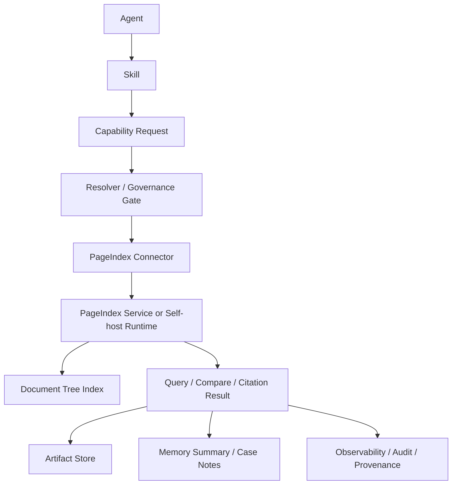

# CyberClaw PageIndex Connector 架构方案 v1

## 1. 结论

PageIndex 适合接入 CyberClaw 作为**长文档知识引擎 Connector**，不适合直接充当 CyberClaw 的**统一长期记忆主库**。

准确定位：

- 适合：`Document Knowledge Connector`
- 不适合：`Memory Core`
- 本质上仍然属于：`Vectorless / Reasoning-based Retrieval`

因此，CyberClaw 对 PageIndex 的采用方式应当是：

> 作为 `Connector` 接入平台，为 Agent / Skill 提供高质量长文档检索、引用和对比能力；不替代 `Artifact / Memory / Case State / Session Memory` 的平台内核职责。

---

## 2. 采用背景

PageIndex 官方定位是：

- `vectorless`
- `reasoning-based RAG`
- `no vector db`
- `no chunking`
- `tree-structured index`

它解决的问题不是“统一记忆管理”，而是：

1. 如何把长文档变成可推理的树状索引
2. 如何在长文档中进行可解释检索
3. 如何在多页、跨章节信息中做更接近人工专家的导航与提取

这与 CyberClaw 在以下场景高度匹配：

- 安全手册
- Runbook / SOP
- 审计材料
- 合规文档
- 漏洞报告
- 威胁情报 PDF
- 调研报告
- 产品白皮书
- 技术标准文档

---

## 3. 为什么不适合作为 Memory Core

### 3.1 PageIndex 解决的是文档检索，不是记忆管理

CyberClaw 的 Memory / Artifact / Case / Session 需要处理：

- 会话沉淀
- 任务过程状态
- Case 级上下文
- Agent 长期经验
- Provenance 关系
- 可写回、可修订、可失效、可分层记忆

PageIndex 公开能力主要面向：

- 文档处理
- 文档树索引
- 单文档或少量文档问答
- 多文档比较
- 文档章节级引用

因此它适合做 `Knowledge Retrieval Engine`，不适合直接做 `Memory Store`。

### 3.2 PageIndex 对“多文档知识库平台”不是主打能力

根据官方文档，截至 `2026-03-17`：

- reasoning-based RAG 默认面向单文档
- 多文档搜索提供的是额外 workflow
- Chat API 支持多 `doc_id`，但仍处于 `beta`

这意味着它更像：

- 高质量长文档分析引擎

而不是：

- 海量多租户知识库底座
- 平台级记忆数据库

### 3.3 CyberClaw 的 Memory 还需要写路径和治理路径

CyberClaw 的平台内核要求：

- 写入策略
- 审批和审计
- 租户边界
- Workspace / Case 归属
- Artifact provenance
- 生命周期与过期策略

这些都不是 PageIndex 的核心职责。

---

## 4. 在 CyberClaw 中的正式定位

PageIndex 应被建模为：

- `Connector`: `pageindex`
- `ConnectorSubtype`: `document-knowledge`

它对平台提供的不是“记忆写入能力”，而是以下 `Capability`：

1. `doc.ingest`
2. `doc.tree.get`
3. `doc.query`
4. `doc.compare`
5. `doc.cite`
6. `doc.describe`
7. `doc.search.metadata`

其中建议优先落地的最小能力是：

1. `doc.ingest`
2. `doc.query`
3. `doc.compare`
4. `doc.tree.get`

---

## 5. 与 CyberClaw 对象模型的映射

| CyberClaw 对象 | PageIndex 中的对应角色 | 定位 |
|---|---|---|
| `Agent` | 文档分析者 / 报告撰写者 / 合规审查者 | 决策与编排 |
| `Skill` | 安全研判方法、审计方法、报告模板 | 方法与知识 |
| `Connector` | `pageindex` | 长文档知识接入 |
| `Capability` | `doc.query` / `doc.compare` / `doc.tree.get` | 最小执行与治理单元 |
| `Platform Plugin` | 不建议用来承载 PageIndex 访问 | 横切增强，不做文档执行 |
| `Artifact` | 查询结果、引用片段、比较报告 | 执行产物 |
| `Memory` | 仅保存摘要、结论、标签、引用指针 | 不保存全文索引本体 |

核心原则：

- PageIndex 只做“文档知识能力”
- CyberClaw Memory 只保存“沉淀与引用”
- 二者职责严格分离

---

## 6. 推荐架构



执行含义：

1. Agent 决定需要查哪类文档知识
2. Skill 决定查询方法和提示模板
3. Resolver 选择 `pageindex` connector 的具体 capability
4. Governance Gate 根据 capability 风险和数据域策略做校验
5. Connector 调 PageIndex 服务
6. 返回章节级引用、结构化结果和对比结论
7. CyberClaw 将结果沉淀为 Artifact，并按需要写入 Memory 摘要

---

## 7. 推荐 Capability 设计

### 7.1 `doc.ingest`

用途：

- 将 PDF / Markdown / 文档资源导入 PageIndex 并获得 `doc_id`

输入建议：

```yaml
source_uri: string
source_type: pdf | markdown
case_id: string?
workspace_id: string?
labels: []
metadata: {}
```

输出建议：

```yaml
doc_id: string
status: queued | processing | completed | failed
description: string?
```

风险建议：`Medium`

### 7.2 `doc.query`

用途：

- 针对单文档或少量文档进行推理式检索

输入建议：

```yaml
query: string
doc_ids: []
mode: single | multi
return_citations: true
```

输出建议：

```yaml
answer: string
citations: []
trace: object?
```

风险建议：`Low`

### 7.3 `doc.compare`

用途：

- 比较两个或多个长文档在某主题上的差异

输入建议：

```yaml
query: string
doc_ids: []
comparison_axes: []
```

输出建议：

```yaml
summary: string
differences: []
citations: []
```

风险建议：`Low`

### 7.4 `doc.tree.get`

用途：

- 获取文档的树结构索引

输入建议：

```yaml
doc_id: string
```

输出建议：

```yaml
tree: object
```

风险建议：`Low`

---

## 8. 数据边界设计

### 8.1 应该进入 PageIndex 的数据

适合进入 PageIndex 的是：

- 长篇、结构化、偏静态文档
- 需要章节级引用和解释的专业文档
- 不适合简单 chunking 的复杂 PDF

### 8.2 不应该进入 PageIndex 的数据

不建议放入 PageIndex 的是：

- 高频变更的任务状态
- Agent 短期会话历史
- 审批记录
- 租户运行时配置
- 执行日志
- 细粒度证据关系图
- 技能包内容本身

### 8.3 CyberClaw 应保存什么

CyberClaw 内核应保存：

- `doc_id`
- 引用信息
- 结果摘要
- provenance 映射
- query 历史
- case / artifact 绑定关系

不直接把 PageIndex 树索引当作平台统一 Memory 数据模型。

---

## 9. 治理与审计要求

PageIndexConnector 接入后，仍必须服从 CyberClaw 的统一治理：

1. capability 级授权
2. 租户边界检查
3. 文档域访问控制
4. 结果审计
5. 引用溯源
6. 输出脱敏

建议治理策略：

- `doc.query` / `doc.tree.get` 视为 `Read`
- `doc.ingest` 视为 `Write`
- 跨文档比较在敏感租户下可要求 `Review`
- 高敏文档场景下必须记录 `doc_id + actor + case_id + execution_id`

---

## 10. 实施建议

### 10.1 采用方式

推荐以 `Connector` 落地，而不是塞进 `Memory` 子系统。

建议目录：

- `ecosystem/connectors/pageindex/manifest.yaml`
- `crates/cyberclaw-connectors/src/pageindex/`

### 10.2 最小版本范围

P0 范围建议：

1. `doc.ingest`
2. `doc.query`
3. `doc.tree.get`

P1 再补：

1. `doc.compare`
2. `doc.search.metadata`
3. `doc.describe`

### 10.3 部署模式

建议支持两种：

1. `Remote`：调用官方 API / 托管服务
2. `Self-host`：调用企业私有部署的 PageIndex 服务

不建议第一版做：

- 把 PageIndex 代码深度嵌入 CyberClaw core
- 直接把它作为 Memory backend

---

## 11. 最终建议

正式结论：

> PageIndex 适合成为 CyberClaw 的高质量长文档知识 Connector，不适合作为 CyberClaw 的统一 Memory Core。

推荐落地策略：

1. 作为 `Connector` 接入
2. 以 `Capability` 提供长文档检索与引用能力
3. 将结果沉淀为 `Artifact + Memory Summary`
4. 不让 PageIndex 承担平台级记忆、状态和治理职责

---

## 12. 参考来源

评估日期：`2026-03-20`

参考资料：

1. [PageIndex GitHub](https://github.com/VectifyAI/PageIndex)
2. [PageIndex README](https://raw.githubusercontent.com/VectifyAI/PageIndex/main/README.md)
3. [PageIndex Docs](https://docs.pageindex.ai/)
4. [Document Search](https://docs.pageindex.ai/tutorials/doc-search)
5. [Python SDK](https://docs.pageindex.ai/sdk)
6. [PageIndex Framework Blog](https://pageindex.ai/blog/pageindex-intro)
