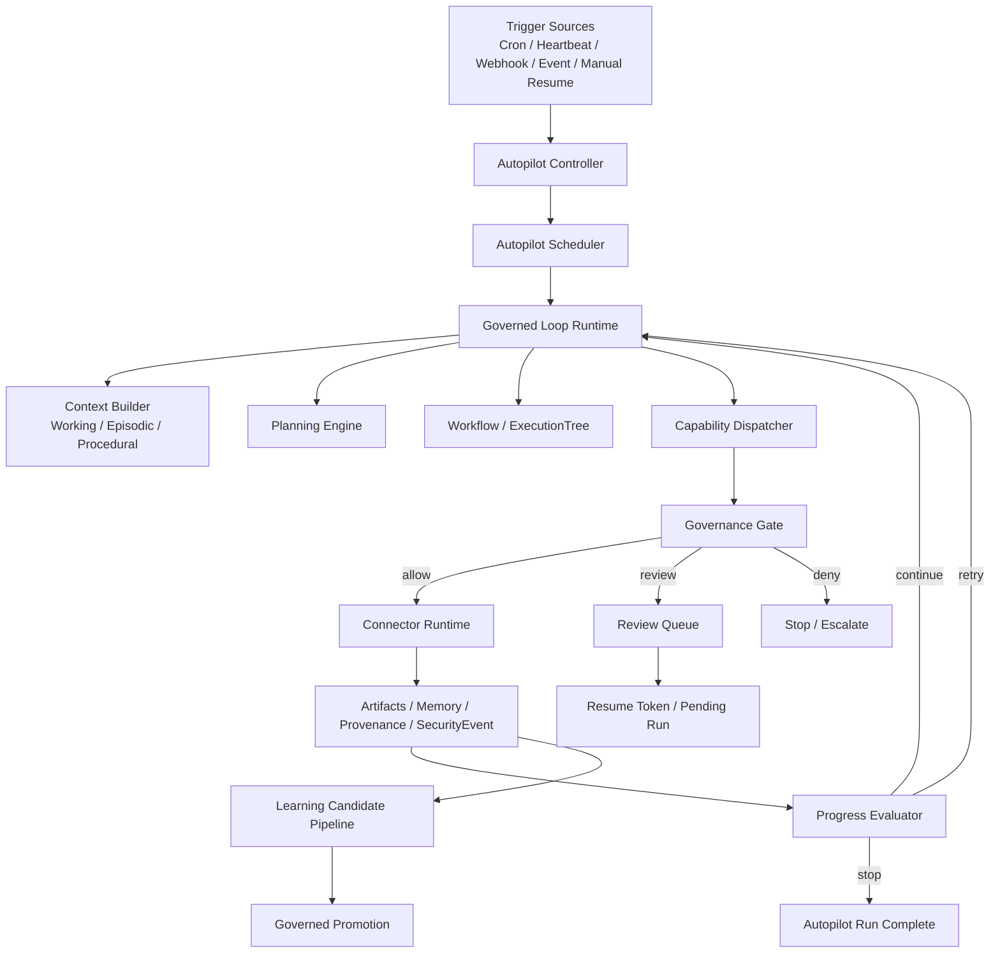

# CyberClaw Autopilot Architecture v1

- Status: Draft
- Scope: Architecture
- Owner: CyberClaw Maintainers
- Created: 2026-03-22
- Target: Post-Beta Runtime / Control Plane

---

## 执行摘要

CyberClaw 的 `Autopilot` 不应被设计成“无限自治 Agent”，而应被设计成一种**受控的持续执行模式**。

它不是新的生态对象，不与 `Agent / Skill / Connector / Platform Plugin` 并列；它属于 `Control Plane` 上层的一种运行模式，用来把以下能力持续地、自动地、受控地组织起来：

1. `Governed Loop Runtime`
2. `Workflow / ExecutionTree`
3. `Review Gate`
4. `Runtime Isolation`
5. `Memory / Provenance / SecurityEvent`
6. `Resume / Retry / Stop Policy`

CyberClaw 的 Autopilot 设计应吸收以下行业方案：

1. `OpenClaw`：内建调度、心跳、Hook、session-aware 自动化
2. `Codex`：后台 agent、自动化产品形态、异步持续执行
3. `Claude Code`：Hooks 生命周期、Subagent 独立上下文、项目级指令与记忆
4. `OpenHands`：事件驱动 loop、stuck detection、headless 与 observability

但 CyberClaw 必须保留自己的平台差异：

1. 治理内生
2. Review 不可绕过
3. Runtime Isolation 不可绕过
4. 全链路可审计、可追踪、可溯源
5. 学习与晋升必须受控

---

## 1. 正式定义

`Autopilot` 是 CyberClaw Control Plane 上的一种**持续执行模式**。它让平台能够在无人值守或半无人值守条件下，基于 `Trigger` 自动唤起一个受控 loop，并在预算、隔离、治理和可观察性约束下持续推进任务。

它回答的问题不是“Agent 会不会思考”，而是：

1. 什么时候自动开始
2. 在什么上下文里继续推进
3. 遇到高风险动作是否暂停审批
4. 遇到无进展或反复失败是否停止
5. 如何记录每一轮执行与决策
6. 如何在人工干预后恢复

---

## 2. 非目标

本方案明确不做以下事情：

1. 不引入新的生态对象类型
2. 不把 Autopilot 设计成“无限 loop 永不停机”
3. 不允许 Autopilot 绕过治理、审批和隔离
4. 不把 Autopilot 与 Self-Learning 混成一个概念
5. 不引入数据库、MQ、K8s 作为第一阶段前提
6. 不让外部记忆系统（Letta / Zep / PageIndex / RAG）成为 Autopilot 内核

---

## 3. 行业参考与借鉴边界

## 3.1 OpenClaw

可借鉴：

1. 内建 `Cron` / `Heartbeat`
2. `main session` / `isolated session` 区分
3. Hook 驱动的自动化能力
4. 自动化作为平台正式能力，而不是脚本外挂

不直接照搬：

1. 工具链和 session 语义以聊天型 agent 为中心
2. 治理与审批约束不如 CyberClaw 强

## 3.2 Codex

可借鉴：

1. 后台 agent 是正式产品能力
2. 异步长期运行
3. 并行任务与后台执行形态
4. 自动化入口清晰

不直接照搬：

1. 云端托管与商业产品环境假设
2. 企业级控制面依赖外部平台语义

## 3.3 Claude Code

可借鉴：

1. 完整 hooks 生命周期
2. subagent 独立上下文
3. `CLAUDE.md` 等项目级规则前置加载
4. 项目记忆与 session 记忆的协同

不直接照搬：

1. 官方没有完整 scheduler / background jobs 产品层
2. 更偏交互式 coding agent，而不是受控平台

## 3.4 OpenHands

可借鉴：

1. event-driven reasoning loop
2. headless mode
3. stuck detection
4. observability / tracing 一等能力

不直接照搬：

1. SDK 架构更偏研究和代理框架
2. 治理深度与 CyberClaw 目标不同

---

## 4. 设计原则

1. **Autopilot 是运行模式，不是生态对象**
2. **Autopilot 依赖 Governed Loop Runtime，而不是直接跑 Workflow**
3. **所有自动动作必须进入统一治理入口**
4. **所有高风险动作必须可暂停、可审批、可恢复**
5. **Autopilot 默认受预算、超时、无进展检测约束**
6. **Autopilot 必须具备 session 视角和隔离策略**
7. **Autopilot 的所有决策与结果必须可追踪、可审计、可溯源**
8. **Self-Learning 只能消费 Autopilot 的产物，不能反向在线改写主 loop 规则**

---

## 5. 总体架构



---

## 6. 运行层次

## 6.1 Trigger Layer

负责唤起 Autopilot，不负责执行。

支持的触发源：

1. `CronTrigger`
2. `HeartbeatTrigger`
3. `WebhookTrigger`
4. `EventTrigger`
5. `ManualResumeTrigger`

## 6.2 Control Layer

由 `AutopilotController` 和 `AutopilotScheduler` 组成。

职责：

1. 选择目标 Agent
2. 绑定 Workspace / Session / Case
3. 装配 `AutopilotSpec`
4. 创建或恢复 `AutopilotRun`
5. 控制 pause / resume / stop

## 6.3 Governed Loop Layer

这是 Autopilot 的核心执行层。

loop 必须统一包含：

1. Context Build
2. Agent Inference
3. Planning
4. Review Gate
5. Connector Dispatch
6. Observation / Artifact
7. Memory / Provenance / SecurityEvent 写回
8. Progress Evaluation
9. Continue / Retry / Stop

## 6.4 Promotion Layer

Autopilot 产物可以进入：

1. Artifact
2. Memory Summary
3. SecurityEvent
4. LearningCandidate

但只有 `LearningCandidate -> GovernanceDecision -> Promotion` 能把“执行经验”变成正式资产。

---

## 7. 核心能力设计

## 7.1 Session 模式

Autopilot 必须支持两种 session 模式：

### Main Session Mode

适合：

1. 长期 case 跟进
2. 周期性助手
3. 持续维护同一上下文

特点：

1. 复用主 session
2. 累积上下文更强
3. 风险更高，治理更重要

### Isolated Session Mode

适合：

1. 批处理任务
2. 研究型任务
3. 定时巡检
4. 独立实验 loop

特点：

1. 独立上下文
2. 污染更小
3. 更适合自动化

## 7.2 Progress Evaluator

负责判断 loop 是否继续。

至少要判断：

1. 是否有实际进展
2. 是否重复调用相同 capability
3. 是否连续失败
4. 是否超出预算
5. 是否进入 review timeout

输出应为：

1. `Continue`
2. `Retry`
3. `PauseForReview`
4. `Escalate`
5. `Complete`
6. `Abort`

## 7.3 Stop Policy

Autopilot 必须有正式停止条件。

建议支持：

1. `OnGoalReached`
2. `OnNoProgress`
3. `OnRepeatedFailure`
4. `OnBudgetExceeded`
5. `OnReviewTimeout`
6. `OnPolicyDeny`
7. `ManualOnly`

## 7.4 Runtime Isolation

Autopilot 下必须做 runtime 决策。

建议策略：

1. `Low` -> `Native` / `Process`
2. `Medium` -> `Process`
3. `High / Critical` -> `Container` 或直接 deny

硬规则：

1. 未实现的 runtime 必须 fail-fast
2. 不允许偷偷 fallback 到更弱 runtime

## 7.5 Review Gate

Autopilot 必须内生 review gate。

规则：

1. 中高风险 capability 自动进入 review
2. review 通过后恢复 run
3. review 拒绝后 run `Abort` 或 `CompleteWithEscalation`
4. review timeout 可进入 `Paused` 或 `Aborted`

## 7.6 Observability / Provenance

Autopilot 必须记录：

1. `autopilot_job_id`
2. `autopilot_run_id`
3. `loop_iteration`
4. `execution_id`
5. `trace_id`
6. `review_id`
7. `connector_id`
8. `capability_id`
9. `runtime_mode`
10. `outcome`

---

## 8. 与现有对象模型的关系

Autopilot 不增加新的生态对象；它只是把已有对象放进一个持续执行控制模式里。

| 对象 | 在 Autopilot 中的角色 |
|---|---|
| `Agent` | 定义谁来执行 |
| `Skill` | 定义怎么做 |
| `Connector` | 定义用什么做 |
| `Platform Plugin` | 做平台级 hook、审计增强、上下文增强 |
| `Task` | 表示被自动推进的请求 |
| `Workflow` | 定义任务结构 |
| `Execution / ExecutionTree` | 表示实际运行实例 |
| `Review` | 表示人工治理节点 |
| `Artifact` | 表示产物和证据 |
| `Memory` | 记录工作记忆、情景记忆、程序性规则 |

---

## 9. 状态机

## 9.1 AutopilotRun 状态机

```text
Scheduled
-> Starting
-> Running
-> WaitingReview
-> Resuming
-> Completed

Scheduled
-> Starting
-> Running
-> Paused

Scheduled
-> Starting
-> Running
-> Failed

Scheduled
-> Starting
-> Running
-> Aborted
```

说明：

1. `WaitingReview`
   - 自动化任务进入审批等待
2. `Resuming`
   - 审批通过或人工恢复
3. `Paused`
   - 用户暂停、系统暂停、资源不足
4. `Failed`
   - 执行器、连接器、系统错误
5. `Aborted`
   - policy deny、review reject、stuck、预算超限

## 9.2 LoopIteration 状态机

```text
Prepared
-> Planning
-> Dispatching
-> Observing
-> Evaluating
-> Continued

Prepared
-> Planning
-> WaitingReview
-> Resumed
-> Dispatching

Prepared
-> Planning
-> Aborted
```

---

## 10. Rust 类型草案

以下类型草案遵循当前 CyberClaw 代码组织风格，优先落在 `cyberclaw-core` 和 `cyberclaw-control-plane`，不新增新的生态层。

## 10.1 `cyberclaw-core/src/autopilot.rs`

```rust
use chrono::{DateTime, Utc};
use serde::{Deserialize, Serialize};

use crate::execution::ExecutionId;
use crate::ids::{AgentId, CaseId, ReviewId, SessionId, TraceId, WorkspaceId};

#[derive(Debug, Clone, PartialEq, Eq, Hash, Serialize, Deserialize)]
pub struct AutopilotJobId(pub String);

#[derive(Debug, Clone, PartialEq, Eq, Hash, Serialize, Deserialize)]
pub struct AutopilotRunId(pub String);

#[derive(Debug, Clone, PartialEq, Eq, Serialize, Deserialize)]
pub enum AutopilotSessionMode {
    Main,
    Isolated,
}

#[derive(Debug, Clone, PartialEq, Eq, Serialize, Deserialize)]
pub enum AutopilotTriggerKind {
    Cron,
    Heartbeat,
    Webhook,
    Event,
    ManualResume,
}

#[derive(Debug, Clone, PartialEq, Eq, Serialize, Deserialize)]
pub enum StopPolicyKind {
    OnGoalReached,
    OnNoProgress,
    OnRepeatedFailure,
    OnBudgetExceeded,
    OnReviewTimeout,
    OnPolicyDeny,
    ManualOnly,
}

#[derive(Debug, Clone, PartialEq, Eq, Serialize, Deserialize)]
pub enum ProgressDecision {
    Continue,
    Retry,
    PauseForReview,
    Escalate,
    Complete,
    Abort,
}

#[derive(Debug, Clone, PartialEq, Eq, Serialize, Deserialize)]
pub enum AutopilotRunStatus {
    Scheduled,
    Starting,
    Running,
    WaitingReview,
    Resuming,
    Paused,
    Completed,
    Failed,
    Aborted,
}

#[derive(Debug, Clone, Serialize, Deserialize)]
pub struct TriggerSpec {
    pub kind: AutopilotTriggerKind,
    pub schedule: Option<String>,
    pub event_filter: Option<String>,
}

#[derive(Debug, Clone, Serialize, Deserialize)]
pub struct StopPolicy {
    pub kind: StopPolicyKind,
    pub max_iterations: Option<u32>,
    pub max_runtime_seconds: Option<u64>,
    pub max_failures: Option<u32>,
    pub max_review_waits: Option<u32>,
}

#[derive(Debug, Clone, Serialize, Deserialize)]
pub struct AutopilotSpec {
    pub max_iterations_per_run: u32,
    pub max_runtime_seconds: u64,
    pub max_failures: u32,
    pub max_review_waits: u32,
    pub max_subagent_depth: u32,
    pub allow_parallel_subagents: bool,
    pub memory_budget_chars: usize,
    pub thinking_budget_tokens: usize,
    pub stuck_detection_enabled: bool,
    pub stop_policy: StopPolicy,
}

#[derive(Debug, Clone, Serialize, Deserialize)]
pub struct AutopilotJob {
    pub job_id: AutopilotJobId,
    pub name: String,
    pub agent_id: AgentId,
    pub trigger: TriggerSpec,
    pub session_mode: AutopilotSessionMode,
    pub workspace_id: Option<WorkspaceId>,
    pub case_id: Option<CaseId>,
    pub spec: AutopilotSpec,
    pub enabled: bool,
    pub created_at: DateTime<Utc>,
    pub updated_at: DateTime<Utc>,
}

#[derive(Debug, Clone, Serialize, Deserialize)]
pub struct AutopilotRun {
    pub run_id: AutopilotRunId,
    pub job_id: AutopilotJobId,
    pub status: AutopilotRunStatus,
    pub started_at: Option<DateTime<Utc>>,
    pub finished_at: Option<DateTime<Utc>>,
    pub trigger_kind: AutopilotTriggerKind,
    pub root_execution_id: Option<ExecutionId>,
    pub session_id: Option<SessionId>,
    pub trace_id: TraceId,
    pub iteration_count: u32,
    pub failure_count: u32,
    pub review_wait_count: u32,
}

#[derive(Debug, Clone, Serialize, Deserialize)]
pub struct LoopIteration {
    pub run_id: AutopilotRunId,
    pub iteration: u32,
    pub execution_id: Option<ExecutionId>,
    pub review_id: Option<ReviewId>,
    pub plan_summary: String,
    pub actions_executed: Vec<String>,
    pub progress_decision: ProgressDecision,
    pub progress_score: f32,
    pub continue_reason: Option<String>,
    pub timestamp: DateTime<Utc>,
}
```

## 10.2 `cyberclaw-control-plane/src/autopilot_controller.rs`

```rust
use async_trait::async_trait;
use anyhow::Result;
use std::sync::Arc;

use cyberclaw_core::autopilot::{AutopilotJob, AutopilotJobId, AutopilotRun, AutopilotRunId};

#[async_trait]
pub trait AutopilotStore: Send + Sync {
    async fn upsert_job(&self, job: AutopilotJob) -> Result<()>;
    async fn get_job(&self, id: &AutopilotJobId) -> Result<Option<AutopilotJob>>;
    async fn list_enabled_jobs(&self) -> Result<Vec<AutopilotJob>>;

    async fn create_run(&self, run: AutopilotRun) -> Result<()>;
    async fn get_run(&self, id: &AutopilotRunId) -> Result<Option<AutopilotRun>>;
    async fn update_run(&self, run: AutopilotRun) -> Result<()>;
}

#[async_trait]
pub trait AutopilotScheduler: Send + Sync {
    async fn schedule(&self, job_id: &AutopilotJobId) -> Result<()>;
    async fn wake_now(&self, job_id: &AutopilotJobId) -> Result<AutopilotRunId>;
    async fn pause(&self, job_id: &AutopilotJobId) -> Result<()>;
    async fn resume(&self, job_id: &AutopilotJobId) -> Result<AutopilotRunId>;
}

#[async_trait]
pub trait GovernedLoopRuntime: Send + Sync {
    async fn start_run(&self, run_id: &AutopilotRunId) -> Result<()>;
    async fn resume_run(&self, run_id: &AutopilotRunId) -> Result<()>;
}

pub struct AutopilotController {
    pub store: Arc<dyn AutopilotStore>,
    pub scheduler: Arc<dyn AutopilotScheduler>,
    pub loop_runtime: Arc<dyn GovernedLoopRuntime>,
}
```

## 10.3 `cyberclaw-control-plane/src/progress_evaluator.rs`

```rust
use async_trait::async_trait;
use anyhow::Result;

use cyberclaw_core::autopilot::{AutopilotRun, LoopIteration, ProgressDecision};

#[derive(Debug, Clone)]
pub struct ProgressEvaluation {
    pub decision: ProgressDecision,
    pub score: f32,
    pub reason: String,
}

#[async_trait]
pub trait ProgressEvaluator: Send + Sync {
    async fn evaluate(
        &self,
        run: &AutopilotRun,
        iteration: &LoopIteration,
    ) -> Result<ProgressEvaluation>;
}
```

## 10.4 `cyberclaw-control-plane/src/loop_runtime.rs`

```rust
use async_trait::async_trait;
use anyhow::Result;
use std::sync::Arc;

use cyberclaw_core::autopilot::{AutopilotRunId, ProgressDecision};
use cyberclaw_core::prelude::*;

use crate::execution_service::ExecutionService;
use crate::progress_evaluator::ProgressEvaluator;
use crate::review_queue::ReviewQueue;

pub struct DefaultGovernedLoopRuntime {
    pub execution_service: Arc<dyn ExecutionService>,
    pub review_queue: Arc<dyn ReviewQueue>,
    pub progress_evaluator: Arc<dyn ProgressEvaluator>,
}

#[async_trait]
pub trait LoopRuntimeHooks: Send + Sync {
    async fn on_iteration_start(&self, run_id: &AutopilotRunId, iteration: u32) -> Result<()>;
    async fn on_iteration_end(
        &self,
        run_id: &AutopilotRunId,
        iteration: u32,
        decision: ProgressDecision,
    ) -> Result<()>;
}
```

---

## 11. 模块落位建议

推荐新增模块落位：

```text
crates/cyberclaw-core/src/
└── autopilot.rs

crates/cyberclaw-control-plane/src/
├── autopilot_controller.rs
├── autopilot_scheduler.rs
├── autopilot_store.rs
├── loop_runtime.rs
├── progress_evaluator.rs
└── autopilot_events.rs
```

理由：

1. `autopilot` 本质是 control-plane 运行模式
2. 不应该新建独立生态 crate
3. `core` 只放共享类型
4. `control-plane` 负责调度、恢复、运行时控制

---

## 12. 与 Self-Learning 的边界

Autopilot 与 Self-Learning 必须分开。

Autopilot 负责：

1. 自动唤起
2. 自动推进 loop
3. 自动暂停/恢复
4. 自动停止

Self-Learning 负责：

1. 从执行产物提炼候选项
2. 进入治理决策
3. 晋升为正式资产或拒绝

正确关系：

```text
Autopilot Run
-> Execution / Artifact / Review / SecurityEvent
-> LearningCandidate
-> GovernanceDecision
-> Promotion / Reject
```

错误关系：

```text
Autopilot
-> 直接在线改策略/改权限/改治理规则
```

---

## 13. 推荐开发顺序

## Phase 1：最小可用 Autopilot

只做：

1. `AutopilotJob`
2. `AutopilotRun`
3. `Cron / Heartbeat Trigger`
4. `Governed Loop Runtime`
5. `Stop Policy`
6. `WaitingReview / Resume`

## Phase 2：运行时增强

1. `stuck detection`
2. `progress evaluator`
3. `session mode`
4. `isolated run mode`
5. `subagent autopilot`

## Phase 3：高级能力

1. `Autopilot + LearningCandidate`
2. `Autopilot + Promotion`
3. `Research Loop`
4. `Continuous Optimization`

---

## 14. 最终结论

CyberClaw 的 Autopilot 不应该设计成“无限自治思考器”，而应该设计成：

> **带有 scheduler、governed loop、review gate、runtime isolation、trace/provenance、resume/retry/stop policy 的受控持续执行模式。**

这套方案吸收了：

1. `OpenClaw` 的调度与 session-aware 自动化
2. `Codex` 的后台任务产品形态
3. `Claude Code` 的 hooks / subagents / memory 组织方式
4. `OpenHands` 的事件驱动 loop 与 stuck detection

同时保留 CyberClaw 自己的核心平台价值：

1. 治理内生
2. 审批不可绕过
3. 运行时隔离不可绕过
4. 全链路可审计、可追踪、可溯源
5. 学习和晋升受控
