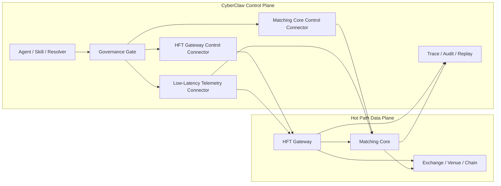
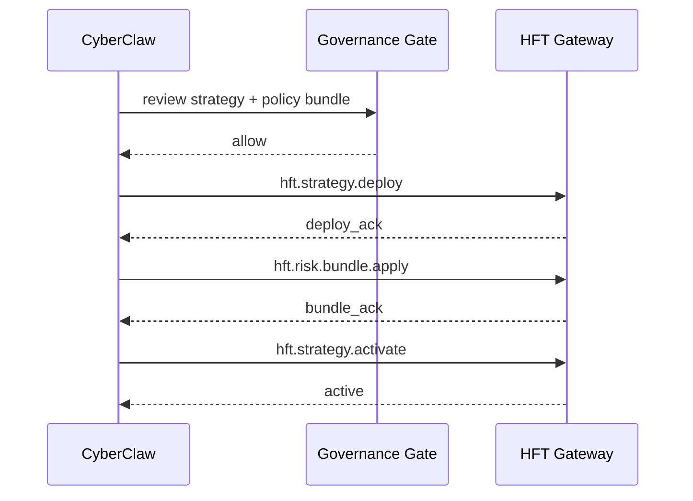
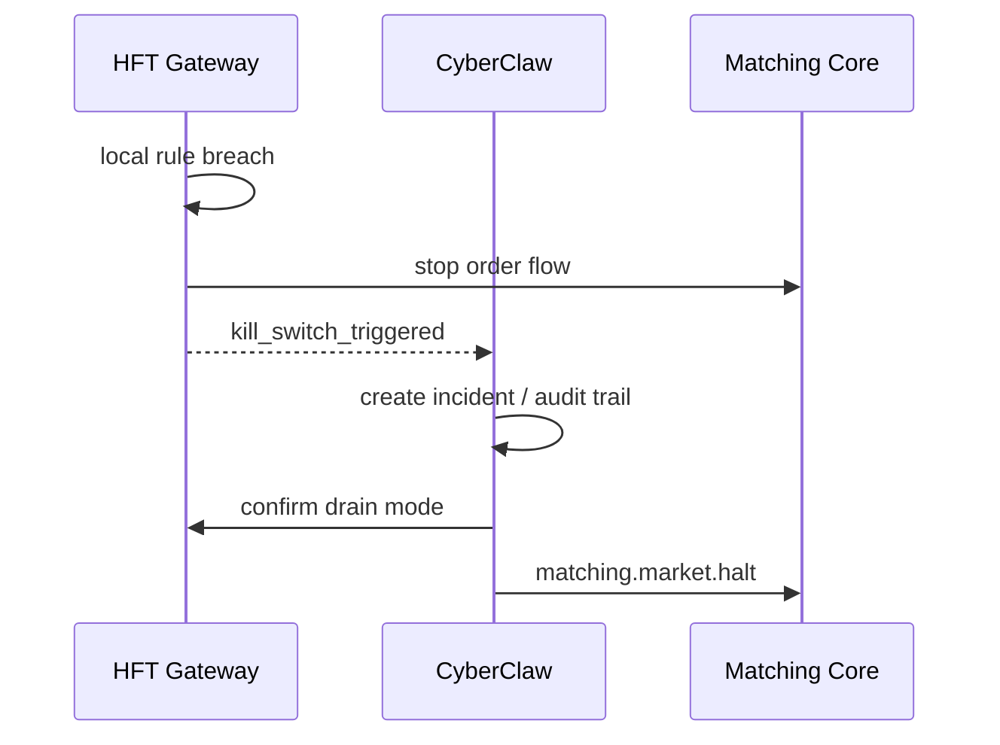
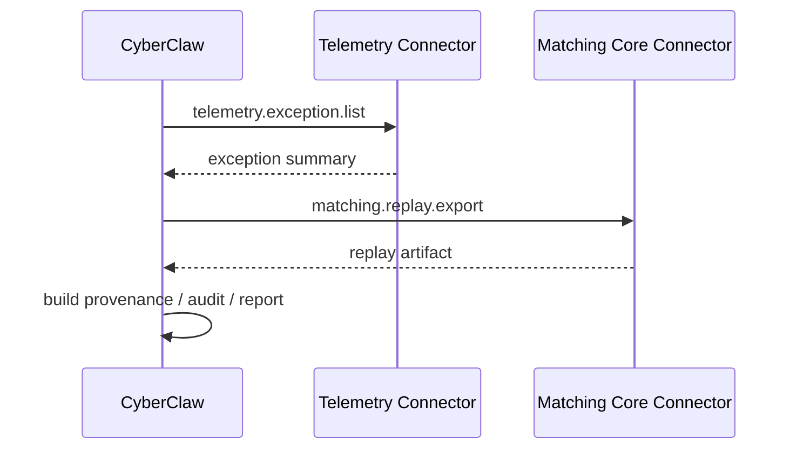

# CyberClaw HFT Control Plane Architecture v1

- Status: Draft
- Scope: Architecture
- Owner: CyberClaw Maintainers
- Last Updated: 2026-03-25
- Target: Post-Beta Runtime / External Low-Latency Systems

---

## 执行摘要

CyberClaw 可以管理 `Matching Core` 和 `HFT Gateway`，但不应直接成为它们的热路径执行内核。

正式定位如下：

> CyberClaw 负责高风险低延迟系统的控制面、治理面、审计面和恢复面；  
> `Matching Core` 与 `HFT Gateway` 负责微秒级到毫秒级热路径执行。

这不是妥协，而是架构分工：

1. `CyberClaw` 负责策略部署、参数下发、授权边界、风控模板、熔断、审计、回放、异常接管
2. `HFT Gateway` 负责行情接入、快速风控、订单生成、订单替换、订单路由
3. `Matching Core` 负责订单簿、撮合、账户冻结与释放、成交事件、确定性状态推进

核心原则只有一句：

> CyberClaw 调度的是系统行为边界，不是逐笔订单动作。

---

## 1. 为什么必须拆成两层

`HFT` 与撮合内核要求的是：

1. 固定而可预测的延迟
2. 极低抖动
3. 尽量少的分配与序列化
4. 尽量少的上下文切换
5. 明确的时间与顺序语义

CyberClaw 当前的主能力则是：

1. `Resolver`
2. `Governance Gate`
3. `Execution Service`
4. `Review Queue`
5. `Observability / SecurityEvent / Trace`
6. `Autopilot / Scheduler / Heartbeat`

这些能力适合控制面，不适合热路径。

因此必须区分：

1. **Data Plane / Hot Path**
2. **Control Plane / Governance Path**

如果不拆分，系统会同时失去：

1. 低延迟
2. 强治理
3. 高可观察
4. 易恢复

---

## 2. 正式定义

## 2.1 CyberClaw

CyberClaw 是：

1. 策略生命周期控制面
2. 风控策略分发面
3. 权限与审批控制面
4. 审计、回放、异常恢复控制面

CyberClaw 不是：

1. 撮合循环
2. 逐笔行情计算器
3. 亚毫秒下单线程
4. 高频撤改单执行线程

## 2.2 HFT Gateway

`HFT Gateway` 是：

1. 行情接入器
2. 快速本地风控执行器
3. 策略热路径运行器
4. 订单路由器
5. 低延迟状态聚合器

`HFT Gateway` 不负责：

1. 人工审批
2. 长周期审计存档
3. 跨团队治理配置管理
4. LLM / Agent 交互式规划

## 2.3 Matching Core

`Matching Core` 是：

1. 订单簿管理器
2. 撮合状态机
3. 成交事件生产者
4. 资金冻结 / 释放 / 持仓变更引擎

`Matching Core` 不负责：

1. 高层策略编排
2. 审批工作流
3. 产品级报表
4. 多 Agent 协作逻辑

---

## 3. 三系统职责矩阵

| 系统 | 核心职责 | 延迟目标 | 是否进入热路径 |
|---|---|---|---|
| `CyberClaw` | 策略控制、治理、审计、恢复 | 毫秒到秒级 | 否 |
| `HFT Gateway` | 行情、快速风控、订单路由 | 微秒到毫秒级 | 是 |
| `Matching Core` | 撮合、账本、成交 | 微秒级到低毫秒级 | 是 |

一个简单判断：

1. 如果动作影响“下一笔订单是否现在发出”，它必须在 `HFT Gateway / Matching Core`
2. 如果动作影响“这个系统应该按什么边界运行”，它应在 `CyberClaw`

---

## 4. 控制面与数据面分离



设计约束：

1. `CyberClaw -> Connector -> Capability -> HFT Gateway / Matching Core` 是唯一控制入口
2. `CyberClaw` 不直接调用逐笔订单接口，也不直接嵌入热路径状态机
3. `HFT Gateway -> Matching Core` 走内部热路径协议
4. `HFT Gateway / Matching Core -> CyberClaw` 回传聚合状态、风险事件、快照、回放材料

---

## 5. 调度的真正含义

在本架构中，“调度”不表示 CyberClaw 逐笔控制订单。

“调度”指的是以下控制动作：

1. `strategy.deploy`
2. `strategy.activate`
3. `strategy.pause`
4. `strategy.resume`
5. `strategy.retire`
6. `risk.limit.update`
7. `risk.profile.switch`
8. `market.allowlist.update`
9. `kill_switch.trigger`
10. `drain_mode.enable`
11. `snapshot.request`
12. `replay.export`
13. `rollout.start`
14. `rollout.rollback`

这些动作不要求微秒级，只要求：

1. 正确
2. 可审计
3. 可追踪
4. 可回滚

---

## 6. 预授权治理模型

如果每一笔订单都回到 CyberClaw 做治理判断，系统一定失败。

因此必须采用 **预授权治理**：

1. CyberClaw 负责生成并下发 `Policy Bundle`
2. `HFT Gateway` 在本地内存中执行这些规则
3. 热路径不回调控制面
4. 只有越界、异常、人工干预、熔断条件触发时才上报控制面

## 6.1 Policy Bundle 示例

```yaml
bundle_id: string
strategy_id: string
wallet_scope: string
market_allowlist:
  - BTC-USD
  - ETH-USD
max_notional_per_order: "50000"
max_position_notional: "250000"
max_cancel_rate_per_minute: 200
max_order_rate_per_second: 500
max_loss_per_day: "20000"
slippage_bps_ceiling: 15
kill_switch_rules:
  - type: drawdown
    threshold: "20000"
  - type: disconnect
    threshold_seconds: 5
  - type: reject_rate
    threshold_percent: 20
```

## 6.2 控制原则

1. 热路径只执行已批准的规则
2. 未授权动作不进入热路径
3. 超出预授权边界时，`HFT Gateway` 必须本地拒绝，再异步上报

---

## 7. Connector 设计

CyberClaw 与低延迟系统之间建议固定三类 connector：

1. `hft-gateway-control-connector`
2. `matching-core-control-connector`
3. `lowlatency-telemetry-connector`

必要时可以补充：

4. `risk-policy-distribution-connector`
5. `replay-artifact-connector`

这些 connector 都属于现有 `Connector` 一级对象，不新增新的平台对象类型。

## 7.1 `hft-gateway-control-connector`

职责：

1. 策略发布
2. 参数更新
3. 生命周期控制
4. 熔断与排空模式切换

推荐 capability：

1. `hft.strategy.deploy`
2. `hft.strategy.activate`
3. `hft.strategy.pause`
4. `hft.strategy.resume`
5. `hft.strategy.retire`
6. `hft.risk.bundle.apply`
7. `hft.drain_mode.enable`
8. `hft.kill_switch.trigger`
9. `hft.health.get`
10. `hft.snapshot.get`

## 7.2 `matching-core-control-connector`

职责：

1. 市场配置
2. 市场状态控制
3. 风险参数控制
4. 账本快照与回放入口

推荐 capability：

1. `matching.market.open`
2. `matching.market.close`
3. `matching.market.halt`
4. `matching.market.resume`
5. `matching.risk.param.update`
6. `matching.snapshot.get`
7. `matching.replay.export`
8. `matching.health.get`

## 7.3 `lowlatency-telemetry-connector`

职责：

1. 读取聚合指标
2. 读取关键异常事件
3. 读取热路径健康状态

推荐 capability：

1. `telemetry.feed.status.get`
2. `telemetry.order_rate.get`
3. `telemetry.reject_rate.get`
4. `telemetry.pnl.get`
5. `telemetry.latency.profile.get`
6. `telemetry.exception.list`
7. `telemetry.kill_switch.reason.get`

---

## 8. 不允许通过 CyberClaw 的热路径动作

以下动作不允许经过 CyberClaw 主执行链：

1. 行情逐 tick 更新
2. 逐笔下单
3. 逐笔撤单
4. 逐笔改单
5. 撮合循环
6. 风险内存态增量更新
7. 订单簿增量写入

这些动作只能存在于：

1. `HFT Gateway`
2. `Matching Core`

CyberClaw 只读取其**状态快照**和**聚合事件**。

---

## 9. 状态回传链路

状态回传不要求微秒级，但必须分层。

## 9.1 快速回报

由 `HFT Gateway / Matching Core` 异步推送：

1. 策略启动成功 / 失败
2. kill switch 触发
3. feed disconnect
4. reject rate 异常
5. position breach

目标延迟：

1. `10ms - 200ms`

## 9.2 聚合快照

周期性输出：

1. 当前仓位
2. 当前订单数
3. 当前拒单率
4. 当前延迟分布
5. 当前 PnL

目标周期：

1. `100ms`
2. `1s`
3. `5s`

由业务场景决定。

## 9.3 回放材料

异步落库：

1. 成交日志
2. 风控命中日志
3. kill switch 触发链
4. 策略版本与配置版本

目标：

1. 不阻塞热路径
2. 保证可回放与可审计

---

## 10. 控制时序

## 10.1 策略部署时序



## 10.2 熔断时序



## 10.3 回放时序



---

## 11. 延迟预算

为避免目标混乱，必须区分不同链路的延迟预算。

| 链路 | 目标 |
|---|---|
| 行情接入 -> 下单决策 | 微秒到毫秒 |
| 下单 -> 撤单 / 改单 | 微秒到毫秒 |
| 本地风控命中 | 微秒到毫秒 |
| kill switch 本地触发 | 低毫秒 |
| 状态上报到 CyberClaw | 毫秒到百毫秒 |
| 参数更新 / 策略切换 | 毫秒到秒级 |
| 审计导出 / 回放 | 秒级到分钟级 |

这张表的意义在于：

1. 热路径性能目标由 `HFT Gateway / Matching Core` 负责
2. 控制面性能目标由 CyberClaw 负责
3. 两者不混为一个 SLA

---

## 12. 实现建议

## 12.1 推荐实现方式

推荐三进程或三服务模型：

1. `CyberClaw`
2. `HFT Gateway`
3. `Matching Core`

接口建议：

1. 控制接口：`gRPC / QUIC / unix domain socket`
2. 快照接口：`gRPC / HTTP`
3. 事件流：`NATS / Kafka / Redpanda / 内部 ring buffer -> adapter`

## 12.2 不推荐实现方式

不建议：

1. 把 `Matching Core` 直接嵌进 CyberClaw `Execution Service`
2. 让热路径订单逐笔走 `Connector -> Governance -> Observability`
3. 让 LLM / Agent 直接参与微秒决策
4. 让回放写入阻塞热路径

---

## 13. 与 CyberClaw 对象模型的映射

| CyberClaw 对象 | 在该方案中的角色 |
|---|---|
| `Agent` | 负责策略与控制逻辑编排 |
| `Skill` | 负责策略模板、操作手册、响应 playbook |
| `Connector` | 负责控制 `HFT Gateway / Matching Core` 与读取其状态 |
| `Capability` | 负责控制动作与只读状态动作的治理单元 |
| `Platform Plugin` | 负责横切监控、告警、审计增强 |

注意：

1. `Matching Core` 和 `HFT Gateway` 是外部系统，不是新的平台一级对象
2. CyberClaw 通过 `Connector` 管它们，而不是把它们吸收进 `Agent Runtime`

---

## 14. 对 Web3 交易架构的关系

如果是普通 Web3 自动化交易，适用：

1. [WEB3_CONNECTOR_PACK_V1.md](/Users/cyber/cyberclawlabs/cyberclaw/docs/architecture/runtime/WEB3_CONNECTOR_PACK_V1.md)

如果是：

1. 低延迟策略
2. 订单密集型做市
3. 自建撮合
4. 高频撤改单

则应采用：

1. 本文档的 `CyberClaw + HFT Gateway + Matching Core` 分层架构

---

## 15. 最终规则

团队执行时，以以下规则为准：

1. CyberClaw 不进入撮合与逐笔订单热路径
2. `Matching Core` 不承担审批、审计和多 Agent 逻辑
3. `HFT Gateway` 本地执行预授权风控，不回调控制面逐笔审批
4. CyberClaw 只调度系统行为边界，不调度逐笔动作
5. 所有高风险控制动作仍然通过 `Connector -> Capability -> Governance`
6. 所有回报必须最终沉淀到 `Trace / SecurityEvent / Provenance / Replay`

---

## 16. 参考资料

1. [Hummingbot Connector Architecture](https://hummingbot.org/connectors/connectors/architecture/)
2. [Hummingbot Order Lifecycle](https://hummingbot.org/connectors/connectors/architecture/order_lifecycle/)
3. [CyberClaw Web3 Connector Pack Architecture](./WEB3_CONNECTOR_PACK_V1.md)
