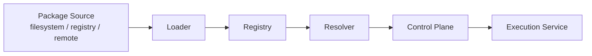
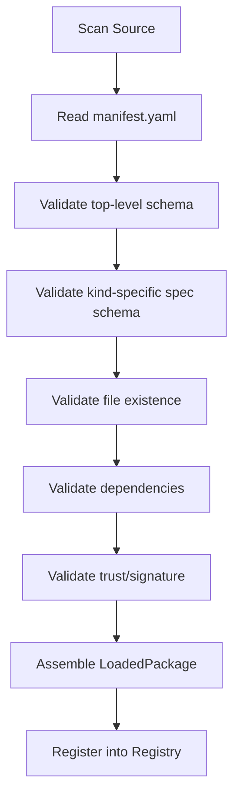
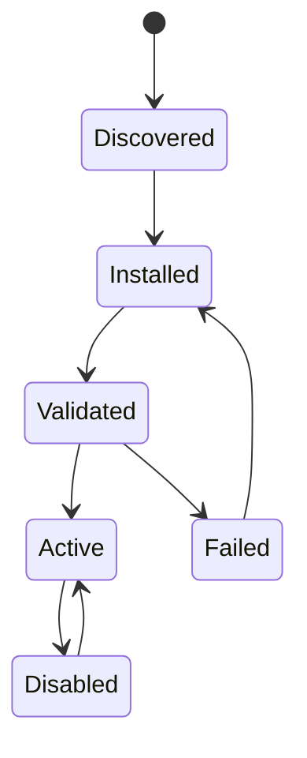
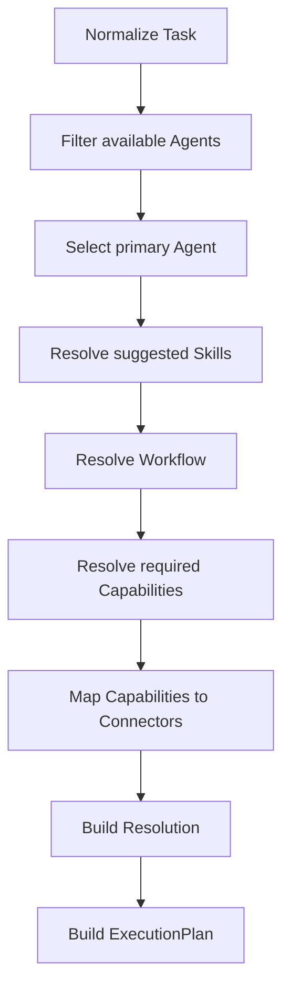
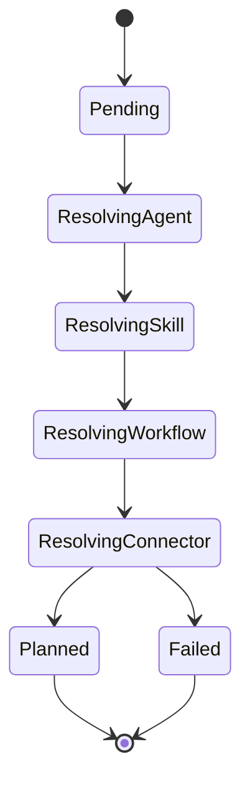

# CyberClaw Registry / Loader / Resolver 设计草案 v2.0

## 1. 目标

本文档定义 CyberClaw 中三类平台服务的职责与流程：

1. `Registry`
2. `Loader`
3. `Resolver`

目标：

1. 统一生态对象的发现、安装、校验、激活和查询
2. 统一 Agent / Skill / Connector / Platform Plugin 的加载流程
3. 统一从 `Task / Case / Context` 到 `ExecutionPlan` 的解析路径
4. 避免把安装逻辑、加载逻辑、调度解析逻辑混在一个模块里

---

## 2. 三者边界

## 2.1 `Registry`
Registry 是**平台事实来源**。

负责：

- 记录有哪些包
- 记录版本、状态、来源、信任信息
- 记录激活状态
- 提供查询索引

不负责：

- 解析具体文件内容
- 执行对象选择策略
- 执行 runtime 生命周期

## 2.2 `Loader`
Loader 是**对象装配器**。

负责：

- 扫描文件系统/远程源
- 读取 `manifest.yaml`
- 校验 schema
- 组装运行时可用对象
- 产出 `LoadedPackage`

不负责：

- 安装包到 registry
- 最终选择哪个对象执行
- 审批和治理

## 2.3 `Resolver`
Resolver 是**运行时选择器**。

负责：

- 根据 Task / Case / Context 选 Agent
- 选 Skill
- 选 Connector / Capability
- 选 Workflow
- 产出 `Resolution` 和 `ExecutionPlan`

不负责：

- 执行 connector
- 持久化 registry 元数据
- 解析 manifest 文件本身

---

## 3. 高层关系图



---

## 4. Registry 设计

## 4.1 职责

Registry 至少维护四类记录：

1. `PackageRecord`
2. `PackageVersionRecord`
3. `ActivationRecord`
4. `TrustRecord`

## 4.2 关键数据结构

```rust
#[derive(Debug, Clone)]
pub struct PackageRecord {
    pub id: String,
    pub kind: PackageKind,
    pub latest_version: String,
    pub installed_versions: Vec<String>,
    pub active_version: Option<String>,
    pub source: PackageSource,
    pub state: RegistryState,
}
```

```rust
#[derive(Debug, Clone)]
pub enum PackageSource {
    LocalPath(String),
    Registry(String),
    Git(String),
    Archive(String),
}

#[derive(Debug, Clone)]
pub enum RegistryState {
    Discovered,
    Installed,
    Validated,
    Active,
    Disabled,
    Failed,
}
```

## 4.3 Registry 必须支持的查询

1. 按 `kind + id` 查询
2. 按标签查询
3. 按 capability 查询 connector
4. 按 role 查询 agent
5. 按 skill 依赖查询
6. 按 active version 查询
7. 按 trust status 查询

---

## 5. Loader 设计

## 5.1 Loader 职责拆分

建议拆成四层：

1. `SourceScanner`
2. `ManifestReader`
3. `SchemaValidator`
4. `ObjectAssembler`

## 5.2 加载流程



## 5.3 `LoadedPackage`

```rust
#[derive(Debug, Clone)]
pub struct LoadedPackage {
    pub manifest: PackageManifest,
    pub object: LoadedObject,
    pub source: PackageSource,
}

#[derive(Debug, Clone)]
pub enum LoadedObject {
    Agent(LoadedAgent),
    Skill(LoadedSkill),
    Connector(LoadedConnector),
    PlatformPlugin(LoadedPlatformPlugin),
}
```

---

## 6. Kind-specific Loader 行为

## 6.1 Agent Loader

规则：

1. 必须存在 `manifest.yaml`
2. 必须存在 `AGENT.md`
3. 可选存在 `PERSONA.md`、`POLICY.md`、`MEMORY.md`
4. 需要校验默认 Skill / Connector 引用是否存在
5. 需要校验 `spawnPolicy` 是否合法

## 6.2 Skill Loader

规则：

1. 本地 loose skill 可只读 `SKILL.md`
2. 进入 registry 模式必须有 `manifest.yaml`
3. 必须校验 `SKILL.md` 存在
4. `workflowTemplates` 需要校验路径存在
5. `requiredCapabilities` 只校验格式，不强制在加载时绑定到具体 connector

## 6.3 Connector Loader

规则：

1. 必须存在 `manifest.yaml`
2. 必须存在 `spec.capabilities`
3. 每个 capability 都必须有 input/output schema
4. 认证模式字段必须通过 schema 校验
5. 网络 allowlist 字段必须合法

## 6.4 Platform Plugin Loader

规则：

1. 必须存在 `manifest.yaml`
2. 必须存在 hooks
3. 必须存在 failurePolicy
4. 必须校验 hooks 事件名是否合法
5. 必须校验平台 API 权限声明是否合法

---

## 7. Registry 状态机

## 7.1 包状态机



### 状态定义

- `Discovered`：已发现，但未安装
- `Installed`：已落地到本地目录
- `Validated`：schema / 文件 / trust 校验通过
- `Active`：当前启用版本
- `Disabled`：已安装但停用
- `Failed`：校验失败或装配失败

## 7.2 Loader 失败分类

```rust
#[derive(Debug, Clone)]
pub enum LoadFailureKind {
    MissingManifest,
    SchemaViolation,
    MissingArtifact,
    InvalidDependency,
    InvalidHook,
    InvalidCapability,
    TrustValidationFailed,
    UnsupportedCompatibility,
}
```

---

## 8. Resolver 设计

## 8.1 输入

Resolver 的输入不应该是自然语言原文，而应该是结构化上下文：

```rust
#[derive(Debug, Clone)]
pub struct ResolutionInput {
    pub task: Task,
    pub case: Option<Case>,
    pub actor: ActorRef,
    pub workspace: Option<WorkspaceRef>,
    pub session: Option<SessionRef>,
    pub available_agents: Vec<AgentId>,
    pub available_skills: Vec<SkillId>,
    pub available_connectors: Vec<ConnectorId>,
}
```

## 8.2 输出

```rust
#[derive(Debug, Clone)]
pub struct Resolution {
    pub agent: AgentId,
    pub skills: Vec<SkillId>,
    pub workflow: Option<WorkflowRef>,
    pub connectors: Vec<ConnectorId>,
    pub capabilities: Vec<CapabilityId>,
    pub reasons: Vec<String>,
}
```

```rust
#[derive(Debug, Clone)]
pub struct ExecutionPlan {
    pub resolution: Resolution,
    pub actions: Vec<PlannedAction>,
    pub review_required: bool,
}
```

## 8.3 Resolver 过程



---

## 9. Resolver 选择策略

## 9.1 Agent 选择

优先级：

1. 显式指定的 Agent
2. 与 `TaskKind` 匹配的 Agent
3. 与 `Case` 标签匹配的 Agent
4. 默认 `MasterAgent`

## 9.2 Skill 选择

优先级：

1. Agent 默认 Skill
2. Task 显式绑定 Skill
3. 根据 capability 需求补充 Skill
4. 根据 workflow 模板补充 Skill

## 9.3 Connector 选择

优先级：

1. 满足 capability 的 active connector
2. 满足治理和租户策略的 connector
3. 与 Agent 默认 connector 集合相交的 connector
4. 风险更低、审批更少的 connector

---

## 10. Resolver 状态机



### 状态定义

- `Pending`：等待解析
- `ResolvingAgent`：正在选择 Agent
- `ResolvingSkill`：正在选择 Skill
- `ResolvingWorkflow`：正在匹配 workflow
- `ResolvingConnector`：正在匹配 connector/capability
- `Planned`：解析完成，生成执行计划
- `Failed`：解析失败

---

## 11. 事件与 Hook 点

Registry / Loader / Resolver 应暴露事件，供 `Platform Plugin` 监听。

建议事件：

1. `package.discovered`
2. `package.installed`
3. `package.validated`
4. `package.activated`
5. `package.failed`
6. `resolution.started`
7. `resolution.completed`
8. `resolution.failed`

这些事件不属于业务事件，而是平台运行事件。

---

## 12. trait 草案

## 12.1 Registry trait

```rust
#[async_trait::async_trait]
pub trait Registry {
    async fn upsert(&self, package: PackageRecord) -> anyhow::Result<()>;
    async fn get(&self, kind: PackageKind, id: &str) -> anyhow::Result<Option<PackageRecord>>;
    async fn list(&self, kind: Option<PackageKind>) -> anyhow::Result<Vec<PackageRecord>>;
    async fn activate(&self, kind: PackageKind, id: &str, version: &str) -> anyhow::Result<()>;
}
```

## 12.2 Loader trait

```rust
#[async_trait::async_trait]
pub trait Loader {
    async fn load(&self, source: PackageSource) -> anyhow::Result<LoadedPackage>;
}
```

## 12.3 Resolver trait

```rust
#[async_trait::async_trait]
pub trait Resolver {
    async fn resolve(&self, input: ResolutionInput) -> anyhow::Result<Resolution>;
    async fn plan(&self, input: ResolutionInput) -> anyhow::Result<ExecutionPlan>;
}
```

---

## 13. 失败策略建议

## 13.1 Registry

- registry 写入失败不应导致已运行 execution 崩溃
- active version 切换应原子化

## 13.2 Loader

- 任一对象加载失败，不应污染已激活对象
- 失败对象进入 `Failed` 状态并保留错误原因

## 13.3 Resolver

- 没有匹配 Agent 时回退 `MasterAgent`
- 没有匹配 Connector 时应明确返回 `CapabilityUnavailable`
- 无法生成安全执行计划时应失败，不做模糊执行

---

## 14. 推荐实现边界

### `cyberclaw-control-plane`
负责：

- 调用 registry
- 调用 resolver
- 把 resolution 交给 execution service

### `cyberclaw-skill-runtime`
负责：

- Skill loader 实现
- Skill-specific schema 验证

### `cyberclaw-connectors`
负责：

- Connector loader 实现
- capability schema 验证

### `cyberclaw-platform-plugins`
负责：

- Platform Plugin loader 实现
- hook registry

### `cyberclaw-store`
负责：

- Registry 持久化实现
- activation / trust / state 落库

---

## 15. 一句话结论

> **Registry 负责记录事实，Loader 负责组装对象，Resolver 负责做运行时选择。三者必须解耦，否则平台会把安装、加载、执行计划三类职责混成一个不可维护的中心模块。**
