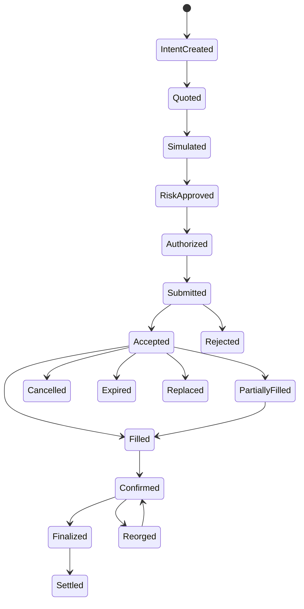
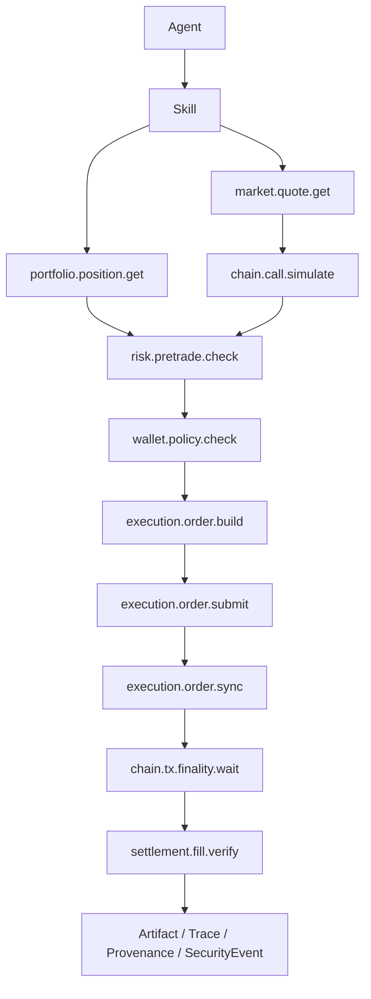
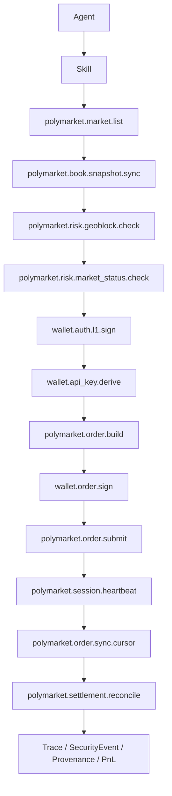

# CyberClaw Web3 Connector Pack Architecture v1

- Status: Draft
- Scope: Architecture
- Owner: CyberClaw Maintainers
- Last Updated: 2026-03-25
- Target: Post-Beta Connector / Governance / Execution Plane

---

## 执行摘要

CyberClaw 在 `Web3` 生态中的正式定位是：

> 面向高风险链上业务的受控智能体控制平面。

它适合承载：

1. 交易自动化
2. 资金操作治理
3. 风险控制与审批
4. 成交回放与审计
5. 多 Agent 协同的链上运营

它不应被定义为：

1. 撮合引擎
2. `HFT` 低延迟内核
3. 明文私钥托管器
4. 绕过审批和审计的交易机器人框架

在 Web3 场景下，CyberClaw 的核心原则不变：

1. 所有外部能力统一通过 `Connector -> Capability` 接入
2. 所有高风险动作统一经过 `Governance Gate`
3. 所有链上动作必须具备 `Trace / SecurityEvent / Provenance / Replay`
4. `Skill` 负责方法与策略表达，不直接拥有执行权限
5. `Platform Plugin` 只做横切增强，不承载交易主执行链

---

## 1. 平台适配判断

结合当前平台对象模型与执行骨架，CyberClaw 已具备作为 Web3 控制平面的基础条件：

1. 统一对象模型：`Agent / Skill / Connector / Capability / Platform Plugin`
2. 统一执行骨架：`Execution / Review / Trace / Artifact / Provenance`
3. 统一治理骨架：风险分级、策略判断、审批与拒绝
4. 统一运行时边界：`Native / Process / Container`
5. 统一持续执行模式：`Autopilot`

相关实现与设计入口：

1. [ARCHITECTURE_V2.0.md](/Users/cyber/cyberclawlabs/cyberclaw/docs/architecture/overview/ARCHITECTURE_V2.0.md)
2. [capability.rs](/Users/cyber/cyberclawlabs/cyberclaw/crates/cyberclaw-core/src/capability.rs)
3. [execution.rs](/Users/cyber/cyberclawlabs/cyberclaw/crates/cyberclaw-core/src/execution.rs)
4. [policy.rs](/Users/cyber/cyberclawlabs/cyberclaw/crates/cyberclaw-governance/src/policy.rs)
5. [mode.rs](/Users/cyber/cyberclawlabs/cyberclaw/crates/cyberclaw-connectors/src/runtime/mode.rs)

当前缺口同样明确：

1. 仓库内尚无 `Web3` 专用 connector 实现
2. 治理目前以静态 `Capability risk` 为主，尚未接入交易上下文风控
3. 平台性能定位是“受控自动化”，不是“超低延迟交易核心”

因此，Web3 方案的重点不是改对象模型，而是补齐 **Connector 执行面 + 动态治理面 + 回放闭环**。

---

## 2. 适用范围与边界

## 2.1 适用范围

本方案适用于以下 `Web3` 场景：

1. `Treasury Ops`：白名单转账、批量支付、金库治理
2. `DeFi Execution`：换币、调仓、借贷、还款、头寸清理
3. `Market Making / Arbitrage Automation`：事件驱动执行、半自动做市、跨 venue 协同
4. `Risk Ops`：额度检查、熔断、策略守卫、紧急暂停
5. `Backoffice / Reconciliation`：持仓、成交、PnL、审计导出
6. `Compliance-heavy Web3 Ops`：地址筛查、地域限制、审批留痕、证据链

## 2.2 非目标

本方案明确不做：

1. 交易所撮合内核
2. 毫秒以下 `HFT` 路径
3. 让 Agent 直接托管生产私钥
4. 在 `Skill` 中嵌入交易 SDK 并绕过 Connector
5. 将外部交易平台状态直接并入 `Memory Core`
6. 在第一阶段同时统一所有链、所有 venue、所有产品类型

如果业务要求进入：

1. 自建撮合
2. 高频撤改单
3. 热路径本地风控
4. 微秒到低毫秒级执行回路

应切换到：

1. [CyberClaw HFT Control Plane Architecture](./CYBERCLAW_HFT_CONTROL_PLANE_ARCHITECTURE_V1.md)

---

## 3. Web3 Connector Pack 的正式分层

CyberClaw 的 Web3 Connector 体系分为三层：

1. **通用基础层**：跨链、跨 venue 通用的底座 connector
2. **业务能力层**：围绕交易、结算、合规、风控的能力 connector
3. **场景适配层**：Polymarket、Uniswap、Hyperliquid、Aave、Safe 等平台专用 connector

这三层都仍然属于 `Connector`，不引入新的一级对象。

---

## 4. 通用 Web3 Connector 全集

## 4.1 核心基础 Connector

第一组回答“链上最基本能力从哪里来”。

1. `web3-market-data-connector`
2. `web3-portfolio-state-connector`
3. `web3-chain-rpc-connector`
4. `web3-wallet-signer-connector`

## 4.2 核心业务 Connector

第二组回答“策略如何变成实际动作”。

1. `web3-execution-connector`
2. `web3-risk-control-connector`
3. `web3-settlement-recon-connector`

## 4.3 扩展业务 Connector

第三组按产品形态和业务类型扩展。

1. `web3-compliance-screening-connector`
2. `web3-bridge-connector`
3. `web3-lending-connector`
4. `web3-staking-connector`
5. `web3-perp-venue-connector`
6. `web3-mev-relay-connector`
7. `web3-governance-vote-connector`
8. `web3-treasury-policy-connector`
9. `web3-notification-connector`
10. `web3-analytics-report-connector`

## 4.4 场景适配 Connector

第四组是 venue / protocol / product 专用 connector。

1. `polymarket-*`
2. `uniswap-*`
3. `hyperliquid-*`
4. `aave-*`
5. `safe-*`
6. `coinbase-advanced-*`
7. `binance-*`

原则：

1. 通用抽象优先放在 `web3-*`
2. 具体平台差异由 `venue-specific connector` 吸收
3. 不为了统一而牺牲真实业务语义

---

## 5. 第一阶段建议固定的 7 个通用核心 Connector

第一阶段正式固定为以下 7 个：

1. `web3-market-data-connector`
2. `web3-portfolio-state-connector`
3. `web3-chain-rpc-connector`
4. `web3-wallet-signer-connector`
5. `web3-execution-connector`
6. `web3-risk-control-connector`
7. `web3-settlement-recon-connector`

职责矩阵如下：

| Connector | 回答的问题 | 主要职责 | 默认风险基调 |
|---|---|---|---|
| `web3-market-data-connector` | 市场现在是什么状态 | quote、orderbook、pool、gas、mempool signal | `Low` |
| `web3-portfolio-state-connector` | 当前账户状态如何 | balance、position、allowance、debt、pending tx | `Low` |
| `web3-chain-rpc-connector` | 链会如何执行 | simulate、estimateGas、nonce、receipt、finality | `Low/Medium` |
| `web3-wallet-signer-connector` | 这笔交易能否被授权和签名 | policy check、sign、Safe、KMS/HSM/MPC | `Critical` |
| `web3-execution-connector` | 交易如何构建、提交和同步 | route、build、order submit、tx broadcast、replace、cancel、sync | `Medium/High` |
| `web3-risk-control-connector` | 交易是否允许执行 | pre-trade、limit、slippage、exposure、kill switch | `Medium/High/Critical` |
| `web3-settlement-recon-connector` | 最终如何确认和结算 | fill、receipt、reconcile、PnL、proof export | `Low/Medium` |

---

## 6. 通用 Capability 设计

## 6.1 `web3-market-data-connector`

建议 capability：

1. `market.quote.get`
2. `market.book.snapshot`
3. `market.book.stream.open`
4. `market.pool.state.get`
5. `market.gas.oracle.get`
6. `market.mempool.signal.get`

## 6.2 `web3-portfolio-state-connector`

建议 capability：

1. `portfolio.balance.get`
2. `portfolio.position.get`
3. `portfolio.allowance.get`
4. `portfolio.debt.get`
5. `portfolio.exposure.get`
6. `portfolio.pending_tx.get`

## 6.3 `web3-chain-rpc-connector`

建议 capability：

1. `chain.call.simulate`
2. `chain.tx.estimate_gas`
3. `chain.tx.nonce.next`
4. `chain.tx.receipt.get`
5. `chain.tx.finality.wait`
6. `chain.block.tag.query`

## 6.4 `web3-wallet-signer-connector`

建议 capability：

1. `wallet.policy.check`
2. `wallet.tx.sign`
3. `wallet.batch.sign`
4. `wallet.safe.propose`
5. `wallet.safe.execute`
6. `wallet.key.rotate`

生产约束：

1. 默认只允许 `Remote / Process` 模式
2. 默认不允许生产热私钥进入 Agent 主进程
3. 默认优先 `Safe / KMS / HSM / MPC`

## 6.5 `web3-execution-connector`

建议 capability：

1. `execution.route.quote`
2. `execution.order.build`
3. `execution.order.submit`
4. `execution.order.cancel`
5. `execution.order.replace`
6. `execution.order.sync`
7. `execution.tx.broadcast`
8. `execution.tx.broadcast_private`

## 6.6 `web3-risk-control-connector`

建议 capability：

1. `risk.pretrade.check`
2. `risk.limit.check`
3. `risk.slippage.check`
4. `risk.exposure.snapshot`
5. `risk.strategy.guard`
6. `risk.kill_switch`

## 6.7 `web3-settlement-recon-connector`

建议 capability：

1. `settlement.fill.verify`
2. `settlement.balance.reconcile`
3. `settlement.pnl.compute`
4. `settlement.proof.export`
5. `settlement.exception.open`

---

## 7. 通用交易业务模型

Web3 交易不应只依赖通用 `Execution` 主类型。建议以 artifact schema 形式补充业务级模型。

## 7.1 Trade Intent

```yaml
intent_id: string
strategy_id: string
wallet_id: string
venue_id: string
chain_id: number
market_id: string
side: buy | sell | swap | transfer | repay | borrow
asset_in: string
asset_out: string
amount_in: string
min_amount_out: string
notional_usd: string
slippage_bps: u32
deadline_unix: u64
client_order_id: string
```

## 7.2 Order Execution Envelope

```yaml
intent_id: string
quote_id: string
route_id: string
execution_mode: order
venue_order_id: string
client_order_id: string
order_type: limit | market | rfq
side: buy | sell
price: string
size: string
time_in_force: gtc | ioc | fok
status: created | submitted | accepted | partially_filled | filled | cancelled | expired | rejected | replaced
filled_size: string
remaining_size: string
auth_context_id: string
submitted_at: string
updated_at: string
```

## 7.3 Onchain Settlement Envelope

```yaml
intent_id: string
related_order_id: string
execution_mode: onchain_settlement
chain_id: number
wallet_id: string
simulation_passed: bool
gas_estimate: string
max_fee_per_gas: string
max_priority_fee_per_gas: string
nonce: u64
broadcast_mode: public | private
tx_hash: string
replacement_of: string
```

## 7.4 Settlement Record

```yaml
intent_id: string
tx_hash: string
block_number: u64
confirmation_level: pending | accepted | confirmed | finalized
actual_amount_in: string
actual_amount_out: string
gas_used: string
effective_gas_price: string
pnl_delta: string
reconciled: bool
```

---

## 8. 通用执行状态机



强制要求：

1. `Simulated` 必须前置
2. `Accepted / PartiallyFilled / Filled` 用于订单执行语义
3. `Confirmed / Finalized` 用于链上结算语义
4. `Replaced / Reorged / Cancelled / Expired / Rejected` 必须进入回放链路

---

## 9. 通用治理模型

## 9.1 静态风险与动态风险并存

静态 `Capability risk` 继续保留，但 Web3 必须增加动态风控上下文。

建议动态字段：

1. `notional_usd`
2. `wallet_tier`
3. `chain_id`
4. `venue_id`
5. `asset_allowlist_hit`
6. `counterparty_allowlist_hit`
7. `simulation_passed`
8. `slippage_bps`
9. `broadcast_mode`
10. `pending_nonce_gap`
11. `strategy_mode`
12. `exposure_after_trade`

## 9.2 通用风险矩阵

| Capability | 默认风险 | 动态提升条件 |
|---|---|---|
| `market.*` | `Low` | 无 |
| `portfolio.*` | `Low` | 跨租户读取提升到 `Medium` |
| `chain.call.simulate` | `Low` | 带状态覆盖或批量仿真提升到 `Medium` |
| `execution.order.build` | `Medium` | 非白名单 venue、长尾资产提升到 `High` |
| `wallet.tx.sign` | `Critical` | 默认保持 `Critical` |
| `execution.order.submit` | `High` | 大额、非白名单 venue、越过价格带时通常拒绝 |
| `execution.tx.broadcast` | `High` | 大额、公开广播、未通过仿真时通常拒绝 |
| `execution.tx.broadcast_private` | `High` | 保持 `High`，但审批频率可策略化调优 |
| `risk.kill_switch` | `Critical` | 默认保持 `Critical` |
| `wallet.key.rotate` | `Critical` | 默认保持 `Critical` |

## 9.3 通用治理规则

1. 未通过 `simulation` 的交易默认拒绝
2. 未通过 `risk.pretrade.check` 的交易默认拒绝
3. 未通过 `wallet.policy.check` 的签名默认拒绝
4. 超过限额或策略越界的交易默认进入 review
5. `Critical` 能力默认要求人工审批或多签链路

---

## 10. 运行时与隔离建议

| Connector | 推荐运行模式 |
|---|---|
| `web3-market-data-connector` | `Native` 或 `Remote` |
| `web3-portfolio-state-connector` | `Native` 或 `Remote` |
| `web3-chain-rpc-connector` | `Remote` 优先 |
| `web3-wallet-signer-connector` | `Remote` 或 `Process` |
| `web3-execution-connector` | `Process` 或 `Remote` |
| `web3-risk-control-connector` | `Native` 或 `Remote` |
| `web3-settlement-recon-connector` | `Native` 或 `Remote` |

关键约束：

1. `wallet signer` 不使用 `Native` 明文热私钥生产模式
2. `execution` 默认支持超时、重试、幂等键
3. `chain rpc` 默认支持多节点回退与确认 / 最终性语义
4. `execution` 默认支持 nonce 锁与替换交易
5. `market` 与 `execution` 默认支持限流预算、游标同步与 WebSocket 重同步
6. 订单型 venue 默认支持快照校准、增量重放和回压控制

---

## 11. 可观察、可审计、可回放基线

每一笔交易或链上动作，至少记录：

1. `trace_id`
2. `execution_id`
3. `intent_id`
4. `strategy_id`
5. `wallet_id`
6. `venue_id`
7. `chain_id`
8. `capability_id`
9. `quote_id`
10. `route_id`
11. `venue_order_id`
12. `tx_hash`
13. `nonce`
14. `slippage_bps`
15. `notional_usd`
16. `risk_decision`
17. `review_id`
18. `confirmation_level`
19. `pnl_delta`
20. `auth_context_id`
21. `rate_limit_bucket`

统一要求：

1. `submit / sign / replace / cancel` 必须产生 `SecurityEvent`
2. `review approve / reject` 必须能回溯到 `intent_id`
3. 交易失败必须保留仿真、构单、广播上下文
4. 回放必须能区分报价、风控、签名、广播、最终性、对账等失败阶段

---

## 12. 通用主链路



主链原则：

1. 先读状态，再形成意图
2. 先仿真，再风控
3. 先风控，再授权
4. 先订单执行，再进入链上结算确认
5. 订单接受不等于链上最终结算完成

---

## 13. Polymarket Connector Pack

Polymarket 不应只被视作“普通 DEX”。它是**事件市场 + CLOB 交易 + Polygon 结算 + 市场解析 / 赎回**组合场景。

因此，Polymarket 需要在通用 Web3 Connector 之上，增加专用能力包。

## 13.1 Polymarket 专用 Connector 组

建议固定为以下 7 个：

1. `polymarket-market-connector`
2. `polymarket-account-connector`
3. `polymarket-clob-execution-connector`
4. `polygon-rpc-connector`
5. `wallet-signer-connector`
6. `polymarket-risk-connector`
7. `polymarket-settlement-connector`

说明：

1. `wallet-signer-connector` 继续复用通用签名 connector
2. `polygon-rpc-connector` 是 `web3-chain-rpc-connector` 在 Polygon 场景下的专用实例
3. `Polymarket` 的专用差异主要体现在 `market / execution / risk / settlement`

## 13.2 Polymarket Connector 职责矩阵

| Connector | 主要职责 |
|---|---|
| `polymarket-market-connector` | 市场发现、事件结构、盘口、价格、成交、WebSocket 订阅 |
| `polymarket-account-connector` | 用户持仓、余额、成交历史、活动查询 |
| `polymarket-clob-execution-connector` | CLOB 下单、撤单、改单、订单状态同步 |
| `polygon-rpc-connector` | Polygon 模拟、确认、链上回执与最终性 |
| `wallet-signer-connector` | Polymarket 认证凭证派生、订单签名、Safe/KMS 授权 |
| `polymarket-risk-connector` | 地域限制、市场可交易性、限额、价格异常、策略守卫 |
| `polymarket-settlement-connector` | 市场 resolution 跟踪、仓位赎回、对账、PnL |

## 13.3 Polymarket 关键 capability

### `polymarket-market-connector`

1. `polymarket.market.list`
2. `polymarket.market.get`
3. `polymarket.book.get`
4. `polymarket.book.stream.open`
5. `polymarket.book.snapshot.sync`
6. `polymarket.book.stream.resync`
7. `polymarket.trade.recent.get`
8. `polymarket.rate_limit.profile.get`

### `polymarket-account-connector`

1. `polymarket.position.list`
2. `polymarket.position.closed.list`
3. `polymarket.activity.list`
4. `polymarket.balance.get`

### `polymarket-clob-execution-connector`

1. `polymarket.order.quote`
2. `polymarket.order.build`
3. `polymarket.order.submit`
4. `polymarket.order.cancel`
5. `polymarket.order.status.get`
6. `polymarket.order.sync`
7. `polymarket.order.sync.cursor`
8. `polymarket.order.reconcile.delta`
9. `polymarket.session.heartbeat`

### `wallet-signer-connector`

1. `wallet.policy.check`
2. `wallet.auth.l1.sign`
3. `wallet.api_key.create`
4. `wallet.api_key.derive`
5. `wallet.api_key.list`
6. `wallet.api_key.delete`
7. `wallet.order.sign`
8. `wallet.safe.propose`
9. `wallet.safe.execute`

### `polymarket-risk-connector`

1. `polymarket.risk.geoblock.check`
2. `polymarket.risk.market_status.check`
3. `polymarket.risk.notional.check`
4. `polymarket.risk.price_band.check`
5. `polymarket.risk.strategy.guard`
6. `polymarket.risk.rate_limit.check`

### `polymarket-settlement-connector`

1. `polymarket.settlement.resolution.get`
2. `polymarket.settlement.redeem.check`
3. `polymarket.settlement.redeem.submit`
4. `polymarket.settlement.reconcile`
5. `polymarket.settlement.proof.export`

## 13.4 Polymarket 专用治理点

Polymarket 必须额外检查：

1. 地域限制与合规阻断
2. 市场是否允许下单
3. 市场是否接近 resolution 或已暂停
4. 市场规则是否支持当前策略
5. `CLOB` 认证链路是否有效
6. 订单与持仓状态是否同步

## 13.5 Polymarket 专用状态补充

除通用交易状态机外，Polymarket 还应补充：

1. `AuthReady`
2. `CredentialsReady`
3. `HeartbeatAlive`
4. `OrderAccepted`
5. `OrderPartiallyFilled`
6. `OrderFullyFilled`
7. `MarketResolved`
8. `Redeemable`
9. `Redeemed`

## 13.6 Polymarket 主链路



---

## 14. 分阶段实施建议

## Phase A：通用 Web3 MVP

1. `web3-market-data-connector`
2. `web3-portfolio-state-connector`
3. `web3-chain-rpc-connector`
4. `web3-wallet-signer-connector`
5. `web3-execution-connector`
6. `web3-risk-control-connector`

目标：

1. 打通 `quote -> simulate -> risk -> authorize -> order submit -> sync -> finality`
2. 先支持 `EVM`
3. 先支持 `Safe / KMS`

## Phase B：通用闭环

1. `web3-settlement-recon-connector`
2. `intent / order / onchain settlement` artifact schema
3. 回放与审计导出工具

目标：

1. 打通 `submit -> included -> finalized -> reconciled`
2. 让交易闭环可回放

## Phase C：Polymarket Pack

1. `polymarket-market-connector`
2. `polymarket-account-connector`
3. `polymarket-clob-execution-connector`
4. `polymarket-risk-connector`
5. `polymarket-settlement-connector`

目标：

1. 打通 `market discovery -> auth credential -> order submit -> heartbeat -> order sync -> settlement`
2. 形成 `Polymarket` 场景的完整专用 Pack

## Phase D：更多场景适配

1. `perp venue connector`
2. `lending connector`
3. `bridge connector`
4. `compliance screening connector`

---

## 15. 最终规则

团队执行时，以以下规则为准：

1. Web3 能力只通过 `Connector` 接入
2. 第一阶段固定通用 7 Connector
3. 通用 Pack 之上允许挂接平台专用 Pack
4. 必须增加 `Portfolio State`
5. 必须采用 `Intent -> Order Execution -> Onchain Settlement` 双包络生命周期模型
6. 必须把 `Simulation / Pre-trade Check` 设为前置门槛
7. 必须把签名边界收紧到 `Safe / KMS / HSM / MPC`
8. 必须把动态风控上下文接入治理
9. Polymarket 必须使用专用 Connector Pack，不直接拿通用 Pack 粗暴代替
10. CyberClaw 在 Web3 中的定位是**受控交易与链上操作控制平面**

---

## 16. 参考资料

1. [Ethereum JSON-RPC API](https://ethereum.org/developers/docs/apis/json-rpc/)
2. [Flashbots Protect Overview](https://docs.flashbots.net/flashbots-protect/overview)
3. [Flashbots Protect Nonce Management](https://docs.flashbots.net/flashbots-protect/nonce-management)
4. [Safe Guards](https://docs.safe.global/advanced/smart-account-guards)
5. [Safe Modules](https://docs.safe.global/advanced/smart-account-modules)
6. [Uniswap Trading API Integration Guide](https://docs.uniswap.org/api/trading/integration-guide)
7. [Hummingbot Connector Architecture](https://hummingbot.org/connectors/connectors/architecture/)
8. [Hummingbot Order Lifecycle](https://hummingbot.org/connectors/connectors/architecture/order_lifecycle/)
9. [OFAC Sanctions Compliance Guidance for the Virtual Currency Industry](https://ofac.treasury.gov/media/913571/download?inline=)
10. [FinCEN CVC Guidance (FIN-2019-G001)](https://www.fincen.gov/resources/statutes-regulations/guidance/application-fincens-regulations-certain-business-models)
11. [Polymarket Docs](https://docs.polymarket.com/)
12. [Polymarket API Overview](https://docs.polymarket.com/api-reference/overview)
13. [Polymarket Trading Quickstart](https://docs.polymarket.com/trading/quickstart)
14. [Polymarket Gamma Markets Structure](https://docs.polymarket.com/developers/gamma-markets-api/gamma-structure)
15. [Polymarket Geographic Restrictions](https://docs.polymarket.com/api-reference/geoblock)
