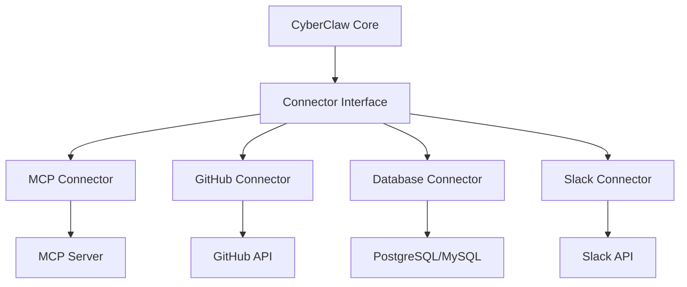

# CyberClaw Connector 开发指南

## 目录

1. [概述](#概述)
2. [Connector 架构](#connector-架构)
3. [创建你的第一个 Connector](#创建你的第一个-connector)
4. [MCP Connector 开发](#mcp-connector-开发)
5. [External Connector 开发](#external-connector-开发)
6. [认证与授权](#认证与授权)
7. [错误处理与重试](#错误处理与重试)
8. [测试](#测试)
9. [最佳实践](#最佳实践)
10. [API 参考](#api-参考)

## 概述

Connector 是 CyberClaw 与外部系统交互的桥梁，负责：

- 将外部服务能力映射为 Capabilities
- 处理协议转换和数据适配
- 管理连接生命周期
- 实施安全策略

### Connector 类型

1. **MCP Connectors**: 支持 Model Context Protocol
2. **API Connectors**: REST/GraphQL API 集成
3. **Database Connectors**: 数据库连接
4. **Message Queue Connectors**: 消息队列集成
5. **Custom Connectors**: 自定义协议

## Connector 架构

### 核心概念



### 生命周期

1. **初始化**: 建立连接，验证配置
2. **发现**: 动态发现可用 Capabilities
3. **执行**: 处理 Capability 调用
4. **清理**: 关闭连接，释放资源

## 创建你的第一个 Connector

### 步骤 1: 项目设置

```bash
# 创建新项目
cargo new my-connector --lib
cd my-connector

# 添加依赖
cat >> Cargo.toml << 'EOF'
[dependencies]
cyberclaw-core = "0.1"
cyberclaw-connectors = "0.1"
async-trait = "0.1"
tokio = { version = "1", features = ["full"] }
serde = { version = "1", features = ["derive"] }
serde_json = "1"
anyhow = "1"
tracing = "0.1"
EOF
```

### 步骤 2: 实现 Connector Trait

```rust
use cyberclaw_connectors::{
    Connector, ConnectorManifest, CapabilityContract,
    CapabilityRequest, CapabilityResponse, RiskLevel,
};
use async_trait::async_trait;
use anyhow::Result;

pub struct MyConnector {
    config: MyConfig,
    client: MyClient,
}

#[derive(Debug, Clone)]
pub struct MyConfig {
    pub api_url: String,
    pub api_key: String,
    pub timeout_secs: u64,
}

#[async_trait]
impl Connector for MyConnector {
    fn id(&self) -> &str {
        "my-connector"
    }

    fn manifest(&self) -> ConnectorManifest {
        ConnectorManifest {
            id: self.id().to_string(),
            name: "My Custom Connector".to_string(),
            version: "1.0.0".to_string(),
            description: "Connects to my custom service".to_string(),
            author: "Your Name".to_string(),
            capabilities: self.list_capabilities(),
        }
    }

    fn list_capabilities(&self) -> Vec<CapabilityContract> {
        vec![
            CapabilityContract {
                id: "my.capability.hello".to_string(),
                description: "Says hello".to_string(),
                risk: RiskLevel::Low,
                requires_review: false,
                input_schema: serde_json::json!({
                    "type": "object",
                    "properties": {
                        "name": { "type": "string" }
                    },
                    "required": ["name"]
                }),
                output_schema: serde_json::json!({
                    "type": "object",
                    "properties": {
                        "message": { "type": "string" }
                    }
                }),
            },
        ]
    }

    async fn execute(
        &self,
        capability: &str,
        request: CapabilityRequest,
    ) -> Result<CapabilityResponse> {
        match capability {
            "my.capability.hello" => self.hello(request).await,
            _ => Err(anyhow::anyhow!("Unknown capability: {}", capability)),
        }
    }

    async fn health_check(&self) -> Result<bool> {
        // 检查服务健康状态
        self.client.ping().await.map(|_| true)
    }

    async fn initialize(&mut self) -> Result<()> {
        // 初始化连接
        self.client.connect().await?;
        Ok(())
    }

    async fn shutdown(&mut self) -> Result<()> {
        // 清理资源
        self.client.disconnect().await?;
        Ok(())
    }
}

impl MyConnector {
    pub fn new(config: MyConfig) -> Result<Self> {
        let client = MyClient::new(&config)?;
        Ok(Self { config, client })
    }

    async fn hello(&self, request: CapabilityRequest) -> Result<CapabilityResponse> {
        let name = request.params["name"]
            .as_str()
            .ok_or_else(|| anyhow::anyhow!("Missing 'name' parameter"))?;

        let message = format!("Hello, {}!", name);

        Ok(CapabilityResponse {
            output: serde_json::json!({ "message": message }),
            metadata: Default::default(),
        })
    }
}
```

### 步骤 3: 客户端实现

```rust
pub struct MyClient {
    base_url: String,
    http_client: reqwest::Client,
}

impl MyClient {
    pub fn new(config: &MyConfig) -> Result<Self> {
        let http_client = reqwest::Client::builder()
            .timeout(std::time::Duration::from_secs(config.timeout_secs))
            .build()?;

        Ok(Self {
            base_url: config.api_url.clone(),
            http_client,
        })
    }

    pub async fn connect(&self) -> Result<()> {
        // 验证连接
        self.ping().await
    }

    pub async fn disconnect(&self) -> Result<()> {
        // 清理连接
        Ok(())
    }

    pub async fn ping(&self) -> Result<()> {
        let url = format!("{}/ping", self.base_url);
        self.http_client.get(&url).send().await?;
        Ok(())
    }
}
```

## MCP Connector 开发

### MCP 协议简介

Model Context Protocol (MCP) 是一个标准化协议，定义了：

- **Tools**: 可调用的函数
- **Resources**: 可读取的数据
- **Prompts**: 预定义模板

### 实现 MCP Connector

```rust
use jsonrpc_core::{IoHandler, Params};
use serde::{Deserialize, Serialize};

pub struct McpConnector {
    server_url: String,
    rpc_client: Arc<JsonRpcClient>,
}

#[derive(Debug, Serialize, Deserialize)]
pub struct McpTool {
    pub name: String,
    pub description: String,
    pub input_schema: serde_json::Value,
}

impl McpConnector {
    pub async fn new(server_url: String) -> Result<Self> {
        let rpc_client = Arc::new(JsonRpcClient::new(&server_url)?);

        Ok(Self {
            server_url,
            rpc_client,
        })
    }

    /// 发现可用工具
    pub async fn discover_tools(&self) -> Result<Vec<McpTool>> {
        let response: Vec<McpTool> = self.rpc_client
            .call("tools/list", serde_json::json!({}))
            .await?;

        Ok(response)
    }

    /// 调用工具
    pub async fn call_tool(
        &self,
        tool_name: &str,
        arguments: serde_json::Value,
    ) -> Result<serde_json::Value> {
        let params = serde_json::json!({
            "name": tool_name,
            "arguments": arguments,
        });

        let response: serde_json::Value = self.rpc_client
            .call("tools/call", params)
            .await?;

        Ok(response)
    }
}

#[async_trait]
impl Connector for McpConnector {
    async fn execute(
        &self,
        capability: &str,
        request: CapabilityRequest,
    ) -> Result<CapabilityResponse> {
        // 从 capability ID 提取工具名
        let tool_name = capability
            .strip_prefix("mcp.tool.")
            .ok_or_else(|| anyhow::anyhow!("Invalid MCP capability"))?;

        let result = self.call_tool(tool_name, request.params).await?;

        Ok(CapabilityResponse {
            output: result,
            metadata: Default::default(),
        })
    }

    fn list_capabilities(&self) -> Vec<CapabilityContract> {
        // 动态发现并转换为 Capabilities
        let tools = tokio::task::block_in_place(|| {
            tokio::runtime::Handle::current()
                .block_on(self.discover_tools())
                .unwrap_or_default()
        });

        tools.into_iter().map(|tool| {
            CapabilityContract {
                id: format!("mcp.tool.{}", tool.name),
                description: tool.description,
                risk: RiskLevel::Medium,
                requires_review: false,
                input_schema: tool.input_schema,
                output_schema: serde_json::json!({}),
            }
        }).collect()
    }
}
```

### MCP Server 实现

```javascript
// mcp-server.js
const { Server } = require('@modelcontextprotocol/server');

class MyMcpServer extends Server {
  constructor() {
    super();

    // 注册工具
    this.registerTool({
      name: 'calculate',
      description: 'Perform calculations',
      inputSchema: {
        type: 'object',
        properties: {
          operation: { type: 'string', enum: ['add', 'subtract', 'multiply', 'divide'] },
          a: { type: 'number' },
          b: { type: 'number' },
        },
        required: ['operation', 'a', 'b'],
      },
      handler: this.calculate.bind(this),
    });
  }

  async calculate({ operation, a, b }) {
    switch (operation) {
      case 'add': return a + b;
      case 'subtract': return a - b;
      case 'multiply': return a * b;
      case 'divide': return a / b;
      default: throw new Error(`Unknown operation: ${operation}`);
    }
  }
}

// 启动服务器
const server = new MyMcpServer();
server.listen(8080);
```

## External Connector 开发

### GitHub Connector 示例

```rust
use octocrab::Octocrab;

pub struct GitHubConnector {
    client: Octocrab,
    rate_limiter: Arc<RateLimiter>,
}

impl GitHubConnector {
    pub fn new(token: String) -> Result<Self> {
        let client = Octocrab::builder()
            .personal_token(token)
            .build()?;

        let rate_limiter = Arc::new(RateLimiter::new(
            5000, // 每小时请求数
            Duration::from_secs(3600),
        ));

        Ok(Self { client, rate_limiter })
    }

    async fn create_issue(
        &self,
        request: CapabilityRequest,
    ) -> Result<CapabilityResponse> {
        // 速率限制
        self.rate_limiter.acquire().await?;

        let owner = request.params["owner"].as_str()
            .ok_or_else(|| anyhow::anyhow!("Missing owner"))?;
        let repo = request.params["repo"].as_str()
            .ok_or_else(|| anyhow::anyhow!("Missing repo"))?;
        let title = request.params["title"].as_str()
            .ok_or_else(|| anyhow::anyhow!("Missing title"))?;
        let body = request.params["body"].as_str().unwrap_or("");

        let issue = self.client
            .issues(owner, repo)
            .create(title)
            .body(body)
            .send()
            .await?;

        Ok(CapabilityResponse {
            output: serde_json::to_value(issue)?,
            metadata: Default::default(),
        })
    }
}
```

### Database Connector 示例

```rust
use sqlx::{Pool, Postgres};

pub struct DatabaseConnector {
    pool: Pool<Postgres>,
}

impl DatabaseConnector {
    pub async fn new(database_url: &str) -> Result<Self> {
        let pool = sqlx::postgres::PgPoolOptions::new()
            .max_connections(10)
            .connect(database_url)
            .await?;

        Ok(Self { pool })
    }

    async fn query(&self, request: CapabilityRequest) -> Result<CapabilityResponse> {
        let sql = request.params["sql"].as_str()
            .ok_or_else(|| anyhow::anyhow!("Missing SQL query"))?;

        // 安全检查：只允许 SELECT 查询
        if !sql.trim_start().to_uppercase().starts_with("SELECT") {
            return Err(anyhow::anyhow!("Only SELECT queries are allowed"));
        }

        let rows = sqlx::query(sql)
            .fetch_all(&self.pool)
            .await?;

        let results: Vec<serde_json::Value> = rows
            .into_iter()
            .map(|row| {
                // 转换行数据为 JSON
                serde_json::json!(row)
            })
            .collect();

        Ok(CapabilityResponse {
            output: serde_json::json!({ "rows": results }),
            metadata: Default::default(),
        })
    }
}
```

## 认证与授权

### OAuth 2.0 实现

```rust
use oauth2::{
    AuthorizationCode, AuthUrl, ClientId, ClientSecret,
    CsrfToken, PkceCodeChallenge, RedirectUrl, Scope,
    TokenResponse, TokenUrl,
};
use oauth2::basic::BasicClient;

pub struct OAuthAuthenticator {
    client: BasicClient,
    token_cache: Arc<RwLock<Option<AccessToken>>>,
}

impl OAuthAuthenticator {
    pub fn new(
        client_id: String,
        client_secret: String,
        auth_url: String,
        token_url: String,
    ) -> Result<Self> {
        let client = BasicClient::new(
            ClientId::new(client_id),
            Some(ClientSecret::new(client_secret)),
            AuthUrl::new(auth_url)?,
            Some(TokenUrl::new(token_url)?),
        );

        Ok(Self {
            client,
            token_cache: Arc::new(RwLock::new(None)),
        })
    }

    pub async fn authenticate(&self) -> Result<String> {
        // 检查缓存的 token
        if let Some(token) = self.token_cache.read().await.as_ref() {
            if !token.is_expired() {
                return Ok(token.access_token.clone());
            }
        }

        // OAuth 流程
        let (pkce_challenge, pkce_verifier) = PkceCodeChallenge::new_random_sha256();

        let (auth_url, csrf_token) = self.client
            .authorize_url(CsrfToken::new_random)
            .add_scope(Scope::new("read:user".to_string()))
            .set_pkce_challenge(pkce_challenge)
            .url();

        // 用户授权 (浏览器重定向)
        println!("Please visit: {}", auth_url);

        // 等待回调
        let code = self.wait_for_callback().await?;

        // 交换 token
        let token_result = self.client
            .exchange_code(AuthorizationCode::new(code))
            .set_pkce_verifier(pkce_verifier)
            .request_async(oauth2::reqwest::async_http_client)
            .await?;

        let access_token = token_result.access_token().secret().to_string();

        // 缓存 token
        *self.token_cache.write().await = Some(AccessToken {
            access_token: access_token.clone(),
            expires_at: Instant::now() + Duration::from_secs(3600),
        });

        Ok(access_token)
    }

    async fn wait_for_callback(&self) -> Result<String> {
        // 启动临时 HTTP 服务器接收回调
        // 实现省略
        todo!()
    }
}
```

### API Key 认证

```rust
pub struct ApiKeyAuthenticator {
    api_key: String,
}

impl ApiKeyAuthenticator {
    pub fn new(api_key: String) -> Self {
        Self { api_key }
    }

    pub fn apply_to_request(&self, request: &mut reqwest::Request) {
        request.headers_mut().insert(
            "Authorization",
            format!("Bearer {}", self.api_key).parse().unwrap(),
        );
    }
}
```

## 错误处理与重试

### 重试策略

```rust
use backoff::{ExponentialBackoff, future::retry};

pub struct RetryPolicy {
    max_retries: u32,
    backoff: ExponentialBackoff,
}

impl RetryPolicy {
    pub fn new() -> Self {
        let mut backoff = ExponentialBackoff::default();
        backoff.max_elapsed_time = Some(Duration::from_secs(60));

        Self {
            max_retries: 3,
            backoff,
        }
    }

    pub async fn execute_with_retry<F, Fut, T>(
        &self,
        operation: F,
    ) -> Result<T>
    where
        F: Fn() -> Fut,
        Fut: Future<Output = Result<T>>,
    {
        retry(self.backoff.clone(), || async {
            operation().await.map_err(|e| {
                if self.is_retryable(&e) {
                    backoff::Error::Transient {
                        err: e,
                        retry_after: None,
                    }
                } else {
                    backoff::Error::Permanent(e)
                }
            })
        }).await
    }

    fn is_retryable(&self, error: &anyhow::Error) -> bool {
        // 判断错误是否可重试
        error.to_string().contains("timeout") ||
        error.to_string().contains("connection") ||
        error.to_string().contains("503")
    }
}
```

### 速率限制

```rust
use governor::{Quota, RateLimiter as Gov, state::NotKeyed};

pub struct RateLimiter {
    limiter: Arc<Gov<NotKeyed, governor::state::InMemoryState, governor::clock::DefaultClock>>,
}

impl RateLimiter {
    pub fn new(requests_per_hour: u32) -> Self {
        let quota = Quota::per_hour(std::num::NonZeroU32::new(requests_per_hour).unwrap());
        let limiter = Arc::new(Gov::new(
            quota,
            governor::state::InMemoryState::default(),
            governor::clock::DefaultClock::default(),
        ));

        Self { limiter }
    }

    pub async fn acquire(&self) -> Result<()> {
        self.limiter.until_ready().await;
        Ok(())
    }

    pub fn check_rate_limit(&self) -> bool {
        self.limiter.check().is_ok()
    }
}
```

## 测试

### 单元测试

```rust
#[cfg(test)]
mod tests {
    use super::*;

    #[tokio::test]
    async fn test_connector_initialization() {
        let config = MyConfig {
            api_url: "http://localhost:8080".to_string(),
            api_key: "test-key".to_string(),
            timeout_secs: 30,
        };

        let connector = MyConnector::new(config).unwrap();
        assert_eq!(connector.id(), "my-connector");
    }

    #[tokio::test]
    async fn test_capability_execution() {
        let connector = create_test_connector();

        let request = CapabilityRequest {
            params: serde_json::json!({ "name": "World" }),
            metadata: Default::default(),
        };

        let response = connector
            .execute("my.capability.hello", request)
            .await
            .unwrap();

        assert_eq!(response.output["message"], "Hello, World!");
    }
}
```

### 集成测试

```rust
#[tokio::test]
async fn test_mcp_connector_integration() {
    // 启动 Mock MCP Server
    let server = MockMcpServer::start().await.unwrap();

    // 创建 Connector
    let connector = McpConnector::new(server.url()).await.unwrap();

    // 发现工具
    let capabilities = connector.list_capabilities();
    assert!(!capabilities.is_empty());

    // 执行工具
    let request = CapabilityRequest {
        params: serde_json::json!({
            "operation": "add",
            "a": 5,
            "b": 3,
        }),
        metadata: Default::default(),
    };

    let response = connector
        .execute("mcp.tool.calculate", request)
        .await
        .unwrap();

    assert_eq!(response.output, 8);

    server.shutdown().await;
}
```

### Mock 服务器

```rust
pub struct MockApiServer {
    server: mockito::ServerGuard,
}

impl MockApiServer {
    pub async fn new() -> Self {
        let server = mockito::Server::new_async().await;

        // 设置 Mock 端点
        server.mock("GET", "/ping")
            .with_status(200)
            .with_body("pong")
            .create();

        Self { server }
    }

    pub fn url(&self) -> String {
        self.server.url()
    }

    pub fn mock_endpoint(&mut self, method: &str, path: &str) -> mockito::Mock {
        self.server.mock(method, path)
    }
}
```

## 最佳实践

### 1. 连接池管理

```rust
pub struct ConnectionPool<T> {
    connections: Arc<RwLock<Vec<T>>>,
    max_size: usize,
}

impl<T: Clone> ConnectionPool<T> {
    pub async fn get(&self) -> Option<T> {
        self.connections.write().await.pop()
    }

    pub async fn return_connection(&self, conn: T) {
        let mut conns = self.connections.write().await;
        if conns.len() < self.max_size {
            conns.push(conn);
        }
    }
}
```

### 2. 健康检查

```rust
#[async_trait]
impl HealthCheck for MyConnector {
    async fn check_health(&self) -> HealthStatus {
        match self.client.ping().await {
            Ok(_) => HealthStatus::Healthy,
            Err(e) if e.to_string().contains("timeout") => HealthStatus::Degraded,
            Err(_) => HealthStatus::Unhealthy,
        }
    }
}
```

### 3. 指标收集

```rust
use prometheus::{Counter, Histogram, register_counter, register_histogram};

pub struct ConnectorMetrics {
    requests_total: Counter,
    request_duration: Histogram,
    errors_total: Counter,
}

impl ConnectorMetrics {
    pub fn new() -> Result<Self> {
        Ok(Self {
            requests_total: register_counter!(
                "connector_requests_total",
                "Total number of requests"
            )?,
            request_duration: register_histogram!(
                "connector_request_duration_seconds",
                "Request duration in seconds"
            )?,
            errors_total: register_counter!(
                "connector_errors_total",
                "Total number of errors"
            )?,
        })
    }

    pub fn record_request(&self, duration: Duration) {
        self.requests_total.inc();
        self.request_duration.observe(duration.as_secs_f64());
    }

    pub fn record_error(&self) {
        self.errors_total.inc();
    }
}
```

### 4. 配置管理

```rust
#[derive(Debug, Deserialize)]
pub struct ConnectorConfig {
    #[serde(default = "default_timeout")]
    pub timeout_secs: u64,

    #[serde(default = "default_max_retries")]
    pub max_retries: u32,

    #[serde(default = "default_rate_limit")]
    pub rate_limit: u32,
}

fn default_timeout() -> u64 { 30 }
fn default_max_retries() -> u32 { 3 }
fn default_rate_limit() -> u32 { 1000 }

impl ConnectorConfig {
    pub fn from_env() -> Result<Self> {
        envy::from_env().map_err(Into::into)
    }

    pub fn from_file(path: &str) -> Result<Self> {
        let contents = std::fs::read_to_string(path)?;
        toml::from_str(&contents).map_err(Into::into)
    }
}
```

## API 参考

### Connector Trait

```rust
#[async_trait]
pub trait Connector: Send + Sync {
    /// Connector 唯一标识
    fn id(&self) -> &str;

    /// Connector 清单
    fn manifest(&self) -> ConnectorManifest;

    /// 列出所有 Capabilities
    fn list_capabilities(&self) -> Vec<CapabilityContract>;

    /// 执行 Capability
    async fn execute(
        &self,
        capability: &str,
        request: CapabilityRequest,
    ) -> Result<CapabilityResponse>;

    /// 健康检查
    async fn health_check(&self) -> Result<bool> {
        Ok(true)
    }

    /// 初始化
    async fn initialize(&mut self) -> Result<()> {
        Ok(())
    }

    /// 关闭
    async fn shutdown(&mut self) -> Result<()> {
        Ok(())
    }
}
```

### 数据类型

```rust
/// Capability 请求
#[derive(Debug, Clone, Serialize, Deserialize)]
pub struct CapabilityRequest {
    /// 请求参数
    pub params: serde_json::Value,

    /// 元数据
    pub metadata: HashMap<String, String>,
}

/// Capability 响应
#[derive(Debug, Clone, Serialize, Deserialize)]
pub struct CapabilityResponse {
    /// 输出数据
    pub output: serde_json::Value,

    /// 元数据
    pub metadata: HashMap<String, String>,
}

/// 风险级别
#[derive(Debug, Clone, Copy, PartialEq, Eq)]
pub enum RiskLevel {
    Low,
    Medium,
    High,
    Critical,
}
```

## 示例 Connectors

### Redis Connector

```rust
pub struct RedisConnector {
    client: redis::Client,
}

impl RedisConnector {
    pub fn new(redis_url: &str) -> Result<Self> {
        let client = redis::Client::open(redis_url)?;
        Ok(Self { client })
    }

    async fn get_value(&self, request: CapabilityRequest) -> Result<CapabilityResponse> {
        let key = request.params["key"].as_str()
            .ok_or_else(|| anyhow::anyhow!("Missing key"))?;

        let mut conn = self.client.get_async_connection().await?;
        let value: String = redis::cmd("GET")
            .arg(key)
            .query_async(&mut conn)
            .await?;

        Ok(CapabilityResponse {
            output: serde_json::json!({ "value": value }),
            metadata: Default::default(),
        })
    }
}
```

### Elasticsearch Connector

```rust
pub struct ElasticsearchConnector {
    client: elasticsearch::Elasticsearch,
}

impl ElasticsearchConnector {
    pub fn new(url: &str) -> Result<Self> {
        let transport = elasticsearch::http::transport::Transport::single_node(url)?;
        let client = elasticsearch::Elasticsearch::new(transport);
        Ok(Self { client })
    }

    async fn search(&self, request: CapabilityRequest) -> Result<CapabilityResponse> {
        let index = request.params["index"].as_str()
            .ok_or_else(|| anyhow::anyhow!("Missing index"))?;
        let query = &request.params["query"];

        let response = self.client
            .search(elasticsearch::SearchParts::Index(&[index]))
            .body(query)
            .send()
            .await?;

        let body = response.json::<serde_json::Value>().await?;

        Ok(CapabilityResponse {
            output: body,
            metadata: Default::default(),
        })
    }
}
```

## 故障排除

### 常见问题

#### 连接超时

**问题**: `Error: Connection timeout`

**解决方案**:
- 增加超时时间
- 检查网络连接
- 使用连接池

#### 认证失败

**问题**: `Error: Authentication failed`

**解决方案**:
- 验证凭据正确性
- 检查 token 过期
- 刷新认证信息

#### 速率限制

**问题**: `Error: Rate limit exceeded`

**解决方案**:
- 实施退避策略
- 使用速率限制器
- 缓存响应结果

## 更多资源

- [Connector 示例](https://github.com/cyberclaw/connector-examples)
- [MCP 规范](https://modelcontextprotocol.io/docs)
- [API 文档](https://docs.cyberclaw.io/api/connectors)
- [社区论坛](https://forum.cyberclaw.io/connectors)

## 贡献

欢迎贡献 Connector 到社区！

1. Fork [connector-registry](https://github.com/cyberclaw/connector-registry)
2. 实现你的 Connector
3. 添加测试和文档
4. 提交 Pull Request

## 许可证

本指南采用 Apache 2.0 许可证。