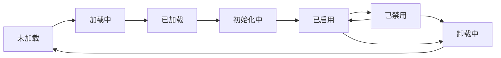

# CyberClaw Plugin 开发指南

## 目录

1. [概述](#概述)
2. [快速开始](#快速开始)
3. [Plugin 架构](#plugin-架构)
4. [创建你的第一个 Plugin](#创建你的第一个-plugin)
5. [Hook 系统](#hook-系统)
6. [安全与权限](#安全与权限)
7. [测试与调试](#测试与调试)
8. [最佳实践](#最佳实践)
9. [API 参考](#api-参考)

## 概述

CyberClaw Plugin 是平台的扩展机制，允许开发者：

- 在执行流程的关键节点注入自定义逻辑
- 扩展平台功能而不修改核心代码
- 实现组织特定的策略和规则
- 集成第三方服务和工具

### Plugin 能做什么？

- ✅ 监听和响应执行事件
- ✅ 修改执行参数和结果
- ✅ 实施安全策略
- ✅ 记录审计日志
- ✅ 触发外部通知
- ✅ 执行数据转换

### Plugin 不能做什么？

- ❌ 直接访问系统内核
- ❌ 绕过安全检查
- ❌ 修改其他 Plugin
- ❌ 无限制使用资源

## 快速开始

### 环境准备

```bash
# 安装 Rust (如果尚未安装)
curl --proto '=https' --tlsv1.2 -sSf https://sh.rustup.rs | sh

# 克隆 Plugin 模板
git clone https://github.com/cyberclaw/plugin-template my-plugin
cd my-plugin

# 安装依赖
cargo build --release
```

### 项目结构

```
my-plugin/
├── Cargo.toml                 # Rust 项目配置
├── cyberclaw-plugin.toml      # Plugin 清单文件
├── src/
│   ├── lib.rs                # Plugin 入口
│   └── hooks/                # Hook 实现
│       ├── mod.rs
│       ├── before_execution.rs
│       └── after_execution.rs
├── tests/                     # 测试文件
└── README.md                  # 文档
```

## Plugin 架构

### 生命周期



### 核心组件

1. **Plugin Manifest**: 描述 Plugin 元数据和需求
2. **Hook Handlers**: 响应系统事件的函数
3. **Plugin Context**: 运行时上下文和状态
4. **Security Policy**: 权限和资源限制

## 创建你的第一个 Plugin

### 步骤 1: 创建 Plugin Manifest

创建 `cyberclaw-plugin.toml`:

```toml
[plugin]
id = "my-first-plugin"
name = "My First Plugin"
version = "0.1.0"
description = "A simple example plugin"
authors = ["Your Name <you@example.com>"]

[plugin.library]
path = "target/release/libmy_first_plugin.so"
entry_point = "cyberclaw_plugin_init"

[plugin.hooks]
# 定义 Hook 处理器
before_execution = { handler = "before_exec", priority = 100, timeout_ms = 5000 }
after_execution = { handler = "after_exec", priority = 100, timeout_ms = 5000 }

[plugin.capabilities]
# 声明需要的权限
required = ["fs.read", "network.http", "env.read"]

[plugin.resources]
# 资源限制
memory = 104857600  # 100 MB
cpu_ms = 10000      # 10 seconds
file_handles = 100
network_connections = 10

[plugin.metadata]
homepage = "https://example.com/my-plugin"
repository = "https://github.com/username/my-plugin"
license = "Apache-2.0"
```

### 步骤 2: 实现 Plugin 入口

创建 `src/lib.rs`:

```rust
use cyberclaw_plugin_runtime::{
    Plugin, PluginApi, PluginManifest, HookRegistration,
    Result, Error,
};

/// Plugin 初始化函数 (必需)
#[no_mangle]
pub extern "C" fn cyberclaw_plugin_init(
    manifest: &PluginManifest
) -> Result<Box<dyn PluginApi>> {
    // 验证 manifest
    validate_manifest(manifest)?;

    // 创建 Plugin 实例
    let plugin = MyFirstPlugin::new(manifest)?;

    Ok(Box::new(plugin))
}

pub struct MyFirstPlugin {
    id: String,
    hooks: Vec<HookRegistration>,
}

impl MyFirstPlugin {
    pub fn new(manifest: &PluginManifest) -> Result<Self> {
        let hooks = vec![
            HookRegistration {
                plugin_id: manifest.plugin.id.clone(),
                hook_type: HookType::BeforeExecution,
                handler: Arc::new(BeforeExecutionHandler),
                priority: 100,
                timeout_ms: 5000,
            },
            HookRegistration {
                plugin_id: manifest.plugin.id.clone(),
                hook_type: HookType::AfterExecution,
                handler: Arc::new(AfterExecutionHandler),
                priority: 100,
                timeout_ms: 5000,
            },
        ];

        Ok(Self {
            id: manifest.plugin.id.clone(),
            hooks,
        })
    }
}

impl PluginApi for MyFirstPlugin {
    fn id(&self) -> &str {
        &self.id
    }

    fn hooks(&self) -> &[HookRegistration] {
        &self.hooks
    }

    fn start(&mut self) -> Result<()> {
        println!("Plugin {} starting", self.id);
        Ok(())
    }

    fn stop(&mut self) -> Result<()> {
        println!("Plugin {} stopping", self.id);
        Ok(())
    }
}
```

### 步骤 3: 实现 Hook 处理器

创建 `src/hooks/before_execution.rs`:

```rust
use cyberclaw_plugin_runtime::{
    HookHandler, HookContext, HookOutput, Result,
};
use async_trait::async_trait;

pub struct BeforeExecutionHandler;

#[async_trait]
impl HookHandler for BeforeExecutionHandler {
    async fn handle(&self, context: &HookContext) -> Result<HookOutput> {
        // 记录执行开始
        tracing::info!(
            "Execution {} starting with params: {:?}",
            context.execution_id,
            context.params
        );

        // 可选：修改参数
        let mut modified_params = context.params.clone();
        modified_params["injected_by_plugin"] = serde_json::json!(true);

        // 返回结果
        Ok(HookOutput {
            modified_params: Some(modified_params),
            metadata: vec![
                ("plugin".to_string(), "my-first-plugin".to_string()),
                ("hook".to_string(), "before_execution".to_string()),
            ],
        })
    }
}
```

### 步骤 4: 构建和安装

```bash
# 构建 Plugin
cargo build --release

# 安装到 CyberClaw
cyberclaw plugin install ./cyberclaw-plugin.toml

# 启用 Plugin
cyberclaw plugin enable my-first-plugin
```

## Hook 系统

### 可用的 Hook 类型

| Hook 类型 | 触发时机 | 用途 |
|----------|---------|------|
| `BeforeExecution` | 执行开始前 | 验证、修改参数、准备资源 |
| `AfterExecution` | 执行完成后 | 清理、记录、后处理 |
| `OnFailure` | 执行失败时 | 错误处理、告警、恢复 |
| `OnReview` | 需要审核时 | 自定义审核逻辑 |
| `BeforeCapability` | Capability 执行前 | 权限检查、参数验证 |
| `AfterCapability` | Capability 执行后 | 结果处理、审计 |

### Hook 优先级

- 数值越小，优先级越高
- 范围：1-1000
- 推荐值：
  - 1-100: 关键安全检查
  - 100-500: 普通业务逻辑
  - 500-1000: 日志和监控

### Hook 上下文

```rust
pub struct HookContext {
    /// 执行 ID
    pub execution_id: String,

    /// Hook 类型
    pub phase: HookType,

    /// 执行参数
    pub params: serde_json::Value,

    /// 执行结果 (仅 After hooks)
    pub result: Option<serde_json::Value>,

    /// 错误信息 (仅 OnFailure)
    pub error: Option<String>,

    /// 元数据
    pub metadata: HashMap<String, String>,
}
```

### 失败策略

```rust
pub enum FailurePolicy {
    /// 忽略错误，继续执行
    Ignore,

    /// 重试 N 次
    Retry { max_attempts: u32 },

    /// 中止执行
    Abort,
}
```

## 安全与权限

### Capability 声明

Plugin 必须声明所需的 Capabilities：

```toml
[plugin.capabilities]
required = [
    "fs.read",          # 文件系统读取
    "fs.write",         # 文件系统写入
    "network.http",     # HTTP 请求
    "network.tcp",      # TCP 连接
    "process.spawn",    # 启动进程
    "env.read",        # 读取环境变量
    "memory.allocate", # 分配内存
]
```

### 资源限制

```toml
[plugin.resources]
memory = 104857600        # 最大内存 (bytes)
cpu_ms = 10000           # 最大 CPU 时间 (ms)
file_handles = 100       # 最大文件句柄数
network_connections = 10 # 最大网络连接数
```

### 沙箱隔离

Plugin 运行在隔离环境中：

- **进程隔离**: 独立进程空间
- **文件系统隔离**: 受限的文件访问
- **网络隔离**: 白名单网络访问
- **资源隔离**: CPU/内存配额

## 测试与调试

### 单元测试

```rust
#[cfg(test)]
mod tests {
    use super::*;

    #[tokio::test]
    async fn test_before_execution_hook() {
        let handler = BeforeExecutionHandler;
        let context = HookContext {
            execution_id: "test-001".to_string(),
            phase: HookType::BeforeExecution,
            params: serde_json::json!({"test": true}),
            result: None,
            error: None,
            metadata: HashMap::new(),
        };

        let result = handler.handle(&context).await.unwrap();

        assert!(result.modified_params.is_some());
        assert_eq!(
            result.modified_params.unwrap()["injected_by_plugin"],
            true
        );
    }
}
```

### 集成测试

```rust
#[tokio::test]
async fn test_plugin_lifecycle() {
    // 加载 Plugin
    let runtime = PluginRuntime::new(Config::default()).await.unwrap();
    let plugin_id = runtime.load_plugin("./cyberclaw-plugin.toml").await.unwrap();

    // 触发 Hook
    let context = HookContext::new("test-exec");
    let result = runtime.dispatch_hook(
        HookType::BeforeExecution,
        &context
    ).await.unwrap();

    assert!(result.success);

    // 卸载 Plugin
    runtime.unload_plugin(&plugin_id).await.unwrap();
}
```

### 调试技巧

1. **启用调试日志**:
```bash
RUST_LOG=debug cyberclaw run
```

2. **使用调试构建**:
```bash
cargo build --features debug
```

3. **Hook 跟踪**:
```rust
#[instrument(skip(context))]
async fn handle(&self, context: &HookContext) -> Result<HookOutput> {
    tracing::debug!("Hook triggered: {:?}", context.phase);
    // ...
}
```

## 最佳实践

### 1. 错误处理

```rust
// ❌ 不好的实践
fn risky_operation() {
    dangerous_call().unwrap(); // 可能 panic
}

// ✅ 好的实践
fn safe_operation() -> Result<()> {
    dangerous_call().context("Failed to perform operation")?;
    Ok(())
}
```

### 2. 异步操作

```rust
// 使用超时防止挂起
timeout(Duration::from_secs(5), async_operation()).await?;

// 使用取消令牌
let token = CancellationToken::new();
select! {
    result = async_operation() => handle_result(result),
    _ = token.cancelled() => handle_cancellation(),
}
```

### 3. 资源管理

```rust
// 自动清理资源
struct ResourceGuard {
    resource: Resource,
}

impl Drop for ResourceGuard {
    fn drop(&mut self) {
        self.resource.cleanup();
    }
}
```

### 4. 版本兼容

```rust
// 检查 API 版本
if runtime.api_version() < Version::new(2, 0, 0) {
    return Err(Error::IncompatibleVersion);
}

// 功能检测
if runtime.supports_feature("async_hooks") {
    use_async_hooks();
} else {
    use_sync_hooks();
}
```

## API 参考

### PluginApi Trait

```rust
#[async_trait]
pub trait PluginApi: Send + Sync {
    /// Plugin 唯一标识
    fn id(&self) -> &str;

    /// Hook 注册列表
    fn hooks(&self) -> &[HookRegistration];

    /// Plugin 启动
    async fn start(&mut self) -> Result<()>;

    /// Plugin 停止
    async fn stop(&mut self) -> Result<()>;

    /// 健康检查
    async fn health_check(&self) -> Result<HealthStatus> {
        Ok(HealthStatus::Healthy)
    }

    /// 获取指标
    async fn metrics(&self) -> Result<Metrics> {
        Ok(Metrics::default())
    }
}
```

### HookHandler Trait

```rust
#[async_trait]
pub trait HookHandler: Send + Sync {
    /// 处理 Hook 事件
    async fn handle(&self, context: &HookContext) -> Result<HookOutput>;
}
```

### 常用类型

```rust
/// Hook 输出
pub struct HookOutput {
    /// 修改后的参数 (可选)
    pub modified_params: Option<serde_json::Value>,

    /// 附加元数据
    pub metadata: Vec<(String, String)>,
}

/// Plugin 状态
#[derive(Debug, Clone, PartialEq)]
pub enum PluginState {
    Loaded,
    Initialized,
    Enabled,
    Disabled,
    Failed(String),
}

/// 健康状态
#[derive(Debug, Clone)]
pub enum HealthStatus {
    Healthy,
    Degraded,
    Unhealthy,
}
```

## 示例 Plugins

### 安全审计 Plugin

```rust
pub struct SecurityAuditPlugin {
    audit_log: Arc<Mutex<Vec<AuditEntry>>>,
}

impl HookHandler for SecurityAuditPlugin {
    async fn handle(&self, context: &HookContext) -> Result<HookOutput> {
        // 记录所有执行
        let entry = AuditEntry {
            timestamp: Utc::now(),
            execution_id: context.execution_id.clone(),
            action: context.phase.to_string(),
            params: context.params.clone(),
            user: context.metadata.get("user").cloned(),
        };

        self.audit_log.lock().await.push(entry);

        // 检查敏感操作
        if is_sensitive_operation(&context.params) {
            // 发送告警
            send_alert("Sensitive operation detected").await?;
        }

        Ok(HookOutput::default())
    }
}
```

### 参数验证 Plugin

```rust
pub struct ValidationPlugin {
    rules: Vec<ValidationRule>,
}

impl HookHandler for ValidationPlugin {
    async fn handle(&self, context: &HookContext) -> Result<HookOutput> {
        // 验证参数
        for rule in &self.rules {
            if !rule.validate(&context.params) {
                return Err(Error::ValidationFailed(rule.message.clone()));
            }
        }

        Ok(HookOutput::default())
    }
}
```

### 通知 Plugin

```rust
pub struct NotificationPlugin {
    webhook_url: String,
}

impl HookHandler for NotificationPlugin {
    async fn handle(&self, context: &HookContext) -> Result<HookOutput> {
        if context.phase == HookType::OnFailure {
            // 发送失败通知
            let notification = json!({
                "execution_id": context.execution_id,
                "error": context.error,
                "timestamp": Utc::now(),
            });

            reqwest::Client::new()
                .post(&self.webhook_url)
                .json(&notification)
                .send()
                .await?;
        }

        Ok(HookOutput::default())
    }
}
```

## 故障排除

### 常见问题

#### Plugin 加载失败

**问题**: `Error: Failed to load plugin: symbol not found`

**解决方案**:
- 确保入口函数名称正确: `cyberclaw_plugin_init`
- 检查函数签名匹配
- 使用 `#[no_mangle]` 防止符号重整

#### Hook 超时

**问题**: `Error: Hook timeout after 5000ms`

**解决方案**:
- 增加 timeout 配置
- 优化 Hook 处理逻辑
- 使用异步操作

#### 资源限制

**问题**: `Error: Resource limit exceeded`

**解决方案**:
- 检查资源配置
- 优化内存使用
- 实现资源池化

## 更多资源

- [Plugin 示例库](https://github.com/cyberclaw/plugin-examples)
- [API 文档](https://docs.cyberclaw.io/api/plugins)
- [社区论坛](https://forum.cyberclaw.io/plugins)
- [视频教程](https://youtube.com/cyberclaw-plugins)

## 贡献

欢迎贡献 Plugin 到社区仓库！

1. Fork [plugin-registry](https://github.com/cyberclaw/plugin-registry)
2. 创建你的 Plugin
3. 提交 Pull Request
4. 通过安全审查

## 许可证

本指南采用 Apache 2.0 许可证。