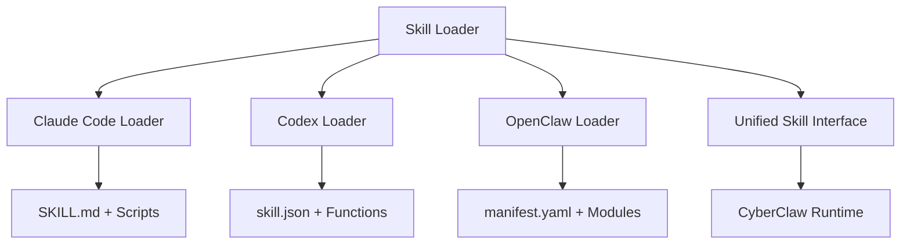

# CyberClaw Skill 开发指南

## 目录

1. [概述](#概述)
2. [Skill 架构](#skill-架构)
3. [支持的 Skill 格式](#支持的-skill-格式)
4. [创建你的第一个 Skill](#创建你的第一个-skill)
5. [Claude Code Skill 格式](#claude-code-skill-格式)
6. [Codex Skill 格式](#codex-skill-格式)
7. [OpenClaw Skill 格式](#openclaw-skill-格式)
8. [热重载与版本管理](#热重载与版本管理)
9. [测试与调试](#测试与调试)
10. [最佳实践](#最佳实践)
11. [API 参考](#api-参考)

## 概述

Skill 是 CyberClaw 中的可重用知识和方法包，提供：

- 📚 领域知识和最佳实践
- 🛠️ 预定义的执行模板
- 📝 文档和示例
- 🔄 跨平台兼容性

### Skill vs Connector

| 特性 | Skill | Connector |
|-----|-------|-----------|
| 职责 | 方法、知识、模板 | 执行、集成、协议 |
| 权限 | 无直接执行权限 | 完全执行权限 |
| 格式 | 多种格式支持 | Rust 实现 |
| 更新 | 热重载支持 | 需要重启 |

## Skill 架构

### 核心概念



### Skill 生命周期

1. **发现**: 扫描 Skill 目录
2. **加载**: 解析 Skill 格式
3. **验证**: 检查依赖和权限
4. **注册**: 添加到运行时
5. **执行**: 响应调用请求
6. **更新**: 热重载新版本

## 支持的 Skill 格式

### 格式对比

| 格式 | 文件结构 | 优势 | 适用场景 |
|-----|---------|------|---------|
| Claude Code | SKILL.md + scripts/ | 简单、人类可读 | 快速开发、文档丰富 |
| Codex | skill.json + functions/ | 结构化、类型安全 | 企业应用、API 集成 |
| OpenClaw | manifest.yaml + modules/ | 模块化、可扩展 | 复杂系统、多语言支持 |

## 创建你的第一个 Skill

### 快速开始

```bash
# 使用 CLI 创建 Skill
cyberclaw skill create my-skill --format claude-code

# 进入 Skill 目录
cd my-skill

# 查看结构
tree .
```

输出：
```
my-skill/
├── SKILL.md           # Skill 定义
├── scripts/          # 可执行脚本
│   ├── setup.sh
│   └── main.py
├── references/       # 参考文档
│   └── api-docs.md
└── assets/          # 静态资源
    └── templates/
```

## Claude Code Skill 格式

### SKILL.md 结构

```markdown
---
name: My Awesome Skill
version: 1.0.0
description: A skill that does awesome things
author: Your Name
tags: [automation, productivity]
capabilities:
  - id: process_data
    description: Process and transform data
  - id: generate_report
    description: Generate detailed reports
---

# My Awesome Skill

## 概述

这个 Skill 提供数据处理和报告生成功能。

## 使用方法

### 处理数据

\`\`\`python
from my_skill import process_data

result = process_data(input_data)
\`\`\`

### 生成报告

\`\`\`python
from my_skill import generate_report

report = generate_report(processed_data)
\`\`\`

## 配置

| 参数 | 类型 | 默认值 | 说明 |
|-----|------|--------|------|
| format | string | json | 输出格式 |
| verbose | boolean | false | 详细输出 |

## 示例

### 示例 1: 基础使用

\`\`\`bash
./scripts/main.py --input data.csv --output result.json
\`\`\`

### 示例 2: 高级配置

\`\`\`python
config = {
    "format": "html",
    "verbose": True,
    "filters": ["date", "status"]
}

result = process_data(input_data, config)
\`\`\`

## 依赖

- Python >= 3.8
- pandas
- numpy

## 更新日志

### v1.0.0 (2024-01-01)
- 初始版本
- 支持 CSV/JSON 输入
- HTML/PDF 报告生成
```

### Scripts 目录

创建 `scripts/main.py`:

```python
#!/usr/bin/env python3
"""
主执行脚本
"""
import json
import argparse
import pandas as pd

def process_data(input_file, output_file, config=None):
    """处理数据"""
    # 读取输入
    if input_file.endswith('.csv'):
        df = pd.read_csv(input_file)
    elif input_file.endswith('.json'):
        df = pd.read_json(input_file)
    else:
        raise ValueError(f"Unsupported file type: {input_file}")

    # 处理逻辑
    processed = transform_data(df, config)

    # 保存输出
    if output_file.endswith('.json'):
        processed.to_json(output_file, orient='records')
    elif output_file.endswith('.csv'):
        processed.to_csv(output_file, index=False)

    return processed

def transform_data(df, config):
    """数据转换逻辑"""
    # 实现你的转换逻辑
    return df

def main():
    parser = argparse.ArgumentParser(description='Process data')
    parser.add_argument('--input', required=True, help='Input file')
    parser.add_argument('--output', required=True, help='Output file')
    parser.add_argument('--config', help='Config file (JSON)')

    args = parser.parse_args()

    config = None
    if args.config:
        with open(args.config) as f:
            config = json.load(f)

    process_data(args.input, args.output, config)
    print(f"✅ Processing complete: {args.output}")

if __name__ == '__main__':
    main()
```

### 集成到 CyberClaw

```rust
// Skill 会自动被加载并映射为 Capabilities
let skill_loader = UnifiedSkillLoader::new();
let skill = skill_loader.load_skill("./my-skill").await?;

// 执行 Skill
let result = skill.execute(
    "process_data",
    json!({
        "input": "data.csv",
        "output": "result.json"
    })
).await?;
```

## Codex Skill 格式

### skill.json 结构

```json
{
  "name": "DataProcessor",
  "version": "2.0.0",
  "description": "Advanced data processing skill",
  "author": {
    "name": "Your Name",
    "email": "you@example.com"
  },
  "functions": [
    {
      "name": "processCSV",
      "description": "Process CSV files",
      "parameters": {
        "type": "object",
        "properties": {
          "inputPath": {
            "type": "string",
            "description": "Path to input CSV file"
          },
          "outputPath": {
            "type": "string",
            "description": "Path to output file"
          },
          "options": {
            "type": "object",
            "properties": {
              "delimiter": {
                "type": "string",
                "default": ","
              },
              "encoding": {
                "type": "string",
                "default": "utf-8"
              }
            }
          }
        },
        "required": ["inputPath", "outputPath"]
      },
      "returns": {
        "type": "object",
        "properties": {
          "success": { "type": "boolean" },
          "rowsProcessed": { "type": "integer" },
          "outputPath": { "type": "string" }
        }
      }
    }
  ],
  "dependencies": {
    "runtime": "node >= 14",
    "packages": {
      "csv-parser": "^3.0.0",
      "fs-extra": "^10.0.0"
    }
  }
}
```

### Functions 实现

创建 `functions/processCSV.js`:

```javascript
const csv = require('csv-parser');
const fs = require('fs-extra');

async function processCSV({ inputPath, outputPath, options = {} }) {
  const { delimiter = ',', encoding = 'utf-8' } = options;

  const results = [];
  let rowCount = 0;

  return new Promise((resolve, reject) => {
    fs.createReadStream(inputPath, { encoding })
      .pipe(csv({ separator: delimiter }))
      .on('data', (data) => {
        // 处理每一行
        const processed = transformRow(data);
        results.push(processed);
        rowCount++;
      })
      .on('end', async () => {
        // 写入输出
        await fs.writeJson(outputPath, results, { spaces: 2 });

        resolve({
          success: true,
          rowsProcessed: rowCount,
          outputPath
        });
      })
      .on('error', reject);
  });
}

function transformRow(row) {
  // 实现转换逻辑
  return {
    ...row,
    processed: true,
    timestamp: new Date().toISOString()
  };
}

module.exports = processCSV;
```

## OpenClaw Skill 格式

### manifest.yaml 结构

```yaml
# OpenClaw Skill Manifest
apiVersion: v1
kind: Skill
metadata:
  name: advanced-processor
  version: 3.0.0
  description: Advanced multi-format data processor
  author: Your Organization
  license: MIT

spec:
  capabilities:
    - name: process
      description: Process data in multiple formats
      inputs:
        - name: source
          type: string
          required: true
          description: Data source (file, URL, or database)
        - name: format
          type: string
          enum: [csv, json, xml, parquet]
          default: json
        - name: transformations
          type: array
          items:
            type: object
            properties:
              type:
                type: string
                enum: [filter, map, reduce, aggregate]
              config:
                type: object
      outputs:
        - name: result
          type: object
        - name: metadata
          type: object
          properties:
            recordsProcessed:
              type: integer
            duration:
              type: number
            errors:
              type: array

  modules:
    - name: core
      language: python
      entrypoint: modules/core.py
    - name: filters
      language: python
      path: modules/filters.py
    - name: utils
      language: rust
      path: modules/utils.rs

  requirements:
    python:
      - pandas>=1.3.0
      - numpy>=1.21.0
      - pyarrow>=5.0.0
    system:
      - memory: 512Mi
      - cpu: 1
      - disk: 1Gi

  configuration:
    defaults:
      batchSize: 1000
      parallelism: 4
      timeout: 300
    validation:
      strict: true
      schemaCheck: true
```

### Module 实现

创建 `modules/core.py`:

```python
"""
OpenClaw Skill 核心模块
"""
from typing import Dict, List, Any
import pandas as pd
import numpy as np
from .filters import apply_filters
from .utils import validate_input

class DataProcessor:
    """数据处理器主类"""

    def __init__(self, config: Dict[str, Any]):
        self.config = config
        self.batch_size = config.get('batchSize', 1000)
        self.parallelism = config.get('parallelism', 4)

    def process(self,
                source: str,
                format: str = 'json',
                transformations: List[Dict] = None) -> Dict[str, Any]:
        """
        处理数据

        Args:
            source: 数据源
            format: 数据格式
            transformations: 转换列表

        Returns:
            处理结果和元数据
        """
        # 验证输入
        validate_input(source, format)

        # 加载数据
        data = self._load_data(source, format)

        # 应用转换
        if transformations:
            for transform in transformations:
                data = self._apply_transformation(data, transform)

        # 返回结果
        return {
            'result': data.to_dict('records'),
            'metadata': {
                'recordsProcessed': len(data),
                'duration': self._get_duration(),
                'errors': []
            }
        }

    def _load_data(self, source: str, format: str) -> pd.DataFrame:
        """加载数据"""
        if format == 'csv':
            return pd.read_csv(source)
        elif format == 'json':
            return pd.read_json(source)
        elif format == 'parquet':
            return pd.read_parquet(source)
        elif format == 'xml':
            return pd.read_xml(source)
        else:
            raise ValueError(f"Unsupported format: {format}")

    def _apply_transformation(self,
                            data: pd.DataFrame,
                            transform: Dict) -> pd.DataFrame:
        """应用单个转换"""
        transform_type = transform['type']
        config = transform.get('config', {})

        if transform_type == 'filter':
            return apply_filters(data, config)
        elif transform_type == 'map':
            return self._apply_map(data, config)
        elif transform_type == 'reduce':
            return self._apply_reduce(data, config)
        elif transform_type == 'aggregate':
            return self._apply_aggregate(data, config)
        else:
            raise ValueError(f"Unknown transformation: {transform_type}")

    def _apply_map(self, data: pd.DataFrame, config: Dict) -> pd.DataFrame:
        """应用映射转换"""
        # 实现映射逻辑
        return data

    def _apply_reduce(self, data: pd.DataFrame, config: Dict) -> pd.DataFrame:
        """应用归约转换"""
        # 实现归约逻辑
        return data

    def _apply_aggregate(self, data: pd.DataFrame, config: Dict) -> pd.DataFrame:
        """应用聚合转换"""
        # 实现聚合逻辑
        return data

    def _get_duration(self) -> float:
        """获取处理时长"""
        # 实现计时逻辑
        return 0.0

# 导出函数供 Skill 运行时调用
def execute(params: Dict[str, Any]) -> Dict[str, Any]:
    """Skill 执行入口"""
    processor = DataProcessor(params.get('config', {}))
    return processor.process(
        source=params['source'],
        format=params.get('format', 'json'),
        transformations=params.get('transformations')
    )
```

## 热重载与版本管理

### 热重载配置

```rust
// 启用热重载
let skill_loader = UnifiedSkillLoader::with_hot_reload(true);

// 监控 Skill 目录
let mut watcher = HotReloadWatcher::new(skill_loader.clone());
watcher.watch(vec![
    PathBuf::from("./skills"),
    PathBuf::from("~/.cyberclaw/skills"),
]).await?;

// Skill 更新时自动重载
watcher.on_change(|event| {
    match event {
        SkillEvent::Updated(skill_id) => {
            println!("Skill {} updated and reloaded", skill_id);
        }
        SkillEvent::Added(skill_id) => {
            println!("New skill {} detected and loaded", skill_id);
        }
        SkillEvent::Removed(skill_id) => {
            println!("Skill {} removed", skill_id);
        }
    }
});
```

### 版本管理

```toml
# skill-lock.toml
[[skills]]
name = "data-processor"
version = "2.1.0"
source = "github:cyberclaw/skills"
checksum = "sha256:abc123..."

[[skills]]
name = "report-generator"
version = "1.5.2"
source = "local:./custom-skills/report-generator"
```

### 版本升级策略

```rust
pub enum UpgradeStrategy {
    /// 自动升级到最新版本
    Auto,

    /// 只升级补丁版本 (1.0.x)
    Patch,

    /// 升级次要版本 (1.x.0)
    Minor,

    /// 手动控制升级
    Manual,
}
```

## 测试与调试

### 单元测试

```python
# tests/test_skill.py
import unittest
from my_skill import process_data, generate_report

class TestMySkill(unittest.TestCase):
    def test_process_data(self):
        """测试数据处理"""
        input_data = {"values": [1, 2, 3]}
        result = process_data(input_data)

        self.assertIsNotNone(result)
        self.assertEqual(len(result["processed"]), 3)

    def test_generate_report(self):
        """测试报告生成"""
        data = {"summary": "Test"}
        report = generate_report(data)

        self.assertIn("summary", report)
        self.assertIn("timestamp", report)

if __name__ == '__main__':
    unittest.main()
```

### 集成测试

```rust
#[tokio::test]
async fn test_skill_loading_and_execution() {
    // 加载 Skill
    let loader = UnifiedSkillLoader::new();
    let skill = loader.load_skill("./test-skill").await.unwrap();

    // 验证元数据
    assert_eq!(skill.metadata().name, "Test Skill");
    assert_eq!(skill.metadata().version, "1.0.0");

    // 执行 Capability
    let result = skill.execute(
        "process_data",
        json!({
            "input": "test.csv",
            "output": "result.json"
        })
    ).await.unwrap();

    assert!(result["success"].as_bool().unwrap());
}
```

### 调试工具

```bash
# Skill 验证
cyberclaw skill validate ./my-skill

# Skill 测试
cyberclaw skill test ./my-skill

# Skill 调试模式
cyberclaw skill run ./my-skill --debug

# 查看 Skill 日志
cyberclaw skill logs my-skill --tail 100
```

### 性能分析

```python
# 使用装饰器进行性能分析
from functools import wraps
import time

def profile(func):
    @wraps(func)
    def wrapper(*args, **kwargs):
        start = time.time()
        result = func(*args, **kwargs)
        duration = time.time() - start
        print(f"{func.__name__} took {duration:.3f}s")
        return result
    return wrapper

@profile
def process_large_dataset(data):
    # 处理逻辑
    pass
```

## 最佳实践

### 1. Skill 设计原则

```markdown
## ✅ 推荐

- 单一职责：每个 Skill 专注一个领域
- 清晰接口：明确定义输入输出
- 版本语义化：遵循 SemVer 规范
- 完整文档：提供示例和说明
- 错误处理：优雅处理异常

## ❌ 避免

- 过度耦合：不要依赖特定环境
- 硬编码路径：使用相对路径或配置
- 忽略错误：始终返回有意义的错误
- 缺少测试：确保核心功能有测试
- 资源泄露：正确清理资源
```

### 2. 目录结构

```
recommended-skill/
├── SKILL.md              # 主文档 (必需)
├── VERSION              # 版本文件
├── LICENSE              # 许可证
├── scripts/            # 可执行脚本
│   ├── __init__.py
│   ├── main.py
│   └── utils.py
├── tests/              # 测试文件
│   ├── unit/
│   └── integration/
├── docs/               # 额外文档
│   ├── API.md
│   └── CHANGELOG.md
├── examples/           # 使用示例
│   ├── basic.py
│   └── advanced.py
└── requirements.txt    # 依赖声明
```

### 3. 错误处理

```python
class SkillError(Exception):
    """Skill 基础错误类"""
    pass

class ValidationError(SkillError):
    """输入验证错误"""
    pass

class ProcessingError(SkillError):
    """处理过程错误"""
    pass

def safe_execute(func):
    """安全执行装饰器"""
    @wraps(func)
    def wrapper(*args, **kwargs):
        try:
            return {
                "success": True,
                "result": func(*args, **kwargs)
            }
        except ValidationError as e:
            return {
                "success": False,
                "error": "VALIDATION_ERROR",
                "message": str(e)
            }
        except ProcessingError as e:
            return {
                "success": False,
                "error": "PROCESSING_ERROR",
                "message": str(e)
            }
        except Exception as e:
            return {
                "success": False,
                "error": "UNKNOWN_ERROR",
                "message": str(e)
            }
    return wrapper
```

### 4. 配置管理

```python
# config.py
from typing import Dict, Any
import os
import json

class SkillConfig:
    """Skill 配置管理"""

    def __init__(self, config_file: str = None):
        self.config = self._load_config(config_file)

    def _load_config(self, config_file: str) -> Dict[str, Any]:
        """加载配置"""
        # 1. 默认配置
        config = self._get_defaults()

        # 2. 文件配置
        if config_file and os.path.exists(config_file):
            with open(config_file) as f:
                file_config = json.load(f)
                config.update(file_config)

        # 3. 环境变量
        env_config = self._load_from_env()
        config.update(env_config)

        return config

    def _get_defaults(self) -> Dict[str, Any]:
        """默认配置"""
        return {
            "debug": False,
            "timeout": 30,
            "batch_size": 100,
            "cache_enabled": True
        }

    def _load_from_env(self) -> Dict[str, Any]:
        """从环境变量加载"""
        config = {}

        if os.getenv("SKILL_DEBUG"):
            config["debug"] = os.getenv("SKILL_DEBUG").lower() == "true"

        if os.getenv("SKILL_TIMEOUT"):
            config["timeout"] = int(os.getenv("SKILL_TIMEOUT"))

        return config

    def get(self, key: str, default: Any = None) -> Any:
        """获取配置值"""
        return self.config.get(key, default)
```

## API 参考

### Skill Trait

```rust
#[async_trait]
pub trait Skill: Send + Sync {
    /// Skill 唯一标识
    fn id(&self) -> &str;

    /// Skill 元数据
    fn metadata(&self) -> &SkillMetadata;

    /// 提供的 Capabilities
    fn capabilities(&self) -> Vec<CapabilityContract>;

    /// 执行 Capability
    async fn execute(
        &self,
        capability: &str,
        params: serde_json::Value,
    ) -> Result<serde_json::Value>;

    /// 验证参数
    fn validate_params(
        &self,
        capability: &str,
        params: &serde_json::Value,
    ) -> Result<()> {
        // 默认实现
        Ok(())
    }

    /// 获取配置
    fn get_config(&self) -> Option<SkillConfig> {
        None
    }
}
```

### 数据类型

```rust
/// Skill 元数据
#[derive(Debug, Clone, Serialize, Deserialize)]
pub struct SkillMetadata {
    pub name: String,
    pub version: String,
    pub description: String,
    pub author: Option<String>,
    pub tags: Vec<String>,
    pub homepage: Option<String>,
    pub repository: Option<String>,
    pub license: Option<String>,
}

/// Skill 配置
#[derive(Debug, Clone, Serialize, Deserialize)]
pub struct SkillConfig {
    pub hot_reload: bool,
    pub cache_enabled: bool,
    pub timeout_secs: u64,
    pub max_retries: u32,
}

/// Capability 定义
#[derive(Debug, Clone, Serialize, Deserialize)]
pub struct CapabilityDefinition {
    pub id: String,
    pub description: String,
    pub parameters: serde_json::Value,
    pub returns: serde_json::Value,
}
```

## 示例 Skills

### 数据分析 Skill

```markdown
---
name: Data Analysis Skill
version: 1.0.0
description: Comprehensive data analysis toolkit
capabilities:
  - id: statistical_analysis
    description: Perform statistical analysis
  - id: visualization
    description: Create data visualizations
  - id: ml_prediction
    description: Machine learning predictions
---

# Data Analysis Skill

提供完整的数据分析能力，包括：
- 统计分析
- 数据可视化
- 机器学习预测
```

### DevOps Skill

```yaml
# OpenClaw 格式
apiVersion: v1
kind: Skill
metadata:
  name: devops-toolkit
  version: 2.0.0

spec:
  capabilities:
    - name: deploy
      description: Deploy application
    - name: rollback
      description: Rollback deployment
    - name: health_check
      description: Check system health
    - name: scale
      description: Scale resources
```

### API 集成 Skill

```json
{
  "name": "APIIntegration",
  "version": "1.5.0",
  "functions": [
    {
      "name": "callAPI",
      "description": "Call external API",
      "parameters": {
        "type": "object",
        "properties": {
          "endpoint": { "type": "string" },
          "method": { "type": "string" },
          "headers": { "type": "object" },
          "body": { "type": "object" }
        }
      }
    }
  ]
}
```

## 故障排除

### 常见问题

#### Skill 加载失败

**问题**: `Error: Failed to load skill: Invalid format`

**解决方案**:
- 检查 SKILL.md/skill.json/manifest.yaml 格式
- 验证必需字段存在
- 确保版本号符合 SemVer

#### 执行超时

**问题**: `Error: Skill execution timeout`

**解决方案**:
- 优化处理逻辑
- 增加超时配置
- 使用异步执行

#### 依赖缺失

**问题**: `Error: Missing dependency: pandas`

**解决方案**:
- 安装必需依赖
- 更新 requirements.txt
- 使用虚拟环境

## 更多资源

- [Skill 示例库](https://github.com/cyberclaw/skill-library)
- [Skill 市场](https://skills.cyberclaw.io)
- [API 文档](https://docs.cyberclaw.io/api/skills)
- [视频教程](https://youtube.com/cyberclaw-skills)

## 贡献

欢迎贡献 Skill 到社区！

1. Fork [skill-library](https://github.com/cyberclaw/skill-library)
2. 创建你的 Skill
3. 添加测试和文档
4. 提交 Pull Request

## 许可证

本指南采用 Apache 2.0 许可证。