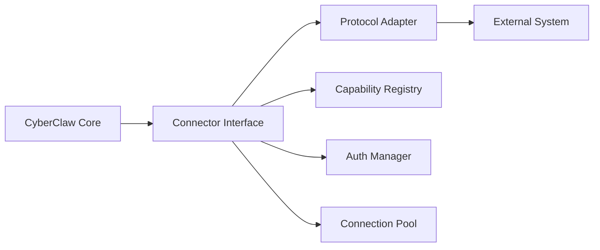

# CyberClaw Connector 开发指南

## 目录

1. [概述](#概述)
2. [Connector 架构](#connector-架构)
3. [快速开始](#快速开始)
4. [实现 Connector](#实现-connector)
5. [MCP Protocol 集成](#mcp-protocol-集成)
6. [外部系统集成](#外部系统集成)
7. [认证和授权](#认证和授权)
8. [错误处理和重试](#错误处理和重试)
9. [测试和调试](#测试和调试)
10. [最佳实践](#最佳实践)

## 概述

Connector 是 CyberClaw 连接外部系统的桥梁，负责：

- 将外部系统的功能映射为 Capability
- 处理协议转换和数据格式化
- 管理认证和会话
- 实现重试和容错机制

### 支持的 Connector 类型

- **MCP Connector**: Model Context Protocol 标准连接器
- **HTTP/REST Connector**: RESTful API 连接器
- **Database Connector**: 数据库连接器（PostgreSQL、MySQL、SQLite）
- **Message Queue Connector**: 消息队列连接器（RabbitMQ、Kafka）
- **Custom Protocol Connector**: 自定义协议连接器

## Connector 架构



### 核心组件

1. **Connector Trait**: 统一接口定义
2. **Capability Mapping**: 功能映射
3. **Protocol Adapter**: 协议适配器
4. **Connection Manager**: 连接管理
5. **Auth Provider**: 认证提供者

## 快速开始

### 创建 Connector 项目

```bash
# 使用 CyberClaw CLI 创建
cyberclaw connector new my-connector --type http

# 项目结构
my-connector/
├── Cargo.toml
├── connector.toml        # Connector 配置
├── src/
│   ├── lib.rs           # 入口
│   ├── connector.rs     # Connector 实现
│   ├── auth.rs         # 认证逻辑
│   ├── capabilities.rs # Capability 定义
│   └── client.rs       # 客户端实现
└── tests/
```

### Connector 配置

```toml
# connector.toml

[connector]
id = "my-connector"
name = "My External Service Connector"
version = "1.0.0"
type = "http"

[connector.endpoint]
base_url = "https://api.example.com"
timeout = 30
max_retries = 3

[connector.auth]
type = "oauth2"
client_id = "${CLIENT_ID}"
client_secret = "${CLIENT_SECRET}"
token_url = "https://auth.example.com/token"
scopes = ["read", "write"]

[connector.capabilities]
# 定义提供的 Capabilities
[[connector.capabilities.list]]
id = "my.list_items"
description = "List all items"
method = "GET"
path = "/items"

[[connector.capabilities.list]]
id = "my.create_item"
description = "Create a new item"
method = "POST"
path = "/items"
```

## 实现 Connector

### 1. 定义 Connector 结构

```rust
// src/connector.rs

use cyberclaw_connectors::{
    Connector, ConnectorManifest, CapabilityContract,
    CapabilityRequest, CapabilityResponse,
};
use async_trait::async_trait;

pub struct MyConnector {
    client: HttpClient,
    auth: AuthManager,
    capabilities: Vec<CapabilityContract>,
}

impl MyConnector {
    pub async fn new(config: ConnectorConfig) -> Result<Self> {
        // 初始化 HTTP 客户端
        let client = HttpClient::builder()
            .base_url(&config.endpoint.base_url)
            .timeout(config.endpoint.timeout)
            .build()?;

        // 初始化认证管理器
        let auth = AuthManager::new(config.auth)?;

        // 加载 Capabilities
        let capabilities = Self::load_capabilities(&config)?;

        Ok(Self {
            client,
            auth,
            capabilities,
        })
    }
}
```

### 2. 实现 Connector Trait

```rust
#[async_trait]
impl Connector for MyConnector {
    fn id(&self) -> &str {
        "my-connector"
    }

    fn manifest(&self) -> ConnectorManifest {
        ConnectorManifest {
            id: self.id().to_string(),
            name: "My External Service Connector".to_string(),
            version: "1.0.0".to_string(),
            capabilities: self.capabilities.clone(),
        }
    }

    async fn execute(
        &self,
        capability: &str,
        request: CapabilityRequest,
    ) -> Result<CapabilityResponse> {
        // 认证
        let token = self.auth.get_token().await?;

        // 路由到具体 Capability
        match capability {
            "my.list_items" => self.list_items(request).await,
            "my.create_item" => self.create_item(request).await,
            "my.update_item" => self.update_item(request).await,
            "my.delete_item" => self.delete_item(request).await,
            _ => Err(Error::UnknownCapability(capability.to_string())),
        }
    }

    async fn test_connection(&self) -> Result<bool> {
        // 测试连接
        match self.client.get("/health").send().await {
            Ok(response) => Ok(response.status().is_success()),
            Err(_) => Ok(false),
        }
    }
}
```

### 3. 实现具体 Capabilities

```rust
// src/capabilities.rs

impl MyConnector {
    /// 列出项目
    async fn list_items(&self, request: CapabilityRequest) -> Result<CapabilityResponse> {
        // 解析参数
        let page = request.params.get("page")
            .and_then(|v| v.as_u64())
            .unwrap_or(1);
        let limit = request.params.get("limit")
            .and_then(|v| v.as_u64())
            .unwrap_or(20);

        // 构建请求
        let response = self.client
            .get("/items")
            .query(&[("page", page), ("limit", limit)])
            .bearer_auth(&self.auth.get_token().await?)
            .send()
            .await?;

        // 处理响应
        let items: Vec<Item> = response.json().await?;

        Ok(CapabilityResponse {
            output: serde_json::to_value(items)?,
            metadata: HashMap::new(),
        })
    }

    /// 创建项目
    async fn create_item(&self, request: CapabilityRequest) -> Result<CapabilityResponse> {
        // 验证输入
        let item_data = request.params.get("item")
            .ok_or_else(|| Error::MissingParameter("item"))?;

        // 发送请求
        let response = self.client
            .post("/items")
            .json(item_data)
            .bearer_auth(&self.auth.get_token().await?)
            .send()
            .await?;

        // 检查状态码
        if !response.status().is_success() {
            let error = response.text().await?;
            return Err(Error::ApiError(error));
        }

        // 返回创建的项目
        let created_item: Item = response.json().await?;

        Ok(CapabilityResponse {
            output: serde_json::to_value(created_item)?,
            metadata: HashMap::from([
                ("operation".to_string(), "create".to_string()),
            ]),
        })
    }
}
```

## MCP Protocol 集成

### MCP Connector 实现

```rust
use jsonrpc_core::{IoHandler, Params};

pub struct McpConnector {
    server_url: String,
    rpc_client: JsonRpcClient,
    tool_cache: Arc<RwLock<HashMap<String, McpTool>>>,
}

impl McpConnector {
    /// 发现 MCP Tools
    async fn discover_tools(&self) -> Result<Vec<McpTool>> {
        let request = json!({
            "jsonrpc": "2.0",
            "method": "tools/list",
            "id": 1
        });

        let response = self.rpc_client.call(request).await?;
        let tools: Vec<McpTool> = serde_json::from_value(response["result"].clone())?;

        Ok(tools)
    }

    /// 调用 MCP Tool
    async fn call_tool(&self, name: &str, args: Value) -> Result<Value> {
        let request = json!({
            "jsonrpc": "2.0",
            "method": "tools/call",
            "params": {
                "name": name,
                "arguments": args
            },
            "id": 2
        });

        let response = self.rpc_client.call(request).await?;
        Ok(response["result"].clone())
    }

    /// 映射 MCP Tools 为 Capabilities
    fn map_tools_to_capabilities(&self, tools: Vec<McpTool>) -> Vec<CapabilityContract> {
        tools.into_iter().map(|tool| {
            CapabilityContract {
                id: format!("mcp.tool.{}", tool.name),
                description: tool.description,
                input_schema: tool.input_schema,
                output_schema: tool.output_schema,
                risk_level: RiskLevel::Medium,
            }
        }).collect()
    }
}
```

### MCP 协议处理

```rust
/// MCP JSON-RPC 客户端
pub struct JsonRpcClient {
    transport: Transport,
}

impl JsonRpcClient {
    pub async fn call(&self, request: Value) -> Result<Value> {
        match &self.transport {
            Transport::Stdio(process) => {
                // 通过 stdio 通信
                self.call_stdio(process, request).await
            }
            Transport::Http(url) => {
                // 通过 HTTP 通信
                self.call_http(url, request).await
            }
        }
    }

    async fn call_stdio(&self, process: &Process, request: Value) -> Result<Value> {
        // 写入请求
        let request_str = serde_json::to_string(&request)?;
        process.stdin.write_all(request_str.as_bytes()).await?;
        process.stdin.write_all(b"\n").await?;

        // 读取响应
        let mut response_str = String::new();
        process.stdout.read_line(&mut response_str).await?;

        Ok(serde_json::from_str(&response_str)?)
    }

    async fn call_http(&self, url: &str, request: Value) -> Result<Value> {
        let response = reqwest::Client::new()
            .post(url)
            .json(&request)
            .send()
            .await?
            .json()
            .await?;

        Ok(response)
    }
}
```

## 外部系统集成

### GitHub Connector 示例

```rust
pub struct GitHubConnector {
    client: octocrab::Octocrab,
    rate_limiter: RateLimiter,
}

impl GitHubConnector {
    pub async fn new(token: String) -> Result<Self> {
        let client = octocrab::OctocrabBuilder::new()
            .personal_token(token)
            .build()?;

        let rate_limiter = RateLimiter::new(5000, Duration::from_secs(3600));

        Ok(Self { client, rate_limiter })
    }

    async fn create_issue(&self, req: CapabilityRequest) -> Result<CapabilityResponse> {
        // 速率限制
        self.rate_limiter.acquire().await;

        // 解析参数
        let owner = req.params["owner"].as_str()?;
        let repo = req.params["repo"].as_str()?;
        let title = req.params["title"].as_str()?;
        let body = req.params["body"].as_str()?;

        // 创建 Issue
        let issue = self.client
            .issues(owner, repo)
            .create(title)
            .body(body)
            .send()
            .await?;

        Ok(CapabilityResponse {
            output: serde_json::to_value(issue)?,
            metadata: HashMap::new(),
        })
    }
}
```

### Database Connector 示例

```rust
pub struct DatabaseConnector {
    pool: sqlx::AnyPool,
}

impl DatabaseConnector {
    pub async fn new(database_url: &str) -> Result<Self> {
        let pool = sqlx::AnyPool::connect(database_url).await?;
        Ok(Self { pool })
    }

    async fn execute_query(&self, req: CapabilityRequest) -> Result<CapabilityResponse> {
        let sql = req.params["sql"].as_str()?;
        let params = req.params.get("params");

        // 参数化查询
        let mut query = sqlx::query(sql);
        if let Some(params) = params {
            for param in params.as_array()? {
                query = query.bind(param);
            }
        }

        // 执行查询
        let rows = query.fetch_all(&self.pool).await?;

        // 转换结果
        let results: Vec<serde_json::Value> = rows
            .into_iter()
            .map(|row| row_to_json(row))
            .collect();

        Ok(CapabilityResponse {
            output: serde_json::to_value(results)?,
            metadata: HashMap::new(),
        })
    }
}
```

## 认证和授权

### OAuth 2.0 认证

```rust
pub struct OAuth2Manager {
    client_id: String,
    client_secret: String,
    token_url: String,
    token: Arc<RwLock<Option<AccessToken>>>,
}

impl OAuth2Manager {
    pub async fn get_token(&self) -> Result<String> {
        // 检查缓存的 token
        if let Some(token) = self.token.read().await.as_ref() {
            if !token.is_expired() {
                return Ok(token.access_token.clone());
            }
        }

        // 刷新 token
        self.refresh_token().await
    }

    async fn refresh_token(&self) -> Result<String> {
        let params = [
            ("grant_type", "client_credentials"),
            ("client_id", &self.client_id),
            ("client_secret", &self.client_secret),
        ];

        let response = reqwest::Client::new()
            .post(&self.token_url)
            .form(&params)
            .send()
            .await?
            .json::<TokenResponse>()
            .await?;

        let token = AccessToken {
            access_token: response.access_token.clone(),
            expires_at: Utc::now() + Duration::seconds(response.expires_in),
        };

        *self.token.write().await = Some(token);

        Ok(response.access_token)
    }
}
```

### API Key 认证

```rust
pub struct ApiKeyAuth {
    api_key: String,
    header_name: String,
}

impl ApiKeyAuth {
    pub fn apply_to_request(&self, request: RequestBuilder) -> RequestBuilder {
        request.header(&self.header_name, &self.api_key)
    }
}
```

## 错误处理和重试

### 重试策略

```rust
pub struct RetryPolicy {
    max_retries: u32,
    backoff: BackoffStrategy,
}

pub enum BackoffStrategy {
    Fixed(Duration),
    Exponential { base: Duration, max: Duration },
}

impl RetryPolicy {
    pub async fn execute<F, T>(&self, mut f: F) -> Result<T>
    where
        F: FnMut() -> Result<T>,
    {
        let mut attempt = 0;

        loop {
            match f() {
                Ok(result) => return Ok(result),
                Err(e) if attempt >= self.max_retries => return Err(e),
                Err(e) => {
                    let delay = self.backoff.delay(attempt);
                    tracing::warn!(
                        "Attempt {} failed: {}. Retrying in {:?}",
                        attempt + 1,
                        e,
                        delay
                    );
                    tokio::time::sleep(delay).await;
                    attempt += 1;
                }
            }
        }
    }
}
```

### 错误分类

```rust
#[derive(Debug, Error)]
pub enum ConnectorError {
    #[error("Connection failed: {0}")]
    Connection(String),

    #[error("Authentication failed: {0}")]
    Authentication(String),

    #[error("API error: {0}")]
    ApiError(String),

    #[error("Rate limit exceeded")]
    RateLimit,

    #[error("Timeout")]
    Timeout,

    #[error("Invalid response: {0}")]
    InvalidResponse(String),
}

impl ConnectorError {
    pub fn is_retryable(&self) -> bool {
        match self {
            Self::Connection(_) | Self::RateLimit | Self::Timeout => true,
            _ => false,
        }
    }
}
```

## 测试和调试

### 单元测试

```rust
#[cfg(test)]
mod tests {
    use super::*;
    use mockito;

    #[tokio::test]
    async fn test_list_items() {
        // 创建 Mock 服务器
        let mock = mockito::mock("GET", "/items")
            .with_status(200)
            .with_header("content-type", "application/json")
            .with_body(r#"[{"id": 1, "name": "Item 1"}]"#)
            .create();

        // 创建 Connector
        let config = ConnectorConfig {
            endpoint: EndpointConfig {
                base_url: mockito::server_url(),
                ..Default::default()
            },
            ..Default::default()
        };

        let connector = MyConnector::new(config).await.unwrap();

        // 执行测试
        let request = CapabilityRequest::default();
        let response = connector.execute("my.list_items", request).await.unwrap();

        // 验证结果
        assert!(response.output.is_array());
        mock.assert();
    }
}
```

### 集成测试

```rust
// tests/integration.rs

#[tokio::test]
async fn test_full_workflow() {
    // 启动测试环境
    let test_env = TestEnvironment::new().await;

    // 创建 Connector
    let connector = create_test_connector(&test_env).await;

    // 测试连接
    assert!(connector.test_connection().await.unwrap());

    // 测试 CRUD 操作
    let create_req = CapabilityRequest {
        params: json!({
            "item": {
                "name": "Test Item"
            }
        }),
        ..Default::default()
    };

    let create_resp = connector.execute("my.create_item", create_req).await.unwrap();
    let item_id = create_resp.output["id"].as_u64().unwrap();

    // 验证创建的项目
    let list_resp = connector.execute("my.list_items", CapabilityRequest::default()).await.unwrap();
    assert!(list_resp.output.as_array().unwrap().len() > 0);
}
```

## 最佳实践

### 1. 连接池管理

```rust
pub struct ConnectionPool<T> {
    connections: Arc<RwLock<Vec<T>>>,
    max_size: usize,
}

impl<T: Connection> ConnectionPool<T> {
    pub async fn acquire(&self) -> PooledConnection<T> {
        // 获取或创建连接
        let mut pool = self.connections.write().await;

        if let Some(conn) = pool.pop() {
            PooledConnection::new(conn, self.connections.clone())
        } else if pool.len() < self.max_size {
            let conn = T::connect().await?;
            PooledConnection::new(conn, self.connections.clone())
        } else {
            // 等待可用连接
            self.wait_for_connection().await
        }
    }
}
```

### 2. 速率限制

```rust
pub struct RateLimiter {
    permits: Arc<Semaphore>,
    refill_task: JoinHandle<()>,
}

impl RateLimiter {
    pub fn new(max_requests: usize, window: Duration) -> Self {
        let permits = Arc::new(Semaphore::new(max_requests));
        let permits_clone = permits.clone();

        // 定期补充许可
        let refill_task = tokio::spawn(async move {
            let mut interval = tokio::time::interval(window);
            loop {
                interval.tick().await;
                // 重置许可
                while permits_clone.available_permits() < max_requests {
                    permits_clone.add_permits(1);
                }
            }
        });

        Self {
            permits,
            refill_task,
        }
    }

    pub async fn acquire(&self) {
        self.permits.acquire().await.unwrap().forget();
    }
}
```

### 3. 缓存策略

```rust
pub struct CacheManager<K, V> {
    cache: Arc<RwLock<LruCache<K, V>>>,
    ttl: Duration,
}

impl<K: Hash + Eq, V: Clone> CacheManager<K, V> {
    pub async fn get_or_fetch<F, Fut>(&self, key: K, fetch: F) -> Result<V>
    where
        F: FnOnce() -> Fut,
        Fut: Future<Output = Result<V>>,
    {
        // 检查缓存
        if let Some(value) = self.cache.read().await.get(&key) {
            return Ok(value.clone());
        }

        // 获取新值
        let value = fetch().await?;

        // 更新缓存
        self.cache.write().await.put(key, value.clone());

        Ok(value)
    }
}
```

## 总结

Connector 开发的关键要点：

1. **统一接口**: 实现标准的 Connector trait
2. **错误处理**: 分类错误，实现重试机制
3. **性能优化**: 使用连接池、缓存、批处理
4. **安全性**: 安全存储凭证，验证输入
5. **可观察性**: 记录日志、指标、追踪

## 参考资源

- [API 文档](../../api/connectors)
- [示例项目](../../ecosystem/connectors)
- [MCP 规范](https://modelcontextprotocol.io)

---

**文档版本**: v1.0.0
**最后更新**: 2026-03-23