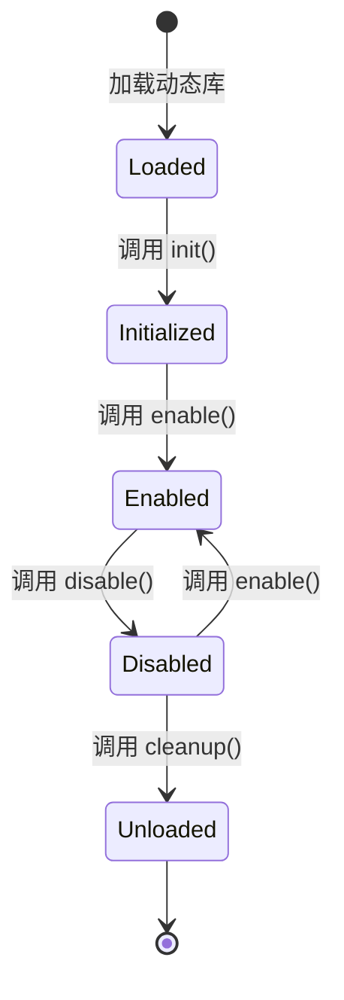

# CyberClaw Plugin 开发指南

## 目录

1. [概述](#概述)
2. [快速开始](#快速开始)
3. [Plugin 架构](#plugin-架构)
4. [创建你的第一个 Plugin](#创建你的第一个-plugin)
5. [Hook 系统](#hook-系统)
6. [安全模型](#安全模型)
7. [最佳实践](#最佳实践)
8. [调试和测试](#调试和测试)
9. [发布和分发](#发布和分发)
10. [API 参考](#api-参考)

## 概述

CyberClaw Plugin 系统允许开发者通过动态加载的方式扩展平台功能。Plugin 可以：

- 在执行生命周期的关键点注入自定义逻辑
- 扩展平台的 Capability
- 与外部系统集成
- 实现自定义的治理策略

### 核心概念

- **Plugin**: 独立的功能扩展单元
- **Hook**: 生命周期钩子，允许 Plugin 介入执行流程
- **Capability**: Plugin 提供的功能能力
- **Sandbox**: Plugin 运行的隔离环境

## 快速开始

### 环境准备

```bash
# 安装 Rust 工具链
curl --proto '=https' --tlsv1.2 -sSf https://sh.rustup.rs | sh

# 安装 CyberClaw CLI
cargo install cyberclaw-cli

# 创建新的 Plugin 项目
cyberclaw plugin new my-plugin
cd my-plugin
```

### 项目结构

```
my-plugin/
├── Cargo.toml                 # Rust 项目配置
├── cyberclaw-plugin.toml      # Plugin manifest
├── src/
│   ├── lib.rs                # Plugin 入口
│   ├── hooks.rs              # Hook 处理器
│   └── capabilities.rs      # Capability 实现
├── tests/
│   └── integration_test.rs  # 集成测试
└── README.md                 # 文档
```

## Plugin 架构

### Plugin 生命周期



### Plugin Manifest

`cyberclaw-plugin.toml` 是 Plugin 的配置文件：

```toml
[plugin]
id = "my-plugin"
name = "My Awesome Plugin"
version = "1.0.0"
description = "A plugin that does awesome things"
authors = ["Your Name <you@example.com>"]
homepage = "https://github.com/you/my-plugin"
license = "Apache-2.0"

[plugin.library]
# 动态库路径
path = "target/release/libmy_plugin.so"
# 入口函数
entry_point = "cyberclaw_plugin_init"

[plugin.hooks]
# 注册的 Hook 列表
before_execution = {
    handler = "before_exec_hook",
    priority = 100,
    timeout_ms = 5000
}

after_execution = {
    handler = "after_exec_hook",
    priority = 100,
    timeout_ms = 5000
}

[plugin.capabilities]
# Plugin 需要的系统 capabilities
required = [
    "fs.read",        # 文件系统读取
    "fs.write",       # 文件系统写入
    "network.http",   # HTTP 网络访问
    "process.spawn"   # 进程创建
]

[plugin.resources]
# 资源限制
memory = 104857600    # 100 MB
cpu_ms = 10000        # 10 seconds
file_handles = 100
network_connections = 10

[plugin.dependencies]
# 依赖的其他 Plugin
another-plugin = ">=1.0.0"
```

## 创建你的第一个 Plugin

### 1. 定义 Plugin 结构

```rust
// src/lib.rs

use cyberclaw_plugin::{Plugin, PluginResult, PluginInfo};
use async_trait::async_trait;

pub struct MyPlugin {
    name: String,
    version: String,
    config: PluginConfig,
}

#[derive(Debug, Clone)]
pub struct PluginConfig {
    pub debug: bool,
    pub log_level: String,
}

impl MyPlugin {
    pub fn new() -> Self {
        Self {
            name: "my-plugin".to_string(),
            version: "1.0.0".to_string(),
            config: PluginConfig {
                debug: false,
                log_level: "info".to_string(),
            },
        }
    }
}
```

### 2. 实现 Plugin Trait

```rust
#[async_trait]
impl Plugin for MyPlugin {
    fn info(&self) -> PluginInfo {
        PluginInfo {
            id: self.name.clone(),
            version: self.version.clone(),
            description: "My awesome plugin".to_string(),
        }
    }

    async fn initialize(&mut self) -> PluginResult<()> {
        // 初始化逻辑
        println!("Plugin {} initializing...", self.name);

        // 加载配置
        self.load_config().await?;

        // 连接外部服务
        self.connect_services().await?;

        Ok(())
    }

    async fn enable(&mut self) -> PluginResult<()> {
        println!("Plugin {} enabled", self.name);
        Ok(())
    }

    async fn disable(&mut self) -> PluginResult<()> {
        println!("Plugin {} disabled", self.name);
        Ok(())
    }

    async fn cleanup(&mut self) -> PluginResult<()> {
        // 清理资源
        println!("Plugin {} cleaning up...", self.name);
        Ok(())
    }
}
```

### 3. 导出入口函数

```rust
// 必须导出的入口函数
#[no_mangle]
pub extern "C" fn cyberclaw_plugin_init() -> *mut dyn Plugin {
    Box::into_raw(Box::new(MyPlugin::new()))
}

// 版本兼容性检查
#[no_mangle]
pub extern "C" fn cyberclaw_plugin_version() -> *const u8 {
    concat!(env!("CARGO_PKG_VERSION"), "\0").as_ptr()
}
```

## Hook 系统

### Hook 类型

```rust
pub enum HookType {
    BeforeExecution,     // 执行前
    AfterExecution,      // 执行后
    OnFailure,          // 失败时
    OnReview,           // 审核时
    BeforeCapability,   // Capability 执行前
    AfterCapability,    // Capability 执行后
}
```

### 实现 Hook Handler

```rust
// src/hooks.rs

use cyberclaw_plugin::{HookHandler, HookContext, HookResult};
use async_trait::async_trait;

pub struct BeforeExecutionHook;

#[async_trait]
impl HookHandler for BeforeExecutionHook {
    async fn handle(&self, context: &HookContext) -> PluginResult<HookResult> {
        // 获取执行上下文
        let execution_id = context.execution_id();
        let params = context.params();

        // 执行前的检查或修改
        println!("Before execution: {}", execution_id);

        // 可以修改参数
        let modified_params = self.preprocess_params(params)?;

        // 返回结果
        Ok(HookResult::Modify {
            key: "params".to_string(),
            value: modified_params,
        })
    }
}
```

### Hook 结果类型

```rust
pub enum HookResult {
    Continue,                           // 继续执行
    Abort(String),                     // 中止执行
    Modify { key: String, value: Value }, // 修改上下文
    Combined(Vec<HookResult>),         // 组合结果
}
```

### 失败策略

```rust
pub enum FailurePolicy {
    Ignore,                    // 忽略失败，继续执行
    Retry { max_attempts: u32 }, // 重试
    Abort,                     // 中止执行
}
```

## 安全模型

### Capability 声明

Plugin 必须声明所需的 Capability：

```toml
[plugin.capabilities]
required = [
    "fs.read:/data/**",           # 读取 /data 目录
    "network.http:*.example.com", # 访问 example.com
    "process.spawn:python",        # 运行 Python
]
```

### 资源限制

```rust
pub struct ResourceLimits {
    pub max_memory: usize,         // 最大内存使用
    pub max_cpu_ms: u64,          // 最大 CPU 时间
    pub max_file_handles: usize,  // 最大文件句柄数
    pub max_network_connections: usize, // 最大网络连接数
}
```

### 沙箱隔离

Plugin 运行在隔离的沙箱中：

- **进程隔离**: 独立进程空间
- **文件系统隔离**: chroot 或容器
- **网络隔离**: 网络命名空间
- **资源限制**: cgroup 限制

## 最佳实践

### 1. 错误处理

```rust
use thiserror::Error;

#[derive(Error, Debug)]
pub enum PluginError {
    #[error("Configuration error: {0}")]
    Config(String),

    #[error("External service error: {0}")]
    ExternalService(String),

    #[error("Resource limit exceeded")]
    ResourceLimit,
}

// 优雅处理错误
async fn risky_operation() -> PluginResult<()> {
    match external_call().await {
        Ok(result) => process_result(result),
        Err(e) => {
            // 记录错误
            tracing::error!("External call failed: {}", e);
            // 降级处理
            fallback_operation()
        }
    }
}
```

### 2. 异步操作

```rust
use tokio::time::{timeout, Duration};

async fn with_timeout<T>(
    future: impl Future<Output = T>,
    duration: Duration,
) -> PluginResult<T> {
    timeout(duration, future)
        .await
        .map_err(|_| PluginError::Timeout)
}

// 使用超时
let result = with_timeout(
    external_api_call(),
    Duration::from_secs(5)
).await?;
```

### 3. 配置管理

```rust
use serde::{Deserialize, Serialize};

#[derive(Debug, Deserialize, Serialize)]
pub struct Config {
    pub api_endpoint: String,
    pub timeout_secs: u64,
    pub retry_count: u32,
}

impl Config {
    pub fn from_env() -> PluginResult<Self> {
        envy::from_env()
            .map_err(|e| PluginError::Config(e.to_string()))
    }

    pub fn from_file(path: &Path) -> PluginResult<Self> {
        let content = std::fs::read_to_string(path)?;
        toml::from_str(&content)
            .map_err(|e| PluginError::Config(e.to_string()))
    }
}
```

### 4. 日志和监控

```rust
use tracing::{info, warn, error, instrument};

#[instrument(skip(sensitive_data))]
pub async fn process_request(
    request_id: &str,
    sensitive_data: &[u8],
) -> PluginResult<()> {
    info!("Processing request: {}", request_id);

    // 记录指标
    metrics::counter!("plugin.requests.total", 1);

    let start = std::time::Instant::now();
    let result = do_processing(sensitive_data).await;

    // 记录延迟
    metrics::histogram!(
        "plugin.request.duration",
        start.elapsed().as_secs_f64()
    );

    result
}
```

## 调试和测试

### 单元测试

```rust
#[cfg(test)]
mod tests {
    use super::*;
    use mockall::mock;

    mock! {
        ExternalService {
            async fn call(&self, params: &str) -> Result<String>;
        }
    }

    #[tokio::test]
    async fn test_plugin_initialization() {
        let mut plugin = MyPlugin::new();

        // Mock 外部服务
        let mut mock_service = MockExternalService::new();
        mock_service
            .expect_call()
            .returning(|_| Ok("success".to_string()));

        // 测试初始化
        let result = plugin.initialize().await;
        assert!(result.is_ok());
    }
}
```

### 集成测试

```rust
// tests/integration_test.rs

use cyberclaw_test_framework::PluginTestHarness;

#[tokio::test]
async fn test_plugin_e2e() {
    // 创建测试环境
    let harness = PluginTestHarness::new()
        .with_plugin("my-plugin")
        .with_mock_service("external-api")
        .build()
        .await;

    // 触发 Hook
    let result = harness.trigger_hook(
        HookType::BeforeExecution,
        json!({ "test": "data" })
    ).await;

    assert!(result.is_ok());
}
```

### 调试技巧

1. **启用调试日志**:
```bash
RUST_LOG=debug cyberclaw plugin test my-plugin
```

2. **使用调试器**:
```bash
# 使用 lldb
lldb target/debug/my-plugin

# 使用 gdb
gdb target/debug/my-plugin
```

3. **性能分析**:
```bash
# 使用 perf
perf record -g target/release/my-plugin
perf report

# 使用 flamegraph
cargo flamegraph --bin my-plugin
```

## 发布和分发

### 构建发布版本

```bash
# 优化构建
cargo build --release

# 运行测试
cargo test --all

# 打包
cyberclaw plugin package
```

### 签名和验证

```bash
# 生成密钥对
cyberclaw plugin keygen --output plugin.key

# 签名 Plugin
cyberclaw plugin sign \
    --key plugin.key \
    --plugin my-plugin.tar.gz

# 验证签名
cyberclaw plugin verify \
    --public-key plugin.pub \
    --plugin my-plugin.tar.gz.sig
```

### 发布到 Registry

```bash
# 登录 Registry
cyberclaw login

# 发布
cyberclaw plugin publish \
    --plugin my-plugin.tar.gz \
    --signature my-plugin.tar.gz.sig
```

## API 参考

### Core Types

```rust
// Plugin trait
#[async_trait]
pub trait Plugin: Send + Sync {
    fn info(&self) -> PluginInfo;
    async fn initialize(&mut self) -> PluginResult<()>;
    async fn enable(&mut self) -> PluginResult<()>;
    async fn disable(&mut self) -> PluginResult<()>;
    async fn cleanup(&mut self) -> PluginResult<()>;
}

// Plugin 信息
pub struct PluginInfo {
    pub id: String,
    pub version: String,
    pub description: String,
}

// Hook 上下文
pub struct HookContext {
    pub execution_id: String,
    pub hook_type: HookType,
    pub params: serde_json::Value,
    pub metadata: HashMap<String, String>,
}

// Plugin 结果
pub type PluginResult<T> = Result<T, PluginError>;
```

### 宏助手

```rust
// 简化 Plugin 定义
#[cyberclaw_plugin]
impl MyPlugin {
    #[hook(BeforeExecution, priority = 100)]
    async fn before_exec(&self, ctx: &HookContext) -> HookResult {
        // Hook 逻辑
    }

    #[capability("my.capability")]
    async fn my_capability(&self, params: Value) -> Result<Value> {
        // Capability 逻辑
    }
}
```

## 示例项目

完整的示例项目请参考：

- [Basic Plugin](../../ecosystem/plugins/example-plugin) - 基础 Plugin 示例
- [Auth Plugin](../../ecosystem/plugins/auth-plugin) - 认证 Plugin
- [Monitoring Plugin](../../ecosystem/plugins/monitoring-plugin) - 监控 Plugin

## 获取帮助

- [API 文档](https://docs.cyberclaw.io/api/plugin)
- [社区论坛](https://forum.cyberclaw.io)
- [GitHub Issues](https://github.com/cyberclaw/cyberclaw/issues)

---

**文档版本**: v1.0.0
**最后更新**: 2026-03-23