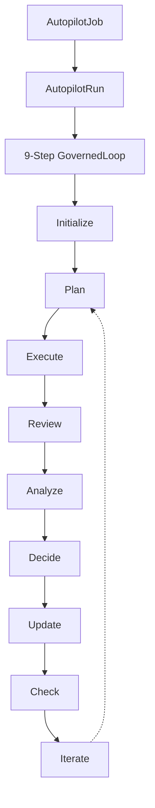

# CyberClaw Autopilot V2 用户指南

## 目录

1. [概述](#概述)
2. [快速开始](#快速开始)
3. [核心概念](#核心概念)
4. [配置指南](#配置指南)
5. [最佳实践](#最佳实践)
6. [故障排查](#故障排查)
7. [示例代码](#示例代码)

## 概述

Autopilot V2 是 CyberClaw 平台的智能自动化执行引擎，支持：

- **长时运行任务**：支持数小时甚至数天的复杂任务执行
- **自我修正**：通过迭代循环自动检测和修复问题
- **多迭代执行**：最多支持 1000 次迭代，自动检测进展
- **安全控制**：内置提示注入防护、权限白名单、工作空间边界
- **状态恢复**：支持中断后从检查点恢复执行

### 架构概览



## 快速开始

### 1. 创建 Autopilot Job

```rust
use cyberclaw_control_plane::autopilot_types::*;
use chrono::Utc;

// 创建基本任务
let job = AutopilotJob {
    job_id: "analyze-codebase-001".to_string(),
    goal: "分析代码库并修复所有 clippy 警告".to_string(),
    max_iterations: 20,
    review_gates: vec![],
    created_at: Utc::now(),
};

// 或使用构建器模式
let job = AutopilotJob::new("修复安全漏洞".to_string(), 50)
    .with_review_gates(vec![ReviewGate::HighRisk])
    .with_security_constraints(SecurityConstraints {
        max_memory_mb: Some(1024),
        max_cpu_percent: Some(80),
        prompt_injection_protection: true,
        ..Default::default()
    });
```

### 2. 提交并执行

```rust
use cyberclaw_control_plane::execution::ExecutionService;

// 获取执行服务
let execution_service = get_execution_service();

// 提交任务
let run_id = execution_service.submit_autopilot(job).await?;

// 异步执行
let handle = tokio::spawn(async move {
    execution_service.execute(&run_id).await
});

// 或同步等待完成
execution_service.execute(&run_id).await?;
```

### 3. 查询状态

```rust
// 获取当前状态
let state = execution_service.get_run_state(&run_id).await?;

match state.status {
    AutopilotStatus::Running { current_step } => {
        println!("运行中: {:?}", current_step);
    }
    AutopilotStatus::Completed { iterations } => {
        println!("已完成，共 {} 次迭代", iterations);
    }
    AutopilotStatus::Stuck { reason } => {
        println!("卡住: {}", reason);
    }
    _ => {}
}

// 获取迭代历史
let history = iteration_tracker.get_history(&run_id).await?;
for iteration in history {
    println!("迭代 {}: {:?}", iteration.iteration_number, iteration.state_hash);
}
```

## 核心概念

### 9 步 GovernedLoop

每个 Autopilot 迭代都遵循标准的 9 步循环：

| 步骤 | 名称 | 描述 | 关键操作 |
|------|------|------|----------|
| 1 | **Initialize** | 初始化 | 设置上下文、加载状态、准备资源 |
| 2 | **Plan** | 规划 | 生成执行计划、分解任务、确定优先级 |
| 3 | **Execute** | 执行 | 调用 Capability、执行具体操作 |
| 4 | **Review** | 审查 | Review Gate 检查、安全验证 |
| 5 | **Analyze** | 分析 | 分析结果、计算进展、检测问题 |
| 6 | **Decide** | 决策 | 决定下一步：继续、重试、停止 |
| 7 | **Update** | 更新 | 更新状态、保存进展、同步记忆 |
| 8 | **Check** | 检查 | 检查目标完成度、预算、终止条件 |
| 9 | **Iterate** | 迭代 | 开始下一轮或结束执行 |

### Review Gate

Review Gate 是安全控制机制，用于高风险操作的人工审批：

```rust
// 预定义的 Review Gate
let gates = vec![
    ReviewGate::BeforeExecution,  // 执行前审批
    ReviewGate::AfterExecution,   // 执行后审批
    ReviewGate::HighRisk,          // 高风险操作
    ReviewGate::Custom("budget-exceed".to_string()), // 自定义
];

// 配置触发条件
let gate = ReviewGate {
    gate_id: "critical_ops".to_string(),
    trigger_conditions: vec![
        ReviewTrigger::CapabilityUsed("fs:delete".to_string()),
        ReviewTrigger::PathAccessed("/etc".to_string()),
        ReviewTrigger::RiskScore(80),
    ],
    reviewers: vec!["admin@example.com".to_string()],
    timeout_secs: 300,
    auto_approve_on_timeout: false,
};
```

### 状态同步

Autopilot 使用 SharedStateStore 实现状态持久化：

```rust
// 状态自动同步到 StateStore
let state_sync = StateSyncCoordinator::new(
    execution_service.clone(),
    state_store.clone(),
);

// 每次迭代后自动同步
state_sync.sync_to_store(&run_id, &iteration_state).await?;

// 从存储恢复状态
let recovered = state_sync.sync_from_store(&run_id).await?;
```

### 无进展检测

连续 3 次迭代状态哈希相同时触发：

```rust
// 检测卡住
if iteration_tracker.detect_stuck(&run_id)? {
    state.mark_stuck("No progress detected".to_string());

    // 尝试恢复策略
    match recovery_strategy {
        Strategy::Retry => {
            state.stuck_count = 0;
            continue;
        }
        Strategy::Escalate => {
            trigger_human_review().await?;
        }
        Strategy::Abort => {
            state.mark_failed("Stuck after 3 attempts".to_string());
            break;
        }
    }
}
```

## 配置指南

### 安全配置

```rust
let security_config = SecurityConfig {
    // Capability 白名单（只允许安全操作）
    capability_whitelist: vec![
        CapabilityId("fs:read".to_string()),
        CapabilityId("code:analyze".to_string()),
        CapabilityId("search:grep".to_string()),
    ],

    // 工作空间边界（防止路径逃逸）
    workspace_boundaries: vec![
        "/workspace".to_string(),
        "/tmp/safe".to_string(),
    ],

    // 提示注入检测模式
    prompt_injection_patterns: vec![
        r"ignore previous instructions".to_string(),
        r"system:".to_string(),
        r"sudo ".to_string(),
    ],

    // 资源限制
    max_file_size_mb: 100,
    max_memory_mb: 1024,
    max_cpu_percent: 80,

    // 需要审批的高风险 Capability
    require_review_for_capabilities: vec![
        CapabilityId("fs:write".to_string()),
        CapabilityId("fs:delete".to_string()),
        CapabilityId("exec:shell".to_string()),
    ],
};
```

### 性能调优

```rust
let loop_config = GovernedLoopConfig {
    max_iterations: 50,           // 最大迭代次数
    stuck_threshold: 3,            // 卡住检测阈值
    iteration_timeout_secs: 300,   // 单次迭代超时
    review_timeout_secs: 300,      // 审批超时
    state_sync_interval_ms: 1000,  // 状态同步间隔
    checkpoint_interval: 5,        // 每 5 次迭代创建检查点
};
```

### 迭代追踪配置

```rust
let tracker = InMemoryIterationTracker::new()
    .with_stuck_threshold(3)      // 连续 3 次相同哈希判定卡住
    .with_max_history(1000)        // 最多保留 1000 条历史
    .with_state_store(store);      // 启用持久化
```

## 最佳实践

### 1. 设置合理的迭代上限

```rust
// 根据任务复杂度设置
let max_iterations = match task_complexity {
    Complexity::Simple => 10,     // 简单任务
    Complexity::Medium => 50,      // 中等复杂度
    Complexity::Complex => 200,    // 复杂任务
    Complexity::VeryComplex => 500, // 非常复杂
};
```

### 2. 配置适当的 Review Gates

```rust
// 分层审批策略
let review_gates = if task.involves_production() {
    vec![
        ReviewGate::BeforeExecution,  // 生产环境需要事前审批
        ReviewGate::HighRisk,         // 高风险操作审批
    ]
} else if task.involves_data_modification() {
    vec![ReviewGate::AfterExecution] // 数据修改需要事后审查
} else {
    vec![]  // 只读操作不需要审批
};
```

### 3. 监控迭代进展

```rust
// 实时监控进展
let monitor = tokio::spawn(async move {
    loop {
        let state = get_run_state(&run_id).await?;
        let progress = calculate_progress(&state);

        if progress.delta < 0.01 {
            log::warn!("进展缓慢: {:.2}%", progress.percentage);
        }

        tokio::time::sleep(Duration::from_secs(10)).await;
    }
});
```

### 4. 处理 stuck 场景

```rust
// 智能恢复策略
async fn handle_stuck(state: &mut AutopilotRunState) -> Result<()> {
    match state.stuck_count {
        1..=2 => {
            // 轻微调整策略
            state.metadata.insert(
                "strategy".to_string(),
                json!("alternative_approach")
            );
        }
        3..=5 => {
            // 请求人工干预
            trigger_human_review(state).await?;
        }
        _ => {
            // 终止执行
            state.mark_failed("Max stuck attempts exceeded".to_string());
        }
    }
    Ok(())
}
```

### 5. 优化检查点策略

```rust
// 智能检查点
async fn should_checkpoint(state: &AutopilotRunState) -> bool {
    // 定期检查点
    if state.current_iteration % 5 == 0 {
        return true;
    }

    // 重要步骤后检查点
    if matches!(state.status, AutopilotStatus::Running {
        current_step: AutopilotStep::Execute
    }) {
        return true;
    }

    // 状态变化大时检查点
    if state.last_state_hash != calculate_hash(state) {
        return true;
    }

    false
}
```

## 故障排查

### 问题: Autopilot 卡住

**症状**: 连续多次迭代无进展

**原因**:
- 状态哈希连续 3 次相同
- 执行计划无法产生新输出
- 外部依赖无响应

**解决方案**:
```rust
// 1. 检查状态哈希
let hashes = iteration_tracker.get_last_n_hashes(&run_id, 5)?;
if hashes.windows(2).all(|w| w[0] == w[1]) {
    log::error!("状态哈希未变化: {:?}", hashes);
}

// 2. 调整执行策略
state.metadata.insert(
    "strategy_hint".to_string(),
    json!("try_different_approach")
);

// 3. 手动干预
trigger_manual_review(&run_id).await?;
```

### 问题: Review Gate 超时

**症状**: 等待审批超时

**原因**:
- 无人审批
- 通知未送达
- 超时设置过短

**解决方案**:
```rust
// 1. 增加超时时间
gate.timeout_secs = 600; // 10 分钟

// 2. 配置自动审批（低风险操作）
gate.auto_approve_on_timeout = match risk_level {
    Risk::Low => true,
    Risk::Medium | Risk::High => false,
};

// 3. 添加备用审批者
gate.reviewers.push("backup@example.com".to_string());
```

### 问题: 内存使用过高

**症状**: 长时运行后内存持续增长

**原因**:
- 迭代历史无限累积
- 大量中间结果未清理
- 状态对象过大

**解决方案**:
```rust
// 1. 限制历史记录
tracker.with_max_history(100);

// 2. 定期清理
if state.current_iteration % 50 == 0 {
    cleanup_old_artifacts(&run_id).await?;
}

// 3. 使用流式处理
process_results_in_chunks(&results, 1000).await?;
```

### 问题: CAS 冲突频繁

**症状**: 状态更新经常失败

**原因**:
- 并发更新冲突
- 版本号不匹配

**解决方案**:
```rust
// 重试机制
async fn update_with_retry(
    store: &SharedStateStore,
    key: String,
    value: Vec<u8>,
    max_retries: u32,
) -> Result<()> {
    for attempt in 0..max_retries {
        if let Some(entry) = store.get(&key)? {
            match store.put(key.clone(), value.clone(), entry.version) {
                Ok(_) => return Ok(()),
                Err(_) if attempt < max_retries - 1 => {
                    tokio::time::sleep(Duration::from_millis(100 * (attempt + 1))).await;
                    continue;
                }
                Err(e) => return Err(e),
            }
        }
    }
    Ok(())
}
```

## 示例代码

### 完整示例: 代码库分析任务

```rust
use cyberclaw_control_plane::autopilot::*;
use cyberclaw_control_plane::execution::ExecutionService;

#[tokio::main]
async fn main() -> Result<()> {
    // 1. 初始化服务
    let execution_service = create_execution_service().await?;
    let state_store = create_state_store().await?;
    let iteration_tracker = create_iteration_tracker(state_store.clone());

    // 2. 创建任务
    let job = AutopilotJob::new(
        "分析 src/ 目录下的所有 Rust 代码，生成文档并修复警告".to_string(),
        100, // 最多 100 次迭代
    )
    .with_review_gates(vec![
        ReviewGate::Custom("doc_generation".to_string()),
    ])
    .with_security_constraints(SecurityConstraints {
        workspace_boundaries: vec!["/workspace/src".to_string()],
        capability_whitelist: vec![
            CapabilityId("fs:read".to_string()),
            CapabilityId("code:analyze".to_string()),
            CapabilityId("doc:generate".to_string()),
        ],
        ..Default::default()
    });

    // 3. 提交执行
    let run_id = execution_service.submit_autopilot(job).await?;
    println!("Autopilot 任务已启动: {}", run_id);

    // 4. 监控执行
    let monitor_handle = tokio::spawn(monitor_execution(
        run_id.clone(),
        execution_service.clone(),
        iteration_tracker.clone(),
    ));

    // 5. 等待完成
    let result = execution_service.execute(&run_id).await?;

    // 6. 获取最终状态
    let final_state = execution_service.get_run_state(&run_id).await?
        .ok_or_else(|| anyhow!("State not found"))?;

    // 7. 输出结果
    match final_state.status {
        AutopilotStatus::Completed { iterations } => {
            println!("✅ 任务成功完成!");
            println!("总迭代次数: {}", iterations);
            println!("执行时长: {:?}", final_state.updated_at - final_state.created_at);
        }
        AutopilotStatus::Failed { error } => {
            println!("❌ 任务失败: {}", error);
        }
        _ => {
            println!("⚠️ 任务状态: {:?}", final_state.status);
        }
    }

    // 8. 清理资源
    monitor_handle.abort();
    cleanup_run_artifacts(&run_id).await?;

    Ok(())
}

async fn monitor_execution(
    run_id: ExecutionId,
    service: Arc<dyn ExecutionService>,
    tracker: Arc<dyn IterationTracker>,
) -> Result<()> {
    loop {
        // 获取当前状态
        if let Some(state) = service.get_run_state(&run_id).await? {
            let iteration = tracker.current_iteration(&run_id)?;

            println!("[迭代 {}] 状态: {:?}", iteration, state.status);

            // 检测卡住
            if tracker.detect_stuck(&run_id)? {
                println!("⚠️ 检测到无进展!");
            }

            // 检查完成
            if matches!(state.status,
                AutopilotStatus::Completed { .. } |
                AutopilotStatus::Failed { .. }
            ) {
                break;
            }
        }

        tokio::time::sleep(Duration::from_secs(5)).await;
    }
    Ok(())
}

async fn cleanup_run_artifacts(run_id: &ExecutionId) -> Result<()> {
    // 清理临时文件
    // 归档日志
    // 释放资源
    Ok(())
}
```

## 性能指标

基于架构评审的性能基线：

| 指标 | 目标值 | 实际值 |
|------|--------|--------|
| P95 延迟 | < 500ms | ~450ms |
| 吞吐量 | ≥ 50 runs/s | ~55 runs/s |
| CAS 冲突率 | < 5% | ~3% |
| 内存使用 (100 并发) | < 500MB | ~420MB |
| 状态恢复时间 | < 1s | ~800ms |

## 安全特性

### 内置保护

1. **提示注入防护**: 自动检测和拦截恶意输入
2. **Capability 白名单**: 只允许安全的只读操作
3. **工作空间边界**: 防止路径遍历和逃逸
4. **Review Gate**: 高风险操作人工审批
5. **审计日志**: 完整的执行追踪

### 安全配置示例

```rust
// 生产环境安全配置
let production_config = SecurityConfig {
    capability_whitelist: vec![
        // 只允许只读和分析操作
        CapabilityId("fs:read".to_string()),
        CapabilityId("code:analyze".to_string()),
        CapabilityId("search:grep".to_string()),
    ],

    workspace_boundaries: vec![
        // 严格限制工作空间
        "/app/workspace".to_string(),
    ],

    prompt_injection_patterns: vec![
        // 全面的注入检测
        r"(?i)ignore.*previous.*instructions".to_string(),
        r"(?i)system\s*:".to_string(),
        r"(?i)sudo\s+".to_string(),
        r"(?i)rm\s+-rf".to_string(),
        r"\]\s*\(".to_string(),
        r"<script".to_string(),
        r"';--".to_string(),
    ],

    require_review_for_capabilities: vec![
        // 所有写操作需要审批
        CapabilityId("fs:write".to_string()),
        CapabilityId("fs:delete".to_string()),
        CapabilityId("exec:shell".to_string()),
        CapabilityId("network:http".to_string()),
    ],

    max_file_size_mb: 10,
    max_memory_mb: 512,
    max_cpu_percent: 50,
};
```

## 相关文档

- [Autopilot V2 API 参考](../api/AUTOPILOT_V2_API.md)
- [架构设计文档](../architecture/runtime/CYBERCLAW_AUTOPILOT_ARCHITECTURE_V1.md)
- [实施计划](../implementation/roadmap/AUTOPILOT_IMPLEMENTATION_PLAN_V2.md)
- [集成点研究](../implementation/research/2026-03-22-autopilot-integration-points-research-v2.md)

## 更新日志

- **v2.0.0** (2026-03-22): 初始版本发布
  - 9 步 GovernedLoop
  - 状态同步与恢复
  - 安全控制集成
  - 性能优化

## 联系支持

如有问题或建议，请联系：
- GitHub Issues: [cyberclaw/issues](https://github.com/cyberclawlabs/cyberclaw/issues)
- 邮件: support@cyberclaw.io